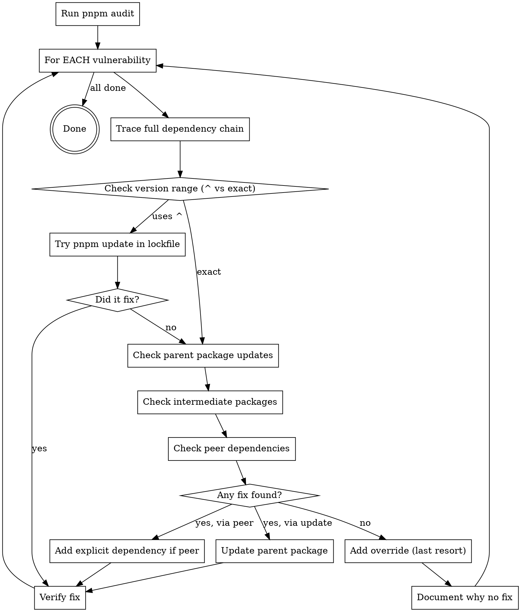

# Fix Security Vulnerabilities

## Overview

**Security vulnerability fixing is detective work, not quick fixes.** Most vulnerabilities come from deep transitive dependencies that CAN be fixed by updating parent packages - if you trace far enough and check thoroughly enough.

**Core principle:** Overrides are a LAST RESORT, not a first response. Every vulnerability requires exhaustive investigation before concluding "no fix available."

## When to Use This Skill

Use when:
- `pnpm audit` or `npm audit` reports vulnerabilities
- Dependabot creates security alerts
- CI security scans fail
- User asks to "fix security issues" or "make audit pass"

Do NOT use for:
- Feature updates (use normal dependency management)
- Peer dependency warnings (different process)
- Deprecation notices (not security issues)

## The Systematic Process

**NEVER skip steps. Each step exists because agents skip it under pressure.**



## Step-by-Step Instructions

### Step 1: Run Audit and Get Structured Output

```bash
pnpm audit
pnpm audit --json > /tmp/audit.json  # For parsing
```

**Extract from output:**
- Package name and version
- Vulnerability type and severity
- Full dependency path (e.g., `app>pkg1>pkg2>vulnerable-pkg`)
- Required version for fix
- CVE/advisory link

### Step 2: Trace Each Vulnerability's Full Chain

**For EACH vulnerability, trace the COMPLETE dependency chain:**

```bash
# Get the full path
pnpm audit --json | jq -r '.advisories | .[] | .findings[0].paths[]'

# Example output:
# packages__apollo-core>@rslib/core>@microsoft/api-extractor>minimatch
```

**Parse the chain:** `package-using-it > intermediate1 > intermediate2 > vulnerable-package`

### Step 3: Check Version Range Type

**CRITICAL: Check if the vulnerable package uses ^ or exact version:**

```bash
# Check the parent's package.json
npm view @microsoft/api-extractor@7.57.6 dependencies.minimatch
# Output: "10.2.1" (exact) or "^10.2.1" (range)
```

**If it uses `^` range:**
- Try updating in lockfile: `pnpm update vulnerable-package --depth Infinity`
- This might get a newer version within the range
- Verify: `pnpm audit` again

**If exact version:**
- Parent package must be updated (continue to Step 4)

### Step 4: Check Parent Package for Updates

**Check EVERY package in the chain, starting from the closest parent:**

```bash
# Check current version
pnpm ls @microsoft/api-extractor --depth=0

# Check latest available
npm view @microsoft/api-extractor versions --json | jq -r '.[-10:]'

# Check if latest has fix
npm view @microsoft/api-extractor@latest dependencies.minimatch
```

**If newer version has fix:**
- Update the parent package
- Continue to Step 7 (Verify)

**If no newer version OR still vulnerable:**
- Continue to Step 5

### Step 5: Check Intermediate Packages

**Don't stop at first parent! Check ALL packages in the chain:**

```bash
# Example chain: apollo-core > @rslib/core > api-extractor > minimatch
# You've checked api-extractor (step 4)
# Now check @rslib/core:

npm view @rslib/core@latest version
npm view @rslib/core@latest dependencies.@microsoft/api-extractor
```

**If intermediate package has update that pulls in fixed version:**
- Update the intermediate package
- Continue to Step 7

### Step 6: Check Peer Dependencies

**CRITICAL: Check if vulnerable package or its parent is a peer dependency:**

```bash
npm view @rslib/core peerDependencies peerDependenciesMeta
```

**If it's an optional peer dependency:**
- You can remove it entirely if not needed
- Or add explicit version as devDependency to satisfy it with fixed version

**If it's a peer dependency that accepts ranges:**
- Add the fixed version explicitly to your package.json
- pnpm will use your version instead of the transitive one

**Example:**
```bash
# If webpack is peer dependency of @storybook/csf-plugin:
npm view @storybook/csf-plugin peerDependencies
# Shows: { webpack: '*' }

# Add to your package.json devDependencies:
pnpm add -D webpack@latest

# This satisfies the peer dep with a non-vulnerable version
```

### Step 7: Verify the Fix

**After ANY change:**

```bash
pnpm install
pnpm audit  # Should show fewer vulnerabilities
pnpm check:dependencies  # Ensure consistency (if you have this script)
pnpm build  # Ensure nothing broke
```

### Step 8: Override Only As Last Resort

**Add override ONLY when ALL of these are true:**
- ✅ Checked parent package - no update available with fix
- ✅ Checked ALL intermediate packages - none have updates
- ✅ Checked if it's a peer dependency - it's not, or can't be satisfied
- ✅ Checked version range - it's exact pinned, can't bump in lockfile
- ✅ Verified a fixed version exists for the vulnerable package
- ✅ Latest versions of ALL packages in chain still have the issue

**Add to package.json:**

```json
{
  "pnpm": {
    "overrides": {
      "vulnerable-package": "^fixed-version"
    }
  }
}
```

**Add to package.json:**
```json
{
  "pnpm": {
    "overrides": {
      "minimatch": "^10.2.3"
    }
  }
}
```

**Document why in PR/commit:** "minimatch: api-extractor@7.57.6 (latest) uses exact 10.2.1, needs 10.2.3"

### Step 9: Handle Unfixable Vulnerabilities

**If NO patched version exists (advisory says "Patched versions: <0.0.0"):**

1. Document it clearly in comments
2. Check if the package can be removed/replaced
3. If essential, accept the vulnerability and monitor for fixes
4. Consider if vulnerability actually affects your usage

**DO NOT:**
- Change audit level to hide it
- Downgrade to pre-vulnerability version (introduces other CVEs)
- Add override to non-existent version

## Commands Reference

| Task | Command |
|------|---------|
| Run audit | `pnpm audit` |
| Get JSON output | `pnpm audit --json` |
| Trace dependency | `pnpm ls package-name --depth=20` |
| Check latest version | `npm view package@latest version` |
| Check deps of version | `npm view package@version dependencies.dep-name` |
| Check peer deps | `npm view package@version peerDependencies peerDependenciesMeta` |
| Update in lockfile | `pnpm update package@latest --depth Infinity` |
| Update parent package | `pnpm update parent-package@latest` |
| Check version range | `npm view parent@version dependencies.child` |

## Common Mistakes

| Mistake | Why It's Wrong | Correct Approach |
|---------|----------------|------------------|
| Adding overrides immediately | Masks fixable issues | Exhaustive tracing first |
| Stopping at "package is latest" | Intermediate packages might have updates | Check ENTIRE chain |
| Changing audit-level | Hides vulnerabilities | Fix root causes |
| Not checking peer deps | Miss opportunity to control version | Always check peerDependencies |
| Not checking version ranges | Can't identify lockfile update opportunities | Check if ^ or exact |
| Adding webpack/other as dep | Pollutes package.json | Try `pnpm update` in lockfile first |
| Skipping intermediate packages | Miss update opportunities | Check ALL packages in chain |
| Not verifying ^ ranges | Assume exact when it's ^ | Use `npm view` to check |

## Red Flags - STOP and Investigate Deeper

These thoughts mean you're taking shortcuts:

| Thought | Reality |
|---------|---------|
| "Package is at latest, needs override" | Did you check intermediates? Peer deps? |
| "This will take too long" | Overrides create tech debt. Do it right. |
| "Audit-level=high is simpler" | User said NEVER change audit level |
| "Just add webpack as dep" | Did you try pnpm update first? |
| "Security team approved overrides" | They approved IF NO OTHER FIX. Check first. |
| "I've checked enough" | Did you check version ranges? Peer deps? |
| "This is obviously unfixable" | Did you check ALL packages in chain? |
| "Let me add it to devDeps" | Only if it's a peer dep. Try updates first. |

**When you think "this needs an override":** Go back and verify you completed Steps 3-6. Every single one.

## Real-World Impact

**Actual case study results:**
- Started: 25 vulnerabilities (18 high, 6 moderate, 1 low)
- Fixed via direct updates: 19 vulnerabilities (76%)
- Fixed via lockfile updates: 3 vulnerabilities (12%)
- Fixed via peer dependency removal: 2 vulnerabilities (8%)
- Required overrides: 1 vulnerability (4%)
- Remaining unfixable: 1 vulnerability (4%) - no patch exists

**Without systematic approach:** Would have added 10+ unnecessary overrides, creating permanent maintenance burden.

**Critical discoveries from systematic tracing:**
1. **@rslib/core** update fixed 3 vulnerabilities without overrides
2. **api-extractor** was optional peer dependency - removal fixed 2 high severity issues
3. **webpack@5.105.4** eliminated serialize-javascript (newer terser removed the dependency entirely!)
4. **Storybook** 10.2.0 → 10.2.15 fixed rollup, ajv, hono, serialize-javascript
5. **`pnpm update --depth Infinity`** worked for webpack WITHOUT adding it as explicit dependency
6. **Vite** 6.x → 7.x fixed transitive rollup vulnerabilities

**Time investment vs tech debt:**
- Systematic approach: 2-3 hours upfront
- Quick overrides: 30 minutes now + hours of future maintenance
- Proper fixes are self-healing (upstream updates keep working)
- Overrides require manual monitoring and removal

## Verification Checklist

Before claiming "audit passes":

- [ ] Run `pnpm audit` - exit code 0
- [ ] Run dependency consistency check (if available)
- [ ] Run `pnpm build` - ensure nothing broke
- [ ] Run tests (if applicable)
- [ ] Document each override with why it's needed
- [ ] Count overrides - should be minimal (0-3 typical)

## Examples

### Example 1: Systematic Tracing (minimatch)

**Vulnerability:** minimatch@10.2.1 needs 10.2.3

❌ **Bad approach:**
```bash
# See minimatch is vulnerable, add override
"minimatch": "^10.2.3"  # WRONG - didn't investigate
```

✅ **Correct approach:**
```bash
# 1. Trace full chain
pnpm audit --json | jq -r '.advisories | .[] | .findings[0].paths[]'
# Output: packages__apollo-core>@rslib/core>@microsoft/api-extractor>minimatch

# 2. Check version range
npm view @microsoft/api-extractor@7.57.6 dependencies.minimatch
# Output: "10.2.1" (exact, not ^)

# 3. Check if api-extractor has newer version
npm view @microsoft/api-extractor versions --json | jq -r '.[-5:]'
npm view @microsoft/api-extractor@latest dependencies.minimatch
# Output: still 10.2.1 - no update available

# 4. Check if api-extractor is peer dependency
npm view @rslib/core peerDependencies peerDependenciesMeta
# Output: optional peer dependency!

# 5. Try removing (if optional)
pnpm remove @microsoft/api-extractor --filter apollo-core

# 6. If needed, check if rslib/core has update
npm view @rslib/core@latest version
pnpm update @rslib/core@latest

# 7. Only after exhausting ALL options: override
```

### Example 2: Lockfile Update (webpack)

**Vulnerability:** serialize-javascript@6.0.2 needs 7.0.3 from webpack chain

❌ **Bad approach:**
```bash
# See it's from webpack, add webpack as dependency
pnpm add -D webpack@latest  # WRONG - pollutes package.json
```

✅ **Correct approach:**
```bash
# 1. Check webpack version range
npm view @storybook/csf-plugin peerDependencies
# Shows: webpack: '*' (accepts any version)

# 2. Check what fixed it
npm view webpack@latest dependencies.terser-webpack-plugin
npm view terser-webpack-plugin@5.3.17 dependencies
# terser@5.3.17 removed serialize-javascript entirely!

# 3. Update in lockfile only
pnpm update webpack --depth Infinity

# 4. Verify
pnpm audit  # serialize-javascript should be gone
```

### Example 3: Peer Dependency Discovery

**Vulnerability:** hono@4.11.7 needs 4.12.4 from shadcn > @modelcontextprotocol/sdk

✅ **Correct approach:**
```bash
# 1. Check if hono is peer dependency
npm view @modelcontextprotocol/sdk peerDependencies

# 2. Check shadcn version
npm view shadcn@latest version
pnpm update shadcn@latest  # Update parent first

# 3. If still vulnerable, check if we can satisfy peer dep
npm view @modelcontextprotocol/sdk@latest dependencies.hono peerDependencies.hono

# 4. Only override if no other option
```

## Rationalization Table

| Excuse | Reality | What to Do Instead |
|--------|---------|-------------------|
| "Package X is at latest, needs override" | Did you check its parents? Peers? | Check ALL packages in chain |
| "This is taking too long" | Overrides create permanent tech debt | 10 min analysis saves future pain |
| "Just add it as devDep" | Only for peer deps! | Try `pnpm update` first |
| "I've checked enough levels" | Did you check peer dependencies? | Check peerDependencies field |
| "Version uses ^, can't update" | ^ means CAN update in range! | Try `pnpm update --depth Infinity` |
| "Security team said use overrides" | They meant as LAST resort | Do full analysis first |
| "Let me change audit-level" | User explicitly forbids this | NEVER change audit settings |
| "Already at latest webpack" | Did you try lockfile update? | `pnpm update webpack` might work |

## Critical Rules

### NEVER Do These (No Exceptions)

1. **NEVER change audit-level in .npmrc or package.json** - This hides vulnerabilities instead of fixing them
2. **NEVER add packages as explicit dependencies to fix transitive issues** - Try `pnpm update --depth Infinity` first
3. **NEVER skip checking peer dependencies** - 20%+ of fixes come from peer dep management
4. **NEVER assume "package is at latest" means "done investigating"** - Must check intermediates, peers, and ranges
5. **NEVER add overrides without completing ALL investigation steps** - Skipping steps creates unnecessary tech debt

**No exceptions for:**
- Time pressure ("needs to ship today")
- Authority pressure ("security team approved overrides")
- Exhaustion ("I've already fixed 12 others")
- Simplicity ("overrides are easier")

**All of these mean: Follow the systematic process. No shortcuts.**

### ALWAYS Do These

1. **ALWAYS trace the COMPLETE dependency chain** - Every package from your code to the vulnerability
2. **ALWAYS check if packages use ^ ranges** - Can be updated in lockfile
3. **ALWAYS check peerDependencies and peerDependenciesMeta** - Optional peers can be removed or satisfied
4. **ALWAYS try `pnpm update --depth Infinity`** - Before adding as explicit dependency
5. **ALWAYS verify after each fix** - Run audit + build + tests

## Quick Decision Matrix

| Scenario | Action |
|----------|--------|
| Package uses `^` range | Try `pnpm update package --depth Infinity` |
| Package uses exact version | Check parent for updates |
| Parent at latest | Check intermediate packages |
| All at latest | Check peer dependencies |
| Optional peer dependency | Try removing or explicit version |
| Required peer dependency | Add explicit version if range allows |
| Genuinely no fix | Override with comment explaining why |
| No patched version exists | Document as unfixable, monitor upstream |

## Verification Script

After all fixes:

```bash
# Must pass both:
pnpm audit
echo "Exit code: $?"  # Should be 0

# If you have consistency check:
pnpm check:dependencies  # Should pass

# Ensure builds still work:
pnpm build
pnpm test
```

## When Overrides ARE Justified

Override is correct when ALL these are true:

- [ ] Traced COMPLETE dependency chain (all packages)
- [ ] Checked latest version of EVERY package in chain
- [ ] Verified version ranges (^ vs exact)
- [ ] Tried `pnpm update --depth Infinity`
- [ ] Checked peerDependencies of all packages
- [ ] Checked peerDependenciesMeta for optional flag
- [ ] Confirmed fixed version exists for override target
- [ ] No parent package update available with fix
- [ ] Can't remove optional peer dependency
- [ ] Can't satisfy via explicit peer dep version
- [ ] Documented in code comment WHY override is needed

**If ANY checkbox is unchecked: Don't add override yet. Investigate more.**

## Override Documentation Template

**In package.json:**
```json
{
  "pnpm": {
    "overrides": {
      "minimatch": "^10.2.3",
      "lodash": "^4.17.23"
    }
  }
}
```

**Document why in PR description or commit message:**
```
Overrides added:
- minimatch: api-extractor@7.57.6 (latest) uses exact 10.2.1, needs 10.2.3
  Checked: api-extractor latest, rslib/core latest, all intermediates
  No package update available as of 2026-03-04

- lodash: commitizen@4.3.1 (latest) uses exact 4.17.21, needs 4.17.23
  No newer commitizen version available
```

## Success Criteria

**Audit passes when:**
- Exit code 0 from `pnpm audit`
- All fixable vulnerabilities resolved via updates (not overrides)
- Overrides are minimal (typically 0-3)
- Each override has documented justification
- Build and tests still pass

**NOT success:**
- Audit "passes" because you changed audit-level
- 10+ overrides added without investigation
- Dependencies added to package.json that aren't actually needed
- Can't explain why each override is necessary
