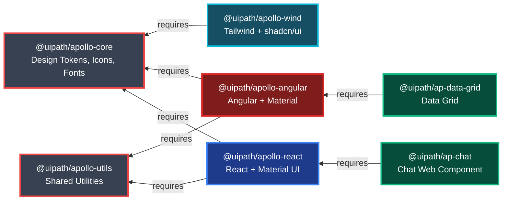

# Apollo v.4 Design System

[](https://opensource.org/licenses/MIT)
[](https://pnpm.io/)
[](https://turbo.build/)

Apollo v.4 is UiPath's open-source design system for building consistent user experiences across all UiPath products.

## ✨ Features

- 🎨 **Design Tokens** - 1300+ icons, comprehensive color system, typography, spacing
- ⚛️ **React Components** - Built on Material UI with Apollo theming
- 🅰️ **Angular Components** - Built on Angular Material with Apollo theming
- 🎐 **Tailwind CSS** - Modern utility-first styling with shadcn/ui
- 🌐 **Web Components** - Cross-framework components for maximum flexibility
- 📘 **TypeScript** - Full type safety across all packages
- 📚 **Storybook** - Interactive component documentation
- 🚀 **Monorepo** - Efficient development with Turborepo and pnpm

## 📦 Package Dependency Graph



## 📁 Repository Structure

```
apollo-ui/
├── packages/              # Core + framework packages
│   ├── apollo-core/       # 🎨 Design tokens, icons, fonts
│   ├── apollo-utils/      # 🛠️ Shared utilities
│   ├── apollo-react/      # ⚛️ React components + MUI theme
│   ├── apollo-angular/    # 🅰️ Angular components + Material theme
│   └── apollo-wind/       # 🎐 Tailwind + shadcn/ui
│
├── web-packages/          # Cross-framework web components
│   ├── ap-chat/ # 💬 Chat web component
│   └── ap-data-grid/      # 📊 Data grid web component
│
└── apps/                  # Development applications
    ├── storybook/         # 📚 Component documentation
    ├── react-playground/  # ⚛️ React testing environment
    └── angular-playground/# 🅰️ Angular testing environment
```

## 🚀 Getting Started

### Prerequisites

- **Node.js** >= 22
- **pnpm** >= 10

### Installation

```bash
# Install pnpm if you haven't already
npm install -g pnpm

# Clone the repository
git clone https://github.com/UiPath/apollo-ui.git
cd apollo-ui

# Install dependencies
pnpm install

# Build all packages
pnpm build
```

### Development

```bash
# Run all packages in development mode
pnpm dev

# Run Storybook
pnpm storybook

# Lint all packages
pnpm lint

# Run tests
pnpm test

# Run visual regression tests
pnpm test:visual
```

### Building

```bash
# Build all packages
pnpm build

# Build Storybook
pnpm storybook:build
```

## 📦 Packages

### Core Packages

| Package | Description |
|---------|-------------|
| [@uipath/apollo-core](./packages/apollo-core) | Design tokens, 1300+ icons, fonts - Foundation of the design system |
| [@uipath/apollo-utils](./packages/apollo-utils) | Shared utilities, formatters, and helper functions |

### Framework Packages

| Package | Description |
|---------|-------------|
| [@uipath/apollo-react](./packages/apollo-react) | React components with Material UI theming and Apollo design tokens |
| [@uipath/apollo-angular](./packages/apollo-angular) | Angular components with Angular Material theming *(Coming soon)* |
| [@uipath/apollo-wind](./packages/apollo-wind) | Tailwind CSS utilities + shadcn/ui components |

### Web Components (Cross-Framework)

| Package | Description |
|---------|-------------|
| [@uipath/ap-chat](./web-packages/ap-chat) | Chat interface web component |
| [@uipath/ap-data-grid](./web-packages/ap-data-grid) | Data grid web component with React wrapper |

## Usage

### React

```tsx
import { ApButton } from '@uipath/apollo-react/material/components';
import { apolloMaterialUiThemeDark } from '@uipath/apollo-react/material/theme';
import { ThemeProvider } from '@mui/material/styles';

function App() {
  return (
    <ThemeProvider theme={apolloMaterialUiThemeDark}>
      <ApButton variant="contained">Click me</ApButton>
    </ThemeProvider>
  );
}
```

### Core Tokens

```tsx
import { ColorPrimary500, SpacingMd } from '@uipath/apollo-core/tokens';
import { IconCheck } from '@uipath/apollo-core/icons';
```

### Tailwind

```tsx
import { Button } from '@uipath/apollo-wind';

function App() {
  return <Button variant="default">Click me</Button>;
}
```

### Web Components (ap-chat)

```html
<!DOCTYPE html>
<html>
<body>
  <ap-chat id="chat"></ap-chat>

  <script type="module">
    import { AutopilotChatService } from '@uipath/ap-chat/service';
    import '@uipath/ap-chat';

    // Create and initialize the service
    const service = AutopilotChatService.Instantiate({
      instanceName: 'my-chat',
      config: {
        mode: 'side-by-side',
        firstRunExperience: {
          title: "Welcome to Autopilot Chat!",
          description: "Ask me anything.",
          suggestions: [
            { label: "Get started", prompt: "How do I get started?" }
          ]
        }
      }
    });

    // Set the service on the web component
    const chatElement = document.getElementById('chat');
    chatElement.chatServiceInstance = service;
    chatElement.locale = 'en';
    chatElement.theme = 'light';

    // Listen for user requests
    service.on('Request', (data) => {
      // Send a response
      service.sendResponse({
        content: `Echo: ${data.content}`,
        role: 'assistant'
      });
    });

    // Open the chat
    service.open();
  </script>
</body>
</html>
```

**For React apps**, use the React component directly:
```tsx
import { ApChat, AutopilotChatService } from '@uipath/apollo-react/ap-chat';
```

## Contributing

Please read [CLAUDE.md](./CLAUDE.md) for detailed architecture documentation and contribution guidelines.

### Component Checklist

- [ ] Follows naming conventions (Ap\* prefix for React)
- [ ] Uses tokens from apollo-core
- [ ] Includes TypeScript types
- [ ] Has Storybook story
- [ ] Has unit tests
- [ ] Has visual regression tests
- [ ] Documented in package README

## 🔗 Local Development Linking

Use these commands to link Apollo packages for local development in external projects.

### Quick Start

**Install yalc globally (one-time setup):**
```bash
npm install -g yalc
```

### Development with Linking

Each package has a `dev:*` command that links and watches with auto-push:

```bash
# Link and watch apollo-core (tokens, icons, fonts)
pnpm dev:core

# Link and watch apollo-utils (utilities)
pnpm dev:utils

# Link and watch apollo-react (React components + dependencies)
pnpm dev:react
```

### Using Linked Packages in Your Project

**In your project:**
```bash
# Add the linked packages manually
yalc add @uipath/apollo-react @uipath/apollo-core @uipath/apollo-utils
npm install
```

### Development Workflow

```bash
# Terminal 1 - Apollo UI (link and watch)
pnpm dev:react

# Terminal 2 - Your project
cd /path/to/your/project
npm run dev
```

Changes in apollo-react automatically rebuild and push to yalc. Your project hot-reloads instantly!

### Unlinking

**In your project:**
```bash
yalc remove --all
npm install  # Restores published versions
```

## License

MIT

## Documentation

- [Architecture](./CLAUDE.md) - Detailed architecture and contribution guidelines
- [Storybook](https://uipath.github.io/apollo-ui) - Component documentation (coming soon)
- [Confluence](https://uipath.atlassian.net/wiki/spaces/CLD/pages/89705644276/Apollo+v.4+Architecture) - Design system documentation
