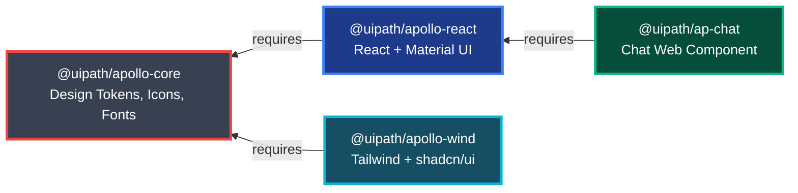

# Apollo v.4 Design System

[](https://opensource.org/licenses/MIT)
[](https://pnpm.io/)
[](https://turbo.build/)

Apollo v.4 is UiPath's open-source design system for building consistent user experiences across all UiPath products.

## Table of Contents
- [✨ Features](#-features)
- [📦 Package Dependency Graph](#-package-dependency-graph)
- [📁 Repository Structure](#-repository-structure)
- [📦 Packages](#-packages)
  - [Core Packages](#core-packages)
  - [Framework Packages](#framework-packages)
  - [Web Components (Cross-Framework)](#web-components-cross-framework)
- [Usage](#usage)
- [🚀 Getting Started](#-getting-started)
  - [Prerequisites](#prerequisites)
  - [Installation](#installation)
  - [Development](#development)
  - [Building](#building)
  - [Component Checklist](#component-checklist)
- [License](#license)
- [Documentation](#documentation)

## ✨ Features

- 🎨 **Design Tokens** - 1300+ icons, comprehensive color system, typography, spacing
- ⚛️ **React Components** - Built on Material UI with Apollo theming
- 🎐 **Tailwind CSS** - Modern utility-first styling with shadcn/ui
- 🌐 **Web Components** - Cross-framework components for maximum flexibility
- 📘 **TypeScript** - Full type safety across all packages
- 📚 **Storybook** - Interactive component documentation
- 🚀 **Monorepo** - Efficient development with Turborepo and pnpm

## 📦 Package Dependency Graph



## 📁 Repository Structure

```
apollo-ui/
├── packages/              # Core + framework packages
│   ├── apollo-core/       # 🎨 Design tokens, icons, fonts
│   ├── apollo-react/      # ⚛️ React components + MUI theme
│   └── apollo-wind/       # 🎐 Tailwind + shadcn/ui
│
├── web-packages/          # Cross-framework web components
│   ├── ap-chat/ # 💬 Chat web component
│
└── apps/                  # Development applications
    ├── storybook/         # 📚 Component documentation
    ├── react-playground/  # ⚛️ React testing environment
```

## 📦 Packages

### Core Packages

| Package | Description |
|---------|-------------|
| [@uipath/apollo-core](./packages/apollo-core) | Design tokens, 1300+ icons, fonts - Foundation of the design system |

### Framework Packages

| Package | Description |
|---------|-------------|
| [@uipath/apollo-react](./packages/apollo-react) | React components with Material UI theming and Apollo design tokens |
| [@uipath/apollo-wind](./packages/apollo-wind) | Tailwind CSS utilities + shadcn/ui components |

### Web Components (Cross-Framework)

| Package | Description |
|---------|-------------|
| [@uipath/ap-chat](./web-packages/ap-chat) | Chat interface web component |

## Usage

- [apollo-core](./packages/apollo-core/README.md)
- [apollo-react](./packages/apollo-react/README.md)
- [apollo-wind](./packages/apollo-wind/README.md)
- [ap-chat](./web-packages/ap-chat/README.md)

## 🚀 Getting Started

### Prerequisites

- **Node.js** >= 22
- **pnpm** >= 10

### Installation

```bash
# Install pnpm if you haven't already
npm install -g pnpm

# Clone the repository
git clone https://github.com/UiPath/apollo-ui.git
cd apollo-ui

# Install dependencies
pnpm install

# Build all packages
pnpm build
```

### Development

```bash
# Run all packages in development mode
pnpm dev

# Run Storybook
pnpm storybook

# Lint all packages
pnpm lint

# Run tests
pnpm test

# Run visual regression tests
pnpm test:visual
```

### Building

```bash
# Build all packages
pnpm build

# Build Storybook
pnpm storybook:build
```

### Component Checklist

- [ ] Follows naming conventions (Ap\* prefix for React)
- [ ] Uses tokens from apollo-core
- [ ] Includes TypeScript types
- [ ] Has Storybook story
- [ ] Has unit tests
- [ ] Has visual regression tests
- [ ] Documented in package README

## License

MIT

## Documentation
- [Storybook](https://uipath.github.io/apollo-ui) - Component documentation (coming soon)
- [Confluence](https://uipath.atlassian.net/wiki/spaces/CLD/pages/89705644276/Apollo+v.4+Architecture) - Design system documentation
