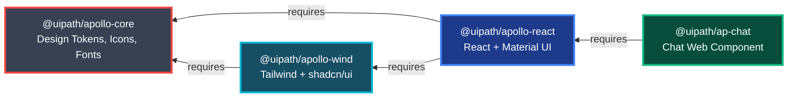

# Apollo v.4 Design System

[](https://opensource.org/licenses/MIT)
[](https://pnpm.io/)
[](https://turbo.build/)

Apollo v.4 is UiPath's open-source design system for building consistent user experiences across all UiPath products.

## Table of Contents
- [✨ Features](#-features)
- [📦 Package Dependency Graph](#-package-dependency-graph)
- [📁 Repository Structure](#-repository-structure)
- [📦 Packages](#-packages)
  - [Core Foundation](#core-foundation)
  - [Framework Implementations](#framework-implementations)
  - [Web Components](#web-components)
- [🎨 Live Demos](#-live-demos)
- [📚 Documentation](#-documentation)
- [🚀 Contributing](#-contributing)
- [License](#license)

## ✨ Features

- 🎨 **Design Tokens** - 1300+ icons, comprehensive color system, typography, spacing
- ⚛️ **React Components** - Built on Material UI with Apollo theming
- 🎐 **Tailwind CSS** - Modern utility-first styling with shadcn/ui
- 🌐 **Web Components** - Cross-framework components for maximum flexibility
- 📘 **TypeScript** - Full type safety across all packages
- 📚 **Storybook** - Interactive component documentation
- 🚀 **Monorepo** - Efficient development with Turborepo and pnpm

## 📦 Package Dependency Graph



## 📁 Repository Structure

```
apollo-ui/
├── packages/              # Core + framework packages
│   ├── apollo-core/       # 🎨 Design tokens, icons, fonts
│   ├── apollo-react/      # ⚛️ Canvas components, chat, icons, MUI theme
│   └── apollo-wind/       # 🎐 Tailwind + shadcn/ui
│
├── web-packages/          # Cross-framework web components
│   └── ap-chat/           # 💬 Chat web component
│
└── apps/                  # Demo & development applications
    ├── apollo-vertex/     # 🌟 Main Storybook hub
    ├── storybook/         # 📚 Component documentation
    └── react-playground/  # 🔬 React testing environment
```

## 📥 Installation

All Apollo packages are published to both **npm** and **GitHub Package Registry** for maximum accessibility.

### For External Users (npm - Recommended)

No special configuration needed. Just install packages directly:

```bash
npm install @uipath/apollo-react
# or
npm install @uipath/apollo-core @uipath/apollo-wind
```

### For Internal UiPath Users (GitHub Package Registry)

If you have `.npmrc` configured with:
```
@uipath:registry=https://npm.pkg.github.com
```

Packages will automatically install from GitHub Package Registry. No changes needed!

### Testing PR Previews

To test a feature from an open PR before it's merged:

```bash
# Install latest PR preview
npm install @uipath/apollo-react@dev

# Or install specific PR version (from PR comment)
npm install @uipath/apollo-react@5.6.1-pr188.4865fad
```

Preview versions are published when the `dev-packages` label is added to a PR. Remove the label to stop publishing on new commits. Packages are deprecated on npm and cleaned up from GitHub Package Registry after the PR is closed or merged.

---

## 📦 Packages

### Core Foundation

| Package | Version | Downloads |
|---------|---------|-----------|
| **[@uipath/apollo-core](./packages/apollo-core)** | [](https://www.npmjs.com/package/@uipath/apollo-core) | [](https://www.npmjs.com/package/@uipath/apollo-core) |

Design tokens, 1300+ icons, and fonts. Framework-agnostic foundation for the design system.

---

### Framework Implementations

| Package | Version | Downloads |
|---------|---------|-----------|
| **[@uipath/apollo-react](./packages/apollo-react)** | [](https://www.npmjs.com/package/@uipath/apollo-react) | [](https://www.npmjs.com/package/@uipath/apollo-react) |
| **[@uipath/apollo-wind](./packages/apollo-wind)** | [](https://www.npmjs.com/package/@uipath/apollo-wind) | [](https://www.npmjs.com/package/@uipath/apollo-wind) |

- **apollo-react**: Canvas/workflow components, ApChat, icons, Material UI themes (Material UI in maintenance mode)
- **apollo-wind**: Modern Tailwind CSS + shadcn/ui components (recommended for new development)

---

### Web Components

| Package | Version | Downloads |
|---------|---------|-----------|
| **[@uipath/ap-chat](./web-packages/ap-chat)** | [](https://www.npmjs.com/package/@uipath/ap-chat) | [](https://www.npmjs.com/package/@uipath/ap-chat) |

Framework-agnostic AI chat interface web component for vanilla JS, Vue, Angular, etc.

**Note:** React users should import `ApChat` from `@uipath/apollo-react` instead.

---

## 🎨 Live Demos

Explore our components in interactive Storybook environments:

- **[Apollo Vertex](https://apollo-vertex.vercel.app/)** - Complete design system showcase
- **[Canvas Components](https://apollo-canvas.vercel.app/)** - Workflow and canvas demos
- **[React Playground](https://apollo-ui-react.vercel.app/)** - Material UI components, design tokens, CSS vars, icons, and chat component
- **[Wind Components](https://apollo-wind.vercel.app/)** - Tailwind CSS components

## 📚 Documentation

- **[@uipath/apollo-core](./packages/apollo-core/README.md)** - Design tokens, icons, fonts
- **[@uipath/apollo-react](./packages/apollo-react/README.md)** - React components and canvas
- **[@uipath/apollo-wind](./packages/apollo-wind/README.md)** - Tailwind components
- **[@uipath/ap-chat](./web-packages/ap-chat/README.md)** - Chat web component
- **[Contributing Guide](./CONTRIBUTING.md)** - How to contribute

## 🚀 Contributing

### Prerequisites

- **Node.js** >= 22
- **pnpm** >= 10

### Setup

```bash
# Clone and setup
git clone https://github.com/UiPath/apollo-ui.git
cd apollo-ui
pnpm install

# Build packages
pnpm build

# Run Storybook
pnpm storybook
```

### Development Commands

```bash
pnpm dev              # Watch mode for all packages
pnpm build            # Build all packages
pnpm lint             # Lint all packages
pnpm test             # Run tests
```

### Component Guidelines

When contributing components:
- ✅ Follow package naming conventions
- ✅ Use design tokens from `@uipath/apollo-core`
- ✅ Include TypeScript types
- ✅ Add Storybook stories
- ✅ Write unit tests
- ✅ Update package README

See [CONTRIBUTING.md](./CONTRIBUTING.md) for detailed guidelines.

## License

MIT © UiPath
