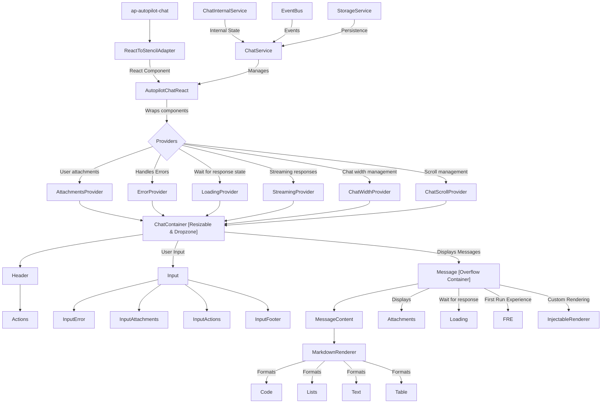

# Autopilot Chat

A flexible chat interface component that provides seamless integration with both React and Angular applications, powered by a globally accessible chat service.

## Overview

The Autopilot Chat component is a full-featured chat interface that can be embedded in applications to provide AI assistant functionality. The component includes:

- A resizable and collapsible UI that can operate in side-by-side or full-screen mode
- Support for text messages with markdown formatting
- File attachments with drag-and-drop support
- Customizable first-run experience with suggested prompts
- Extensible architecture with custom message renderers
- Event system for intercepting and handling chat interactions
- Support for real-time streaming responses and simulated streaming

## Global Chat Service

The chat service is exposed globally and can be accessed as:

```typescript
const chatService = window.PortalShell.AutopilotChat;
```

## API Reference

### Configuration & Initialization

| Method | Description |
|--------|-------------|
| `getConfig()` | Returns the current chat configuration object (see [AutopilotChatConfiguration](#autopilotchatconfiguration)) |
| `initialize(config: AutopilotChatConfiguration, messageRenderers?: AutopilotChatMessageRenderer[])` | Initializes the chat service with the provided configuration (see [AutopilotChatConfiguration](#autopilotchatconfiguration)) and optional message renderers (see [AutopilotChatMessageRenderer](#autopilotchatmessagerenderer)) |
| `injectMessageRenderer(renderer: AutopilotChatMessageRenderer)` | Adds or replaces a custom message renderer in the chat service (see [AutopilotChatMessageRenderer](#autopilotchatmessagerenderer)) |
| `getMessageRenderer(name: string)` | Retrieves a message renderer by name |
| `setFirstRunExperience(config: AutopilotChatConfiguration['firstRunExperience'])` | Configures the first run experience (see [First Run Experience](#first-run-experience)) displayed when the chat is opened for the first time or when there are no messages |

### Chat Window Control

| Method | Description |
|--------|-------------|
| `open(config?: AutopilotChatConfiguration, messageRenderers?: AutopilotChatMessageRenderer[])` | Opens the chat interface with optional configuration (see [AutopilotChatConfiguration](#autopilotchatconfiguration)) and message renderers (see [AutopilotChatMessageRenderer](#autopilotchatmessagerenderer)) |
| `close()` | Closes the chat interface |
| `setChatMode(mode: AutopilotChatMode)` | Sets the chat window mode (see [AutopilotChatMode](#autopilotchatmode)) |
| `newChat(config?: AutopilotChatConfiguration, messageRenderers?: AutopilotChatMessageRenderer[])` | Starts a new chat session with optional configuration (see [AutopilotChatConfiguration](#autopilotchatconfiguration)) and message renderers (see [AutopilotChatMessageRenderer](#autopilotchatmessagerenderer)) |

### Message Handling

| Method | Description |
|--------|-------------|
| `setConversation(messages: AutopilotChatMessage[])` | Sets the entire conversation history in the chat interface (see [AutopilotChatMessage](#autopilotchatmessage)) |
| `getConversation()` | Returns the current conversation history |
| `setPrompt(prompt: AutopilotChatMessage \| string)` | Sets a prompt in the input field of the chat interface (accepts either a string or see [AutopilotChatMessage](#autopilotchatmessage)) |
| `getPrompt()` | Returns the current prompt |
| `sendRequest(request: AutopilotChatMessage)` | Sends a user request to the chat and triggers the request event (see [AutopilotChatMessage](#autopilotchatmessage)) |
| `sendResponse(response: AutopilotChatMessage)` | Sends an AI assistant response to display in the chat (see [AutopilotChatMessage](#autopilotchatmessage)) |
| `stopResponse()` | Stops the current streaming response, if applicable |

### Error Handling

| Method | Description |
|--------|-------------|
| `setError(error: string)` | Sets an error message to display in the chat interface |
| `clearError()` | Clears the current error message |
| `getError()` | Returns the current error message, if any |

### Feature Configuration

| Method | Description |
|--------|-------------|
| `setDisabledFeatures(features: AutopilotChatDisabledFeatures)` | Configures which features should be disabled in the chat interface (see [AutopilotChatDisabledFeatures](#autopilotchatdisabledfeatures)) |

### Event Handling

#### Subscribing to Events

```typescript
on(event: AutopilotChatEvent, handler: AutopilotChatEventHandler): () => void
```

Subscribes to chat events and returns an unsubscribe function. The handler will be called whenever the specified event is published.

**Parameters:**
- `event`: The event type to subscribe to
- `handler`: The function to call when the event is triggered

**Available Events:**
- `Error`: When an error occurs
- `NewChat`: When a new chat is started
- `ModeChange`: When the chat mode changes
- `SetPrompt`: When a prompt is set
- `Request`: When a user sends a message
- `Response`: When an AI response is received
- `StopResponse`: When a response is stopped
- `SetFirstRunExperience`: When the first run experience is set
- `SetDisabledFeatures`: When disabled features are set
- `Open`: When the chat is opened
- `Close`: When the chat is closed
- `SendChunk`: When a chunk of streaming content is sent
- `SetConversation`: Emitted when the conversation is set

#### Intercepting Events

```typescript
intercept(event: AutopilotChatInterceptableEvent, interceptor: AutopilotChatEventInterceptor): () => void
```

Adds an event interceptor for interceptable events. Returns a function to remove the interceptor.

**Parameters:**
- `event`: The event type to intercept (currently only `Request` events are interceptable)
- `interceptor`: The function that will intercept the event

**Usage:**
The interceptor can return `true` to indicate it has handled the event and prevent further processing. Multiple interceptors can be added and will be called in parallel. If any interceptor returns `true`, the event is considered hijacked and the default handling will not occur (it will still emit, but with `hijacked: true` on the message).

## Streaming Capabilities

The Autopilot Chat component provides streaming capabilities for response display. When using the default markdown renderer, you can leverage two different streaming approaches:

### Real-time Streaming

Real-time streaming allows for incremental display of response content as it's received from the server. This creates a more interactive experience where users can see responses being built in real-time.

To implement real-time streaming:

1. When the API returns a message, send the response with `stream: true` on the message

```typescript
// Send chunks as they arrive from your API
function onChunkReceived(chunkContent) {
  chatService.sendResponse({
    id: "unique-message-id",  // Same ID everytime
    content: chunkContent
    stream: true,
  });
}

// Connect to your streaming API and call onChunkReceived for each chunk
```

2. The component will automatically append new chunks to the existing message and scroll to keep the latest content visible (in case the user did not scroll up)

3. When streaming is complete or needs to be interrupted, call:

```typescript
chatService.stopResponse();
```

Alternatively, you can mark a streaming response as complete by sending a message with the same ID and setting the `done` property to `true`:

```typescript
// Using the same ID as in your streaming response
chatService.sendResponse({ 
  id: "unique-message-id",  
  content: "",
  stream: true,
  done: true 
});
```

#### Word-by-Word Streaming Example

Here's an example of implementing word-by-word streaming with a timer:

```typescript
// Start streaming with a unique ID
const randomId = Math.random().toString(36).substring(2, 15);

// Array of words to stream
const words = [
  "Hello", "World", "This", "is", "a", "streaming", 
  "response", "that", "appears", "word", "by", "word"
];

// Send each word with a timer
let index = 0;
const interval = setInterval(() => {
  if (index < words.length) {
    chatService.sendResponse({ 
      id: randomId, 
      content: words[index],
      stream: true,
    });
    index++;
  } else {
    // Mark as complete when done
    clearInterval(interval);

    chatService.sendResponse({ 
      id: randomId, 
      content: '', 
      stream: true,
      done: true
    });
  }
}, 200);

// Listen for stop events
chatService.on(AutopilotChatEvent.StopResponse, () => {
  clearInterval(interval);
});
```

### Simulated Streaming (Fake Streaming)

For cases where you don't have a true streaming API but want to provide a streaming-like experience, the component offers a fake streaming feature that simulates the typing effect:

```typescript
// Send a complete response with the fakeStream flag
chatService.sendResponse({
  id: "unique-message-id",
  content: "Your complete response that will be displayed character by character.",
  role: AutopilotChatRole.Assistant,
  fakeStream: true  // Enables fake streaming
});
```

With fake streaming:
- The message content is split into characters and displayed incrementally
- Characters are shown in small chunks at timed intervals
- The component handles the display animation automatically
- Call `stopResponse()` to immediately display the full content and stop the animation

#### Rich Content Fake Streaming Example

Streaming & fake streaming work with rich Markdown content, including headings, code blocks, tables and other formatting:

```typescript
chatService.sendResponse({ 
  id: 'fake-stream', 
  content: `# Markdown Heading

Here's some **bold text** and *italics*.

## Code Example

\`\`\`javascript
function example() {
  return "This is a code block";
}
\`\`\`

### Table Example

| Column 1 | Column 2 |
|----------|----------|
| Data 1   | Data 2   |
| Data 3   | Data 4   |

> This is a blockquote that will be streamed character by character.`,
  fakeStream: true  // Enable character-by-character animation
});
```

#### Customizing Fake Streaming

The fake streaming feature uses two constants that can be customized by modifying the component code:

- `FAKE_STREAM_CHARS_COUNT`: The number of characters to display in each chunk (default: 10)
- `FAKE_STREAM_INTERVAL`: The time interval between chunks in milliseconds (default: 50)

## First Run Experience

The first run experience is displayed when the chat is opened for the first time or when starting a new chat with no messages. It consists of a title, description, and optional suggested prompts that users can click on to start a conversation.

### Basic First Run Setup

```typescript
chatService.setFirstRunExperience({
  title: "Welcome to Autopilot Chat",
  description: "Ask me anything about your data or how to use this application.",
  suggestions: [
    { label: "Get started", prompt: "How do I get started with this application?" },
    { label: "Show features", prompt: "What features are available?" }
  ]
});
```

## Managing Conversation History

The chat service allows you to set and retrieve the entire conversation history.

### Setting a Complete Conversation

```typescript
chatService.setConversation([
  { 
    id: "1",
    role: AutopilotChatRole.User, 
    content: "How do I extract data from invoices?",
    created_at: new Date().toISOString(),
    widget: "apollo-markdown-renderer" // default renderer defined in apollo for markdown
  },
  { 
    id: "2",
    role: AutopilotChatRole.Assistant, 
    content: "To extract data from invoices, you can use Document Understanding. Here's a step-by-step approach:\n\n1. Install the Document Understanding package\n2. Create a new workflow\n3. Add the Digitize Document activity\n4. Configure it to use Invoice Extraction ML skills\n5. Use Data Extraction to get specific fields",
    created_at: new Date().toISOString(),
    widget: "apollo-markdown-renderer"
  },
  { 
    id: "3",
    role: AutopilotChatRole.User, 
    content: "Can I handle multilingual invoices?",
    created_at: new Date().toISOString(),
    widget: "apollo-markdown-renderer"
  },
  { 
    id: "4",
    role: AutopilotChatRole.Assistant, 
    content: "Yes, Document Understanding supports multiple languages. You can:\n\n- Specify OCR language settings\n- Use pre-built ML skills that support various languages\n- Train custom ML models for specific languages\n- Add language detection pre-processing\n- Use translation activities for standardization",
    created_at: new Date().toISOString(),
    widget: "apollo-markdown-renderer"
  }
]);
```

### Retrieving the Current Conversation

```typescript
const currentConversation = chatService.getConversation();
console.log(`The conversation has ${currentConversation.length} messages`);
```

## Feature Controls

The chat service allows you to disable specific features to customize the experience.

### Disabling Individual Features

```typescript
// Disable the resize handle
chatService.setDisabledFeatures({ 
  resize: true 
});

// Disable file attachments
chatService.setDisabledFeatures({ 
  attachments: true 
});

// Disable full screen mode
chatService.setDisabledFeatures({ 
  fullScreen: true 
});
```

### Setting Multiple Disabled Features at Once

```typescript
// Configure multiple settings at once
chatService.setDisabledFeatures({ 
  resize: true,
  fullScreen: true,
  attachments: true,
});

// Later, re-enable features
chatService.setDisabledFeatures({ 
  resize: false,
  fullScreen: false
});
```

## Configuration Types

### AutopilotChatConfiguration

```typescript
interface AutopilotChatConfiguration {
  mode?: AutopilotChatMode;
  disabledFeatures?: AutopilotChatDisabledFeatures;
  firstRunExperience?: {
    title?: string;
    description?: string;
    suggestions?: Array<{
      label: string;
      prompt: string;
    }>;
  };
}
```

### AutopilotChatMode

```typescript
enum AutopilotChatMode {
  SideBySide = 'side-by-side',
  FullScreen = 'full-screen',
  Closed = 'closed'
}
```

### AutopilotChatDisabledFeatures

```typescript
interface AutopilotChatDisabledFeatures {
  attachments?: boolean;
  resize?: boolean;
  fullScreen?: boolean;
}
```

### AutopilotChatMessage

```typescript
/**
 * Represents a message in the Autopilot Chat system.
 *
 * @property id - Unique identifier for the message. Automatically generated by the chat service if not provided.
 * @property content - The text content of the message.
 * @property created_at - Timestamp when the message was created (generated by the chat service for requests)
 * @property role - Indicates whether the message is from the user or assistant. Set automatically to
 *                  AutopilotChatRole.User for sendRequest and AutopilotChatRole.Assistant for sendResponse.
 * @property widget - The renderer to use for displaying this message.
 * @property attachments - Optional files attached to the message.
 * @property hijacked - Flag set by the chat service when an event is intercepted and the interceptor returns true
 * @property fakeStream - Temporary flag used to simulate streaming for a complete message (will be ignored for requests)
 * @property stream - Flag used to stream a chunk (will be ignored for requests)
 * @property done - Flag to determine if the message is the last chunk of a streaming response
 * @property meta - Optional metadata for the message (additional information about the message)
 */
export interface AutopilotChatMessage {
    id: string;
    content: string;
    created_at: string;
    role: AutopilotChatRole;
    widget: string;
    attachments?: AutopilotChatFileInfo[];
    hijacked?: boolean;
    fakeStream?: boolean;
    stream?: boolean;
    done?: boolean;
    meta?: any;
}
```

### AutopilotChatRole

```typescript
enum AutopilotChatRole {
    User = 'user',
    Assistant = 'assistant',
}
```

### AutopilotChatMessageRenderer

```typescript
interface AutopilotChatMessageRenderer {
    name: string;
    render: (container: HTMLElement, message: AutopilotChatMessage) => void | (() => void);
}
```

The message renderer interface defines a custom renderer for chat messages:
- `name`: Unique identifier for the renderer
- `render`: Function that renders the message content into the provided container element. Can optionally return a cleanup function.

## Usage Examples

### Basic Chat Initialization

```typescript
// Access the global chat service
const chatService = window.PortalShell.AutopilotChat;

// Initialize with custom configuration
chatService.initialize({
  mode: AutopilotChatMode.SideBySide,
  firstRunExperience: {
    title: "Welcome to Autopilot Chat!",
    description: "Ask me anything about your data or how to use this application.",
    suggestions: [
      { label: "How to get started", prompt: "How do I get started with this application?" },
      { label: "Generate a report", prompt: "Help me generate a quarterly sales report" }
    ]
  }
});

// Open the chat interface
chatService.open();
```

### Intercepting User Requests

```typescript
// Intercept user requests to handle them in your application
const unsubscribe = chatService.intercept(AutopilotChatInterceptableEvent.Request, (event) => {
  const userMessage = event.data;
  
  // Process the user message in your application
  processUserMessage(userMessage).then(response => {
    // Send the AI response back to the chat
    chatService.sendResponse({
      content: response,
      role: AutopilotChatRole.Assistant
    });
  });
  
  // Return true to prevent the default handling
  return true;
});

// Later, remove the interceptor when no longer needed
unsubscribe();
```

### Custom Message Renderer

```typescript
// Create a custom message renderer for special message types
chatService.injectMessageRenderer({
  name: "custom-text-renderer",
  render: (container, message) => {
    // A simple text renderer that just displays the message content as-is
    if (message.content) {
      // Create a text element
      const textElement = document.createElement("div");
      
      // Simply set the content as plain text
      textElement.textContent = message.content;
      
      // Add to the container
      container.appendChild(textElement);
    }
  }
});

// Send a message that uses the custom renderer
chatService.sendResponse({
  id: "msg-123", // Unique identifier for the message
  content: "Here's your sales chart:",
  created_at: new Date().toISOString(),
  role: AutopilotChatRole.Assistant,
  widget: "custom-text-renderer" // Reference to our custom renderer
});
```

## Component Architecture

The Autopilot Chat component is built with a modular architecture that allows for easy customization and extension.


