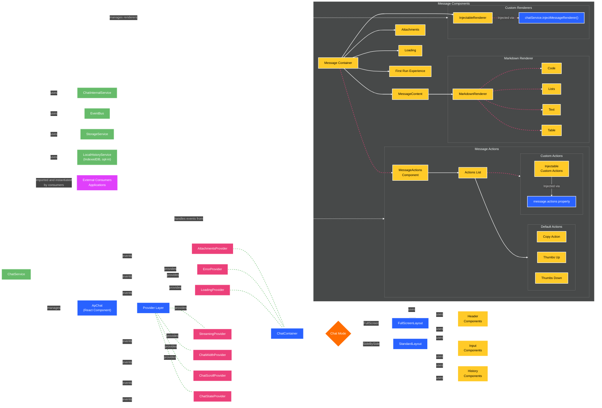

# Chat

A flexible React chat interface component that provides AI assistant functionality with a powerful service-based API.

## Overview

The Chat component is a full-featured chat interface that can be embedded in applications to provide AI assistant functionality. The component includes:

- A resizable and collapsible UI that can operate in side-by-side, full-screen, or embedded mode
- Support for text messages with markdown formatting and citations
- File attachments with drag-and-drop support
- Customizable first-run experience with suggested prompts
- Extensible architecture with custom message renderers
- Event system for intercepting and handling chat interactions
- Support for real-time streaming responses and simulated streaming
- Interactive message actions system with:
  - Default actions (copy, feedback with thumbs up/down)
  - Different default actions for user messages (requests) vs. assistant messages (responses)
  - Support for custom actions with configurable labels and icons
  - Action visibility control (toolbar vs. overflow menu)
- Comprehensive conversation history management with:
  - Built-in history panel for viewing past conversations
  - Optional local storage using IndexedDB
  - API for custom history storage implementation
  - Conversation export/import capabilities
- Settings panel with customizable content:
  - Built-in settings drawer with the same UI pattern as history
  - Custom settings renderer for injecting your own settings UI
  - Settings feature disabled by default (must be explicitly enabled)
- Real time voice input and output streaming
- Model and agent mode selection:
  - Configurable AI models with icons and descriptions
  - Agent mode switching for different interaction patterns
  - Event-driven model/mode change notifications
- Custom header actions with nested menus:
  - 2-level nested menu support
  - Material Icons integration
  - Custom action handlers
- Loading and waiting state management:
  - Automatic state management by default
  - Manual control for custom workflows
  - Event-driven state change notifications
- Pagination support for large conversations
- Pre-hooks for intercepting user interactions
- Feature toggles for UI customization
- Label overrides for internationalization
- Spacing and theming configuration

## Chat Service

The chat service must be imported and instantiated in your application:

```typescript
import { AutopilotChatService } from '@uipath/apollo-react/material/components';

// Create a service instance
const chatService = AutopilotChatService.Instantiate({
  instanceName: 'my-chat',
  config: {
    mode: AutopilotChatMode.SideBySide,
  },
});
```

See [Usage Examples](#usage-examples) for complete setup details.

## API Reference

### Configuration & Initialization

| Method                                                                                                         | Description                                                                                                                                                                                                                     |
| -------------------------------------------------------------------------------------------------------------- | ------------------------------------------------------------------------------------------------------------------------------------------------------------------------------------------------------------------------------- |
| `initialize(config: AutopilotChatConfiguration, messageRenderers?: AutopilotChatMessageRenderer[])`            | Initializes the chat service with the provided configuration (see [AutopilotChatConfiguration](#autopilotchatconfiguration)) and optional message renderers (see [AutopilotChatMessageRenderer](#autopilotchatmessagerenderer)) |
| `patchConfig(config: Partial<AutopilotChatConfiguration>, messageRenderers?: AutopilotChatMessageRenderer[] )` | Patches the configuration of the chat service using existing value. (see [AutopilotChatConfiguration](#autopilotchatconfiguration))                                                                                             |
| `getConfig()`                                                                                                  | Returns the current chat configuration object (see [AutopilotChatConfiguration](#autopilotchatconfiguration))                                                                                                                   |
| `setLocale(locale: string)`                                                                                    | Sets the locale for the chat interface. Changes will be reflected immediately in the UI. Useful for embedded mode where locale needs to be changed dynamically                                                                  |
| `getLocale()`                                                                                                  | Returns the current locale setting                                                                                                                                                                                              |
| `setTheme(theme: string)`                                                                                      | Sets the theme for the chat interface ('light', 'dark', 'light-hc', 'dark-hc'). Changes will be reflected immediately in the UI. Useful for embedded mode where theme needs to be changed dynamically                           |
| `getTheme()`                                                                                                   | Returns the current theme setting                                                                                                                                                                                               |
| `injectMessageRenderer(renderer: AutopilotChatMessageRenderer)`                                                | Adds or replaces a custom message renderer in the chat service (see [AutopilotChatMessageRenderer](#autopilotchatmessagerenderer))                                                                                              |
| `getMessageRenderer(name: string)`                                                                             | Retrieves a message renderer by name                                                                                                                                                                                            |
| `setFirstRunExperience(config: AutopilotChatConfiguration['firstRunExperience'])`                              | Configures the first run experience (see [First Run Experience](#first-run-experience)) displayed when the chat is opened for the first time or when there are no messages                                                      |
| `setAllowedAttachments(allowedAttachments: AutopilotChatAllowedAttachments)`                                   | Configures the allowed file attachments (see [AutopilotChatAllowedAttachments](#autopilotchatallowedattachments))                                                                                                               |
| `setModels(models: AutopilotChatModelInfo[])`                                                                  | Configures the models (see [Model Selection](#model-selection))                                                                                                                                                                 |
| `getModels()`                                                                                                  | Returns the current list of available models                                                                                                                                                                                    |
| `setSelectedModel(modelId: string)`                                                                            | Configures the selected model (see [Model Selection](#model-selection))                                                                                                                                                         |
| `getSelectedModel()`                                                                                           | Returns the currently selected model                                                                                                                                                                                            |
| `setAgentModes(agentModes: AutopilotChatAgentModeInfo[])`                                                      | Configures the agent modes (see [Agent Mode Selection](#agent-mode-selection))                                                                                                                                                  |
| `getAgentModes()`                                                                                              | Returns the current list of available agent modes                                                                                                                                                                               |
| `setAgentMode(mode: string)`                                                                                   | Sets the agent mode (any string value). This emits the `SetSelectedAgentMode` event that consumers can listen to (see [Agent Mode Selection](#agent-mode-selection))                                                            |
| `getAgentMode()`                                                                                               | Returns the currently selected agent mode                                                                                                                                                                                       |
| `setCustomHeaderActions(actions: AutopilotChatCustomHeaderAction[])`                                           | Configures custom header actions with support for nested menus (see [Custom Header Actions](#custom-header-actions))                                                                                                            |
| `getCustomHeaderActions()`                                                                                     | Returns the current list of custom header actions                                                                                                                                                                               |
| `setResourceManager(resourceManager: AutopilotChatResourceManager)`                                            | Sets the resource manager for the @ mention picker in the chat input (see [Resource Picker](#resource-picker))                                                                                                                  |
| `getResourceManager()`                                                                                         | Returns the current resource manager, or undefined if not set                                                                                                                                                                   |

### Chat Window Control

| Method                                                                                            | Description                                                                                                                                                                                                     |
| ------------------------------------------------------------------------------------------------- | --------------------------------------------------------------------------------------------------------------------------------------------------------------------------------------------------------------- |
| `open(config?: AutopilotChatConfiguration, messageRenderers?: AutopilotChatMessageRenderer[])`    | Opens the chat interface with optional configuration (see [AutopilotChatConfiguration](#autopilotchatconfiguration)) and message renderers (see [AutopilotChatMessageRenderer](#autopilotchatmessagerenderer))  |
| `close()`                                                                                         | Closes the chat interface                                                                                                                                                                                       |
| `setChatMode(mode: AutopilotChatMode)`                                                            | Sets the chat window mode (see [AutopilotChatMode](#autopilotchatmode))                                                                                                                                         |
| `newChat(config?: AutopilotChatConfiguration, messageRenderers?: AutopilotChatMessageRenderer[])` | Starts a new chat session with optional configuration (see [AutopilotChatConfiguration](#autopilotchatconfiguration)) and message renderers (see [AutopilotChatMessageRenderer](#autopilotchatmessagerenderer)) |
| `toggleAutoScroll(autoScroll: boolean)`                                                           | Start or stop the autoscroll behavior                                                                                                                                                                           |

### Message Handling

| Method                                                                          | Description                                                                                                                                                                                                                                                                                                                                   |
| ------------------------------------------------------------------------------- | --------------------------------------------------------------------------------------------------------------------------------------------------------------------------------------------------------------------------------------------------------------------------------------------------------------------------------------------- |
| `setConversation(messages: AutopilotChatMessage[])`                             | Sets the entire conversation history in the chat interface (see [AutopilotChatMessage](#autopilotchatmessage))                                                                                                                                                                                                                                |
| `getConversation()`                                                             | Returns the current conversation history                                                                                                                                                                                                                                                                                                      |
| `prependOlderMessages(messages: AutopilotChatMessage[], done?: boolean)`        | Prepends older messages to the conversation when loading more history. Preserves scroll position. Set `done` to `true` when no more messages are available (see [Pagination and Loading More Messages](#pagination-and-loading-more-messages))                                                                                                |
| `setPrompt(prompt: AutopilotChatMessage \| string)`                             | Sets a prompt in the input field of the chat interface (accepts either a string or see [AutopilotChatMessage](#autopilotchatmessage))                                                                                                                                                                                                         |
| `getPrompt()`                                                                   | Returns the current prompt                                                                                                                                                                                                                                                                                                                    |
| `sendRequest(request: AutopilotChatMessage)`                                    | Sends a user request to the chat and triggers the request event (see [AutopilotChatMessage](#autopilotchatmessage))                                                                                                                                                                                                                           |
| `sendResponse(response: AutopilotChatMessage)`                                  | Sends an AI assistant response to display in the chat (see [AutopilotChatMessage](#autopilotchatmessage))                                                                                                                                                                                                                                     |
| `stopResponse()`                                                                | Stops the current streaming response, if applicable                                                                                                                                                                                                                                                                                           |
| `setDefaultLoadingMessages(messages: string[], duration?: number)`              | Sets the default loading messages and duration between switching messages                                                                                                                                                                                                                                                                     |
| `setLoadingMessage(message: string)`                                            | Sets the loading message, overriding the default loading messages                                                                                                                                                                                                                                                                             |
| `setShowLoading(showLoading: boolean)`                                          | Shows or hides the loading indicator in the chat service (see [Loading and Waiting States](#loading-and-waiting-states)). When used, this method overrides the default automatic loading behavior from apollo (except for request), giving you manual control over when the loading state is displayed.                                       |
| `setWaiting(waiting: boolean)`                                                  | Sets the waiting state for the input prompt box (see [Loading and Waiting States](#loading-and-waiting-states)). When set to true, users can still type in the input field but cannot send messages. This overrides the default automatic waiting behavior (except for request), giving you manual control over when users can send messages. |
| `setSuggestions(suggestions: AutopilotChatSuggestion[], sendOnClick?: boolean)` | Sets suggestions that appear in the chat interface. When `sendOnClick` is true, clicking a suggestion sends it immediately (defaults to the first run experience setting); otherwise it sets the prompt (see [AutopilotChatSuggestion](#autopilotchatsuggestion))                                                                             |
| `getMessagesInGroup(groupId: string)`                                           | Returns all messages that belong to the specified group ID                                                                                                                                                                                                                                                                                    |
| `setAttachmentsLoading(attachments: AutopilotChatFileInfo[])`                   | Sets the loading state for attachments. Use this to show loading indicators while attachments are being processed asynchronously (see [Asynchronous Attachment Processing](#asynchronous-attachment-processing))                                                                                                                              |

### Input/Output Stream Handling

| Method                                                         | Description                                                                                         |
| -------------------------------------------------------------- | --------------------------------------------------------------------------------------------------- |
| `sendInputStreamEvent(event: AutopilotChatInputStreamEvent)`   | Sends an input stream event. (see [AutopilotChatInputStreamEvent](#autopilotchatinputstreamevent))  |
| `sendOutputStreamEvent(event: AutopilotChatOutputStreamEvent)` | Sends an input stream event. (see [AutopilotChatOutputStreamEvent](#autopilotchatoutputtreamevent)) |

### History Management

| Method                                                                        | Description                                                                                                                                                                                                                      |
| ----------------------------------------------------------------------------- | -------------------------------------------------------------------------------------------------------------------------------------------------------------------------------------------------------------------------------- |
| `setHistory(history: AutopilotChatHistory[], done?: boolean)`                 | Sets the chat history list. Set `done` to `true` when no more items are available for pagination (see [AutopilotChatHistory](#autopilotchathistory))                                                                             |
| `getHistory()`                                                                | Returns the current chat history                                                                                                                                                                                                 |
| `appendOlderHistoryItems(items: AutopilotChatHistory[], done?: boolean)`      | (Only when `paginatedHistory` is enabled) Appends older history items when loading more. Set `done` to `true` when no more items are available (see [Pagination and Loading More History](#pagination-and-loading-more-history)) |
| `toggleHistory(open?: boolean)`                                               | Toggles the history panel visibility                                                                                                                                                                                             |
| `deleteConversation(conversationId: string)`                                  | Deletes a conversation from the history                                                                                                                                                                                          |
| `openConversation(conversationId: string \| null, showLoadingState: boolean)` | Opens a specific conversation from the history, second parameter indicates if the chat should show loading spinner for conversation (defaults to true)                                                                           |

### Settings Management

| Method                           | Description                                                                                                                                      |
| -------------------------------- | ------------------------------------------------------------------------------------------------------------------------------------------------ |
| `toggleSettings(open?: boolean)` | Toggles the settings panel visibility. Note: Settings are disabled by default and must be enabled via `setDisabledFeatures({ settings: false })` |

### Properties

| Property               | Description                                                                            |
| ---------------------- | -------------------------------------------------------------------------------------- |
| `activeConversationId` | Returns the current active conversation ID that was set with `openConversation` method |
| `historyOpen`          | Returns the current history panel visibility state                                     |
| `settingsOpen`         | Returns the current settings panel visibility state                                    |

### Error Handling

| Method                                                       | Description                                                                                                                                    |
| ------------------------------------------------------------ | ---------------------------------------------------------------------------------------------------------------------------------------------- |
| `setError(message: string, level?: AutopilotChatErrorLevel)` | Sets an error or warning message to display in the chat interface. Supports markdown formatting. Defaults to `'error'` level if not specified. |
| `clearError()`                                               | Clears the current error message                                                                                                               |
| `getError()`                                                 | Returns the current error message, if any                                                                                                      |

### Feature Configuration

| Method                                                         | Description                                                                                                                                                                                |
| -------------------------------------------------------------- | ------------------------------------------------------------------------------------------------------------------------------------------------------------------------------------------ |
| `setDisabledFeatures(features: AutopilotChatDisabledFeatures)` | Configures which features should be disabled in the chat interface (see [AutopilotChatDisabledFeatures](#autopilotchatdisabledfeatures)). Note: Settings and audio are disabled by default |

### Labels Override

| Method                                                   | Description                                                                                                                |
| -------------------------------------------------------- | -------------------------------------------------------------------------------------------------------------------------- |
| `setOverrideLabels(labels: AutopilotChatOverrideLabels)` | Configures which labes to override in the chat interface (see [AutopilotChatOverrideLabels](#autopilotchatoverridelabels)) |

### Pre-hooks

| Method                                                                                   | Description                                                                                                                      |
| ---------------------------------------------------------------------------------------- | -------------------------------------------------------------------------------------------------------------------------------- |
| `setPreHook(action: AutopilotChatPreHookAction, hook: (data?: any) => Promise<boolean>)` | Sets a pre-hook function that runs before a specific user action (see [AutopilotChatPreHookAction](#autopilotchatprehookaction)) |
| `getPreHook(action: AutopilotChatPreHookAction)`                                         | Returns the pre-hook function for a specific action, defaults to returning `Promise.resolve(true)` if no hook is set             |

### Event Handling

#### Subscribing to Events

```typescript
on(event: AutopilotChatEvent, handler: AutopilotChatEventHandler): () => void
```

Subscribes to chat events and returns an unsubscribe function. The handler will be called whenever the specified event is published.

**Parameters:**

- `event`: The event type to subscribe to
- `handler`: The function to call when the event is triggered

**Available Events:**

- `Error`: When an error occurs
- `NewChat`: When a new chat is started
- `ModeChange`: When the chat mode changes
- `SetPrompt`: When a prompt is set
- `Request`: When a user sends a message
- `Response`: When an AI response is received
- `StopResponse`: When a response is stopped
- `SetDefaultLoadingMessages`: When default messages is set
- `SetLoadingMessage`: When a loading message is set
- `SetShowLoading`: When the loading state is manually set
- `SetWaiting`: When the waiting state is manually set for the input prompt
- `SetFirstRunExperience`: When the first run experience is set
- `SetDisabledFeatures`: When disabled features are set
- `SetOverrideLabels`: When override labels are set
- `Open`: When the chat is opened
- `Close`: When the chat is closed
- `SendChunk`: When a chunk of streaming content is sent
- `SetConversation`: Emitted when the conversation is set
- `SetHistory`: Emitted when the history is set
- `DeleteConversation`: Emitted when a conversation is deleted from the history list
- `OpenConversation`: Emitted when a conversation is opened (clicked on in the history list)
- `Feedback`: Emitted when a feedback is sent (thumbs up or thumbs down)
- `Copy`: Emitted when a message is copied
- `SetModels`: Emitted when the models are set
- `SetSelectedModel`: Emitted when the selected model is set
- `ConversationLoadMore`: Emitted when the user scrolls to the top and more messages need to be loaded (see [Pagination and Loading More Messages](#pagination-and-loading-more-messages))
- `HistoryLoadMore`: Emitted when the user scrolls to the bottom of the history list and more items need to be loaded (see [Pagination and Loading More History](#pagination-and-loading-more-history))
- `Attachments`: <strong>DEPRECATED</strong> Emitted when the attachments are set in the prompt (the whole list of attachments)
- `SetAttachments`: Emitted when the attachments change, providing details about which attachments were added and removed (see [Asynchronous Attachment Processing](#asynchronous-attachment-processing))
- `InputStream`: Emitted when sendInputStreamEvent is called (see [AutopilotChatInputStreamEvent](#autopilotchatinputstreamevent)).
- `OutputStream`: Emitted when sendOutputStreamEvent is called (see [AutopilotChatOutputStreamEvent](#autopilotchatoutputtreamevent)).
- `SetSelectedAgentMode`: Emitted when the agent mode is selected
- `CustomHeaderActionClicked`: Emitted when a custom header action is selected by the user (see [AutopilotChatCustomHeaderAction](#autopilotchatcustomheaderaction))
- `SetResourceManager`: Emitted when a resource manager is set for the @ mention picker (see [Resource Picker](#resource-picker))

#### Intercepting Events

```typescript
intercept(event: AutopilotChatInterceptableEvent, interceptor: AutopilotChatEventInterceptor): () => void
```

Adds an event interceptor for interceptable events. Returns a function to remove the interceptor.

**Parameters:**

- `event`: The event type to intercept
- `interceptor`: The function that will intercept the event

**Available Interceptable Events:**

- `Request`: When a user sends a message (currently only Request events are interceptable)

**Interceptor Function:**
The interceptor function receives the event data and can:

- Return `true` to indicate it has handled the event and prevent further processing (by adding a `hijacked` property on the message that can be read by `on` subscribers)
- Return `false | void` if the event should proceed with normal handling
- Return a Promise that resolves to true if the event is handled asynchronously

Multiple interceptors can be added and will be called in parallel. If any interceptor returns `true`, the event is considered hijacked and the default handling will not occur (it will still emit, but with `hijacked: true` on the message).

## Settings Panel

The Chat component includes a customizable settings panel that follows the same drawer-like UI pattern as the history panel. The settings feature is **disabled by default** and must be explicitly enabled.

### Enabling Settings

```typescript
// Enable the settings feature
chatService.setDisabledFeatures({
  settings: false, // Enable settings (disabled by default)
});
```

### Configuring Custom Settings Content

The settings panel uses a custom renderer function that you provide to display your settings UI:

```typescript
// Initialize with a custom settings renderer
chatService.initialize({
  mode: AutopilotChatMode.SideBySide,
  settingsRenderer: (container) => {
    // Create your custom settings UI
    const settingsDiv = document.createElement('div');
    settingsDiv.innerHTML = `
      <div style="padding: 16px;">
        <h3>Chat Settings</h3>
        <label>
          <input type="checkbox" id="darkMode"> Dark Mode
        </label>
        <br><br>
        <label>
          <input type="checkbox" id="notifications"> Enable Notifications
        </label>
        <br><br>
        <button onclick="saveSettings()">Save Settings</button>
      </div>
    `;

    // Add event listeners for your settings
    settingsDiv.querySelector('#darkMode').addEventListener('change', (e) => {
      console.log('Dark mode:', e.target.checked);
    });

    // Append to the container
    container.appendChild(settingsDiv);
  },
});
```

### Toggling Settings Panel

```typescript
// Open the settings panel
chatService.toggleSettings(true);

// Close the settings panel
chatService.toggleSettings(false);

// Toggle the settings panel (open if closed, close if open)
chatService.toggleSettings();

// Check if settings panel is open
const isSettingsOpen = chatService.settingsOpen;
```

### Settings and History Panel Interaction

The settings and history panels are mutually exclusive - opening one will automatically close the other:

```typescript
// Opening settings will close history if it's open
chatService.toggleSettings(true); // History panel closes automatically

// Opening history will close settings if it's open
chatService.toggleHistory(true); // Settings panel closes automatically
```

## Interactive Features

### Message Actions

The Chat component supports adding custom actions to messages. These actions can be used to provide additional functionality for messages (on top of default actions).

```typescript
// Example of sending a response with custom actions
chatService.sendResponse({
  id: 'msg-123',
  content: "Here's your sales chart:",
  role: AutopilotChatRole.Assistant,
  widget: 'apollo-markdown-renderer',
  actions: [
    {
      name: 'export-data',
      label: 'Export Data',
      icon: 'export-icon', // Optional icon
      showInOverflow: false, // Show directly in toolbar, not in overflow menu
      eventName: 'export-data', // Event name that the component will emit on click and you can subscribe to
      details: { format: 'csv' }, // Additional data to pass with the event
    },
  ],
});

// Listen for the custom action event
chatService.on('export-data', ({ message, action }: AutopilotChatActionPayload) => {
  // Handle the export action
  console.log(`Export data from message: ${message.id}, format: ${action.details.format}`);
});
```

#### Default Message Actions

The chat component provides different default actions depending on the message role:

- **User Messages (Requests)**:
  - Copy - Allows copying the message content to clipboard

- **Assistant Messages (Responses)**:
  - Copy - Allows copying the message content to clipboard
  - Thumbs Up - Provides positive feedback for the response
  - Thumbs Down - Provides negative feedback for the response

When feedback has already been given on an assistant message, only the selected feedback action is shown and it becomes disabled.

### Feedback Handling

The Chat component provides a built-in feedback system that allows users to give thumbs up or thumbs down feedback for assistant messages.

```typescript
// Listen for feedback events
chatService.on(AutopilotChatEvent.Feedback, ({ message, action }) => {
  const { isPositive } = action.details;

  // Handle the feedback
  console.log(`Feedback for message ${message.id}: ${isPositive ? 'positive' : 'negative'}`);

  // Send to your analytics system or API
  sendFeedbackToAPI(message.id, isPositive);
});
```

### Copy Event Handling

The Chat component emits copy events when a user copies a message.

````typescript
// Listen for copy events
chatService.on(AutopilotChatEvent.Copy, ({ message, group, action }) => {
  // Handle the copy event
  console.log(`Message ${message.id} was copied`);

  // If this is an assistant message, it may be part of a response group
  if (message.role === AutopilotChatRole.Assistant && group.length > 0) {
    console.log(`This response is part of a group with ${group.length} messages`);

    // Process all related assistant messages in the same group
    group.forEach((msg) => {
      console.log(`Related message in group: ${msg.id}`);
    });
  }

  // Send to your analytics system or API
  trackCopyEvent(message.id);
});

// You can specify custom content to be copied when a user copies a message
// using the toCopy property, which overrides the default content
chatService.sendResponse({
  id: 'msg-123',
  content: "Here's your code snippet:\n```javascript\nconst result = calculate();\n```",
  role: AutopilotChatRole.Assistant,
  widget: 'apollo-markdown-renderer',
  // Specify content to be copied instead of the displayed content
  toCopy: 'const result = calculate();',
});

// This is useful for:
// - Providing clean code snippets without comments or markdown syntax
// - Including additional instructions or context when copying content
// - Formatting data in a way that's ready to paste into another application
// - Removing UI-specific formatting from copied content
````

### Custom Header Actions

The Chat component supports adding custom actions to the chat header with support for 2-level nested menus. These actions provide additional functionality that can be accessed from the header toolbar.

#### Setting Custom Header Actions

```typescript
// Configure custom header actions with nested menus
chatService.setCustomHeaderActions([
  {
    id: 'export',
    name: 'Export',
    icon: 'download',
    description: 'Export conversation in various formats',
    children: [
      {
        id: 'export-pdf',
        name: 'Export as PDF',
        icon: 'picture_as_pdf',
        description: 'Download conversation as PDF file',
      },
      {
        id: 'export-docx',
        name: 'Export as DOCX',
        icon: 'description',
        description: 'Download conversation as Word document',
      },
      {
        id: 'export-json',
        name: 'Export as JSON',
        icon: 'data_object',
        description: 'Download conversation as JSON file',
      },
    ],
  },
  {
    id: 'share',
    name: 'Share Conversation',
    icon: 'share',
    description: 'Share this conversation with others',
  },
  {
    id: 'translate',
    name: 'Translate',
    icon: 'translate',
    description: 'Translate conversation',
    children: [
      {
        id: 'translate-es',
        name: 'Spanish',
        icon: 'language',
        description: 'Translate to Spanish',
      },
      {
        id: 'translate-fr',
        name: 'French',
        icon: 'language',
        description: 'Translate to French',
      },
    ],
  },
  {
    id: 'advanced',
    name: 'Advanced Settings',
    icon: 'tune',
    description: 'Advanced configuration options',
    disabled: true, // This action will appear disabled
  },
]);
```

#### Handling Custom Header Action Clicks

```typescript
// Listen for custom header action clicks
chatService.on(AutopilotChatEvent.CustomHeaderActionClicked, (action) => {
  console.log('Custom header action clicked:', action);

  // Handle the action based on its ID
  switch (action.id) {
    case 'export-pdf':
      exportConversationAsPdf();
      break;
    case 'export-docx':
      exportConversationAsDocx();
      break;
    case 'export-json':
      exportConversationAsJson();
      break;
    case 'share':
      shareConversation();
      break;
    case 'translate-es':
      translateConversation('es');
      break;
    case 'translate-fr':
      translateConversation('fr');
      break;
    default:
      console.log('Unknown action:', action.id);
  }
});
```

#### Custom Header Actions Features

- **2-Level Nested Menus**: Parent actions can have children, but children cannot have nested children (enforced by TypeScript)
- **Material Icons**: Use any Material Icons name for the `icon` property
- **Descriptions**: Optional tooltips that appear on hover to provide additional context
- **Disabled State**: Actions can be disabled to prevent interaction while still being visible
- **Type Safety**: TypeScript ensures correct nesting structure at compile time

#### Getting Current Custom Header Actions

```typescript
// Retrieve the currently configured custom header actions
const currentActions = chatService.getCustomHeaderActions();
console.log('Current custom header actions:', currentActions);
```

### Model Selection

The Chat component supports configuring and selecting different AI models. This allows users to switch between various language models or AI assistants based on their needs.

#### Setting Available Models

```typescript
// Configure the available models
chatService.setModels([
  {
    id: 'gpt-4',
    name: 'GPT-4',
    icon: 'psychology',
    description: 'Most capable model, best for complex tasks',
  },
  {
    id: 'gpt-3.5-turbo',
    name: 'GPT-3.5 Turbo',
    icon: 'speed',
    description: 'Fast and efficient, good for most tasks',
  },
  {
    id: 'claude-3',
    name: 'Claude 3',
    icon: 'memory',
    description: 'Excellent for analysis and reasoning',
  },
  {
    id: 'custom-model',
    name: 'Custom Model',
    icon: 'smart_toy',
    description: null, // Description is optional
  },
]);
```

#### Setting the Selected Model

```typescript
// Set the currently selected model by ID (string)
chatService.setSelectedModel('gpt-4');
```

#### Getting Model Information

```typescript
// Get all available models
const models = chatService.getModels();
console.log('Available models:', models);

// Get the currently selected model
const selectedModel = chatService.getSelectedModel();
console.log('Current model:', selectedModel);
```

#### Listening for Model Changes

```typescript
// Listen for model selection changes
chatService.on(AutopilotChatEvent.SetSelectedModel, (modelId) => {
  console.log('User switched to model:', modelId);

  // You might want to adjust settings based on the model
  if (modelId === 'gpt-4') {
    // Configure for GPT-4 specific settings
  }
});
```

### Agent Mode Selection

The Chat component supports configuring different agent modes, allowing users to switch between various AI interaction patterns or capabilities.

#### Setting Available Agent Modes

```typescript
// Configure the available agent modes
chatService.setAgentModes([
  {
    id: 'agent',
    name: 'Agent',
    description: 'AI-powered autonomous agent mode',
    icon: 'smart_toy',
  },
  {
    id: 'plan',
    name: 'Plan',
    description: 'Create and review execution plans',
    icon: 'edit_note',
  },
  {
    id: 'attended',
    name: 'Attended',
    description: 'Human assisted execution',
    icon: 'play_arrow',
  },
  {
    id: 'copilot',
    name: 'Copilot',
    description: 'Collaborative assistance mode',
    icon: 'group',
  },
]);
```

#### Setting the Selected Agent Mode

```typescript
// Set the currently selected agent mode by ID
chatService.setAgentMode('agent');

// Agent mode can be any string value
chatService.setAgentMode('custom-mode');
```

#### Getting Agent Mode Information

```typescript
// Get all available agent modes
const agentModes = chatService.getAgentModes();
console.log('Available agent modes:', agentModes);

// Get the currently selected agent mode
const selectedMode = chatService.getAgentMode();
console.log('Current agent mode:', selectedMode);
```

#### Listening for Agent Mode Changes

```typescript
// Listen for agent mode selection changes
chatService.on(AutopilotChatEvent.SetSelectedAgentMode, (mode) => {
  console.log('User switched to agent mode:', mode);

  // Handle mode-specific logic
  switch (mode) {
    case 'agent':
      // Enable autonomous agent features
      break;
    case 'plan':
      // Enable planning features
      break;
    case 'attended':
      // Enable human-in-the-loop features
      break;
  }
});
```

#### Combined Model and Agent Mode Configuration

```typescript
// Configure both models and agent modes during initialization
chatService.initialize({
  mode: AutopilotChatMode.SideBySide,
  models: [
    {
      id: 'gpt-4',
      name: 'GPT-4',
      icon: 'psychology',
      description: 'Most capable model',
    },
    {
      id: 'gpt-3.5-turbo',
      name: 'GPT-3.5 Turbo',
      icon: 'speed',
      description: 'Fast and efficient',
    },
  ],
  selectedModel: {
    id: 'gpt-4',
    name: 'GPT-4',
    icon: 'psychology',
    description: 'Most capable model',
  },
  agentModes: [
    {
      id: 'agent',
      name: 'Agent',
      description: 'Autonomous agent mode',
      icon: 'smart_toy',
    },
    {
      id: 'copilot',
      name: 'Copilot',
      description: 'Collaborative mode',
      icon: 'group',
    },
  ],
  selectedAgentMode: {
    id: 'agent',
    name: 'Agent',
    description: 'Autonomous agent mode',
    icon: 'smart_toy',
  },
});
```

### Resource Picker

The Chat component supports a resource picker feature that allows users to reference resources (such as variables, files, or context data) within their messages using an `@` mention system. When users type `@` in the chat input, a dropdown appears showing available resources that can be inserted into the message.

#### Setting Up the Resource Manager

To enable the resource picker, you need to provide a resource manager that implements the `AutopilotChatResourceManager` interface:

```typescript
// Define your resource manager
const resourceManager: AutopilotChatResourceManager = {
  // Return top-level resources (categories) when picker opens
  getTopLevelResources: () => [
    {
      id: 'variables',
      type: 'category',
      displayName: 'Variables',
      icon: 'data_object',
      hasNestedResources: true, // This category has nested items
    },
    {
      id: 'files',
      type: 'category',
      displayName: 'Files',
      icon: 'folder',
      hasNestedResources: true,
    },
    {
      id: 'current-user',
      type: 'context',
      displayName: 'Current User',
      icon: 'person',
      tooltip: 'The currently logged in user',
      hasNestedResources: false, // This is a selectable item, not a category
    },
  ],

  // Fetch nested resources for a category
  getNestedResources: async (resourceId, options) => {
    // Simulate API call
    await new Promise((resolve) => setTimeout(resolve, 300));

    if (resourceId === 'variables') {
      let items = [
        { id: 'var-1', type: 'variable', displayName: 'username', icon: 'text_fields' },
        { id: 'var-2', type: 'variable', displayName: 'email', icon: 'mail' },
        { id: 'var-3', type: 'variable', displayName: 'itemCount', icon: 'numbers' },
      ];

      // Apply search filter if provided
      if (options?.searchText) {
        const search = options.searchText.toLowerCase();
        items = items.filter((item) =>
          item.displayName.toLowerCase().includes(search)
        );
      }

      return { items, done: true };
    }

    return { items: [], done: true };
  },

  // Global search across all resources
  globalSearch: async (options) => {
    // Search across all resource types
    const allItems = [
      { id: 'var-1', type: 'variable', displayName: 'username', icon: 'text_fields' },
      { id: 'file-1', type: 'file', displayName: 'config.json', icon: 'description' },
    ];

    if (!options.searchText) {
      return { items: allItems, done: true };
    }

    const search = options.searchText.toLowerCase();
    const filtered = allItems.filter((item) =>
      item.displayName.toLowerCase().includes(search)
    );

    return { items: filtered, done: true };
  },

  // Optional: Handle when a resource is selected
  onResourceSelected: (item) => {
    console.log('Resource selected:', item.displayName);
  },
};

// Set the resource manager
chatService.setResourceManager(resourceManager);
```

#### Enabling Paginated Resources

For large resource sets, you can enable pagination by setting `paginatedResources` in the configuration:

```typescript
chatService.initialize({
  mode: AutopilotChatMode.SideBySide,
  paginatedResources: true, // Enable pagination for resource fetching
});

// When pagination is enabled, implement skip-based pagination in your resource manager
const paginatedResourceManager: AutopilotChatResourceManager = {
  getTopLevelResources: () => [/* ... */],

  getNestedResources: async (resourceId, options) => {
    const skip = options?.skip ?? 0;
    const limit = 20;

    // Fetch paginated data from your API
    const response = await fetchResources(resourceId, { skip, limit });

    return {
      items: response.items,
      done: response.items.length < limit, // No more items if less than limit returned
    };
  },

  globalSearch: async (options) => {
    const skip = options?.skip ?? 0;
    const limit = 20;

    const response = await searchResources(options.searchText, { skip, limit });

    return {
      items: response.items,
      done: response.items.length < limit,
    };
  },
};
```

#### Getting the Resource Manager

```typescript
// Retrieve the current resource manager
const currentManager = chatService.getResourceManager();
if (currentManager) {
  const topLevel = currentManager.getTopLevelResources();
  console.log('Available resource categories:', topLevel);
}
```

#### Listening for Resource Manager Changes

```typescript
// Listen for when a resource manager is set
chatService.on(AutopilotChatEvent.SetResourceManager, (manager) => {
  console.log('Resource manager updated');
  const resources = manager.getTopLevelResources();
  console.log('Available resources:', resources.length);
});
```

#### Resource Picker Features

- **@ Mention Trigger**: Users type `@` to open the resource picker
- **Hierarchical Navigation**: Categories can contain nested resources
- **Search Support**: Users can type after `@` to filter resources
- **Keyboard Navigation**: Arrow keys, Enter, Tab, and Escape for navigation
- **Resource Chips**: Selected resources appear as styled chips in the input
- **Pagination Support**: Large resource sets can be loaded incrementally
- **Loading States**: Shows loading indicators during async operations
- **Error Handling**: Displays error messages with retry option

#### Resource Manager via Configuration

You can also provide the resource manager during initialization:

```typescript
chatService.initialize({
  mode: AutopilotChatMode.SideBySide,
  paginatedResources: true,
  resourceManager: {
    getTopLevelResources: () => [/* ... */],
    getNestedResources: async (resourceId, options) => {/* ... */},
    globalSearch: async (options) => {/* ... */},
    onResourceSelected: (item) => {/* ... */},
  },
});
```

#### Best Practices for Paginated Resources

1. **Use appropriate page sizes**: 10-20 items per batch typically provides good performance while maintaining a responsive UI
2. **Handle errors gracefully**: Return `{ items: [], done: true }` on error to stop loading and prevent infinite retry loops
3. **Apply search filters before pagination**: When `searchText` is provided, filter your data first, then apply skip/limit to the filtered results
4. **Calculate `done` correctly**: Set `done: true` when `skip + returnedItems.length >= totalItems` to signal no more items are available
5. **Consider caching**: Cache loaded resources to avoid redundant API calls when users navigate back and forth

### Loading and Waiting States

The Chat component provides methods to control loading indicators and input availability, allowing you to create custom user experiences around async operations and state management.

#### Automatic vs Manual Control

By default, the chat automatically manages loading and waiting states based on message flow:

- Shows loading when awaiting responses
- Disables input during processing
- Enables input when ready for user interaction

However, you can override this automatic behavior for custom control scenarios.

#### Manual Loading Control

When you call `setShowLoading()`, you take manual control of the loading indicator. This overrides the default automatic loading behavior.

```typescript
// Show loading indicator
chatService.setShowLoading(true);

// Perform your async operation
await performLongRunningOperation();

// Hide loading indicator when done
chatService.setShowLoading(false);
```

**Important considerations:**

- Once you use `setShowLoading()`, the chat will no longer automatically show loading when processing responses (except for request)
- You must explicitly call `setShowLoading(false)` to hide the loading state
- This gives you full control but also full responsibility for managing the loading state

```typescript
// Example: Custom data fetching with loading state
chatService.on(AutopilotChatEvent.Request, async (message) => {
  // Show loading
  chatService.setShowLoading(true);

  try {
    // Fetch data from your API
    const response = await fetchFromAPI(message.content);

    // Send response
    chatService.sendResponse({
      content: response.data,
      role: AutopilotChatRole.Assistant,
    });
  } catch (error) {
    chatService.setError('Failed to process request');
  } finally {
    // Always hide loading
    chatService.setShowLoading(false);
  }
});
```

#### Manual Waiting Control

When you call `setWaiting()`, you take manual control of the message sending capability. This allows users to type but controls when they can submit messages.

```typescript
// Prevent users from sending messages (but allow typing)
chatService.setWaiting(true);

// Perform some validation or setup
await validateUserContext();

// Allow users to send messages again
chatService.setWaiting(false);
```

**Use cases for waiting control:**

- **External Conditions**: Block sending until external conditions are met (e.g., authentication, initialization)
- **Rate Limiting**: Prevent rapid message submission
- **Sequential Operations**: Ensure messages are processed in order
- **Form Validation**: Wait for required data before allowing submission

```typescript
// Example: Authentication-based message control
async function initializeChat() {
  // Block sending until authenticated
  chatService.setWaiting(true);

  try {
    await authenticateUser();
    // User is authenticated, allow sending
    chatService.setWaiting(false);
  } catch (error) {
    chatService.setError('Please log in to continue');
    // Keep waiting state active
  }
}
```

**Important considerations:**

- When `setWaiting(true)`: Users can type in the input field but cannot send messages
- When `setWaiting(false)`: Users can both type and send messages normally
- The send state will remain as you set it until you explicitly change it (or the user clicks stop response)
- Once you use `setWaiting()`, you are responsible for managing that state throughout the session (except for request handling)

#### Combining Loading and Waiting States

You can combine both controls for sophisticated UX patterns:

```typescript
// Example: Multi-step async workflow
async function handleComplexRequest(message: AutopilotChatMessage) {
  // Step 1: Block input and show loading
  chatService.setWaiting(true);
  chatService.setShowLoading(true);
  chatService.setLoadingMessage('Processing your request...');

  try {
    // Step 2: Perform async operation
    const result = await processRequest(message);

    // Step 3: Update loading message
    chatService.setLoadingMessage('Generating response...');

    // Step 4: Send response
    chatService.sendResponse({
      content: result,
      role: AutopilotChatRole.Assistant,
    });
  } catch (error) {
    chatService.setError('An error occurred');
  } finally {
    // Step 5: Re-enable input and hide loading
    chatService.setShowLoading(false);
    chatService.setWaiting(false);
  }
}
```

#### Listening to State Changes

You can listen to state changes to update your UI or trigger other actions:

```typescript
// Listen for loading state changes
chatService.on(AutopilotChatEvent.SetShowLoading, (isLoading) => {
  console.log('Loading state changed:', isLoading);
  // Update external UI elements
});

// Listen for waiting state changes
chatService.on(AutopilotChatEvent.SetWaiting, (isWaiting) => {
  console.log('Waiting state changed:', isWaiting);
  // Update external UI elements
});
```

#### Resetting to Automatic Behavior

To return to automatic state management, reinitialize the chat or avoid calling these manual control methods.

```typescript
// Reinitialize to reset to automatic behavior
chatService.initialize({
  mode: AutopilotChatMode.SideBySide,
  // ... other config
});
```

## Usage Examples

### Basic Chat Initialization

```typescript
import { ApChat, AutopilotChatService, AutopilotChatMode } from '@uipath/apollo-react/material/components';
import { useState, useEffect } from 'react';

function MyApp() {
  const [chatService] = useState(() => AutopilotChatService.Instantiate({
    instanceName: 'my-chat',
    config: {
      mode: AutopilotChatMode.SideBySide,
      firstRunExperience: {
        title: "Welcome to Chat!",
        description: "Ask me anything about your data or how to use this application.",
        suggestions: [
          { label: "How to get started", prompt: "How do I get started with this application?" },
          { label: "Generate a report", prompt: "Help me generate a quarterly sales report" }
        ]
      }
    }
  }));

  useEffect(() => {
    // Open the chat interface
    chatService.open();

    return () => {
      chatService.close();
    };
  }, [chatService]);

  return (
    <ApChat
      service={chatService}
      locale="en"
      theme="light"
    />
  );
}
```

### Creating a Standalone Instance

```typescript
// Create a standalone instance with a custom name
const chatService = AutopilotChatService.Instantiate({
  instanceName: 'my-custom-chat',
  config: {
    mode: AutopilotChatMode.SideBySide,
    firstRunExperience: {
      title: 'Custom Chat Experience',
      description: 'This is a standalone chat instance',
    },
  },
});

// Later, retrieve the same instance
const sameInstance = AutopilotChatService.getInstance('my-custom-chat');
```

### Using the React Component

The ApChat component is a React component that requires a service instance:

```typescript
import { ApChat, AutopilotChatService } from '@uipath/apollo-react/material/components';

function MyComponent() {
  const [chatService] = useState(() => AutopilotChatService.Instantiate({
    instanceName: 'my-component-chat',
    config: {
      mode: AutopilotChatMode.SideBySide
    }
  }));

  return (
    <ApChat
      service={chatService}
      locale="en"          // Optional: 'en', 'de', 'es', 'fr', 'ja', etc.
      theme="light"        // Optional: 'light', 'dark', 'light-hc', 'dark-hc'
    />
  );
}
```

### Opening Chat in Embedded Mode

Embedded mode allows the chat to be rendered inside a specific container element, taking the full width and height of that container. You need to render the ApChat component and configure embedded mode:

```typescript
import { ApChat, AutopilotChatService, AutopilotChatMode } from '@uipath/apollo-react/material/components';
import { useState, useEffect, useRef } from 'react';

function EmbeddedChat() {
  const [chatService, setChatService] = useState<AutopilotChatService | null>(null);
  const containerRef = useRef<HTMLDivElement>(null);

  useEffect(() => {
    if (containerRef.current && !chatService) {
      const service = AutopilotChatService.Instantiate({
        instanceName: 'embedded-chat',
        config: {
          mode: AutopilotChatMode.Embedded,
          embeddedContainer: containerRef.current,
          locale: 'en', // Optional: Set locale in initialization
          theme: 'light', // Optional: Set theme in initialization
          disabledFeatures: {
            resize: true,
            close: true,
          }
        }
      });

      setChatService(service);
      service.open();

      return () => {
        service.close();
      };
    }
  }, [chatService]);

  return (
    <>
      {/* The ApChat component renders once the service is initialized */}
      {chatService && (
        <ApChat
          service={chatService}
          locale="en"
          theme="light"
        />
      )}

      {/* Container where chat will be embedded using React Portal */}
      <div
        ref={containerRef}
        style={{
          width: '400px',
          height: '600px',
          position: 'fixed',
          bottom: '24px',
          right: '24px',
          boxShadow: '0 8px 24px rgba(0, 0, 0, 0.15)',
          borderRadius: '12px',
          overflow: 'hidden'
        }}
      />
    </>
  );
}
```

#### Dynamically Changing Locale and Theme

You can change the locale and theme at runtime using service methods:

```typescript
// Change locale
chatService.setLocale('de'); // Changes to German

// Change theme
chatService.setTheme('dark'); // Changes to dark theme

// Get current locale
const currentLocale = chatService.getLocale(); // Returns current locale

// Get current theme
const currentTheme = chatService.getTheme(); // Returns current theme
```

**Note:** When you change locale or theme via the service, the ApChat component will automatically update to reflect the changes.

### Intercepting User Requests

```typescript
// Intercept user requests to handle them in your application
const unsubscribe = chatService.intercept(AutopilotChatInterceptableEvent.Request, (event) => {
  const userMessage = event.data;

  // Process the user message in your application
  processUserMessage(userMessage).then((response) => {
    // Send the AI response back to the chat
    chatService.sendResponse({
      content: response,
      role: AutopilotChatRole.Assistant,
      shouldWaitForMoreMessages: true, // Indicates that more messages are expected in this response group and prevents user input until explicitly stopped
    });
  });

  // Return true to prevent the default handling
  return true;
});

// Later, remove the interceptor when no longer needed
unsubscribe();
```

### Working with Pre-hooks for user interactions

```typescript
// Set the pre-hook for the toggle history action
chatService.setPreHook(AutopilotChatPreHookAction.ToggleHistory, async (data) => {
  // Do any business to determine whether the user should be allowed to toggle the history or not
  const shouldBeAbleToProceed: boolean = getShouldAllowToggleHistory();
  return shouldBeAbleToProceed;
});

// Set the pre-hook for the toggle settings action
chatService.setPreHook(AutopilotChatPreHookAction.ToggleSettings, async (data) => {
  // Do any business logic to determine whether the user should be allowed to toggle the settings or not
  const shouldBeAbleToProceed: boolean = getShouldAllowToggleSettings();
  return shouldBeAbleToProceed;
});

// Get the pre-hook for the toggle history action
chatService
  .getPreHook(AutopilotChatPreHookAction.ToggleHistory)({ historyOpen: isHistoryOpen })
  .then((proceed) => {
    if (!proceed) {
      return;
    }
    chatService?.toggleHistory();
  });

// Get the pre-hook for the toggle settings action
chatService
  .getPreHook(AutopilotChatPreHookAction.ToggleSettings)({ settingsOpen: isSettingsOpen })
  .then((proceed) => {
    if (!proceed) {
      return;
    }
    chatService?.toggleSettings();
  });
```

### Message Groups

The Chat component supports message grouping, which allows you to treat multiple related assistant responses as a logical unit. This is useful for chaining responses and handling multi-step interactions.

```typescript
// Create a unique group ID for a sequence of related responses
const groupId = crypto.randomUUID();

// Send a user request (note: user requests don't use groupId)
chatService.sendRequest({
  content: 'Can you explain quantum computing?',
});

// Send first assistant response in a group
chatService.sendResponse({
  content: 'Quantum computing uses quantum bits or qubits...',
  groupId: groupId, // Associate this response with a group
});

// Send another related assistant response in the same group
chatService.sendResponse({
  content: 'These qubits can exist in multiple states simultaneously...',
  groupId: groupId, // Associate this response with the same group
});

// Later, get all messages in this group
const groupMessages = chatService.getMessagesInGroup(groupId);
console.log(`Found ${groupMessages.length} messages in group ${groupId}`);

// Working with message groups in action handlers
chatService.on('custom-action', ({ message, action, group }) => {
  // For assistant messages, 'group' contains all messages that share the same groupId
  console.log(`Action triggered on message ${message.id} in a group with ${group.length} messages`);

  // Process all related messages in the group
  group.forEach((msg) => {
    console.log(`Related message in group: ${msg.content}`);
  });
});
```

### Custom Message Renderer

```typescript
// Create a custom message renderer for special message types
chatService.injectMessageRenderer({
  name: 'custom-text-renderer',
  render: (container, message) => {
    // A simple text renderer that just displays the message content as-is
    if (message.content) {
      // Create a text element
      const textElement = document.createElement('div');

      // Simply set the content as plain text
      textElement.textContent = message.content;

      // Add to the container
      container.appendChild(textElement);
    }
  },
});

// Send a message that uses the custom renderer
chatService.sendResponse({
  id: 'msg-123', // Unique identifier for the message
  content: "Here's your sales chart:",
  created_at: new Date().toISOString(),
  role: AutopilotChatRole.Assistant,
  widget: 'custom-text-renderer', // Reference to our custom renderer
});
```

### Disabling Message Actions

```typescript
// Send a message that uses the custom renderer
chatService.sendResponse({
  id: "msg-121",
  groupId: "group1"
  content: "message 1",
});

chatService.sendResponse({
  id: "msg-122",
  groupId: "group1"
  content: "Message without actions",
  disableActions: true // Invalid. Will be ignored. Message must be the single one in his group
});

chatService.sendResponse({
  id: "msg-123",
  groupId: "group2"
  content: "Message without actions",
  disableActions: true // Valid. Will render the message without message actions
});

```

### Tree Renderer Component

The Chat component includes a built-in tree renderer that can display hierarchical data structures using the Apollo Tree View component. This is particularly useful for displaying structured data like workflow steps, organizational charts, or nested information.

#### Using the Tree Renderer

```typescript
// Send a message with tree data
chatService.sendResponse({
  content: 'Tree renderer response',
  widget: 'apollo-chat-tree-renderer',
  toCopy: 'Tree renderer response',
  meta: {
    span: {
      key: 'root',
      name: 'Agent Execution Flow',
      data: {
        id: 'agent-1',
        titleColor: '#FFA500',
        parentId: null,
        name: 'Agent Execution Flow',
        startTime: new Date('2024-04-04T12:00:00Z'),
        endTime: new Date('2024-04-04T12:02:00Z'),
        status: 'ok',
        customIcon: 'robot',
        additionalInfo: '5s',
        attributes: {
          type: 'agentRun',
          description: 'Main agent execution workflow',
          systemPrompt: 'Executing agent workflow',
          userPrompt: 'Perform multiple operations with different tools',
          inputSchema: {},
          input: {},
        },
      },
      children: [
        {
          key: 'process-1',
          name: 'Tool Call 1',
          data: {
            id: 'process-1',
            parentId: 'agent-1',
            name: 'Tool Call 1',
            icon: 'code', // mui icon
            startTime: new Date('2024-04-04T12:00:10Z'),
            endTime: new Date('2024-04-04T12:00:30Z'),
            status: 'ok',
            additionalInfo: '20s',
            attributes: {
              type: 'toolCall',
              description: 'First tool execution',
              toolName: 'Web_Search',
              arguments: {
                provider: 'GoogleCustomSearch',
                query: 'most interesting scientific fact discovered recently 2025',
                num: 5,
              },
            },
          },
          children: [
            {
              key: 'sub-tool-1',
              name: 'Pre-Process Run',
              data: {
                id: 'sub-tool-1',
                parentId: 'process-1',
                name: 'Pre-Process Run',
                startTime: new Date('2024-04-04T12:00:15Z'),
                endTime: new Date('2024-04-04T12:00:25Z'),
                status: 'ok',
                customIcon: 'waffle',
                additionalInfo: '10s',
                attributes: {
                  type: 'ProcessRun',
                  description: 'Data transformation step',
                },
              },
            },
          ],
        },
        {
          key: 'completion-1',
          name: 'LLM Call',
          data: {
            id: 'completion-1',
            parentId: 'agent-1',
            name: 'LLM Call',
            startTime: new Date('2024-04-04T12:00:45Z'),
            endTime: new Date('2024-04-04T12:00:50Z'),
            status: 'ok',
            icon: 'home', //mat-icon
            additionalInfo: '5s',
            attributes: {
              type: 'completion',
              description: 'AI text completion',
              usage: {
                completionTokens: 50,
                promptTokens: 100,
                totalTokens: 150,
              },
            },
          },
        },
        {
          key: 'process-2',
          name: 'Tool Call 2',
          data: {
            id: 'process-2',
            parentId: 'agent-1',
            name: 'Tool Call 2',
            customIcon: 'model',
            startTime: new Date('2024-04-04T12:01:00Z'),
            endTime: new Date('2024-04-04T12:01:20Z'),
            status: 'ok',
            attributes: {
              type: 'toolCall',
              description: 'Second tool execution',
              toolName: 'Data_Processor',
            },
          },
          children: [
            {
              key: 'parser-1',
              name: 'Parser Execution',
              data: {
                id: 'parser-1',
                parentId: 'process-2',
                name: 'Parser Execution',
                customIcon: 'website',
                startTime: new Date('2024-04-04T12:01:05Z'),
                endTime: new Date('2024-04-04T12:01:10Z'),
                status: 'ok',
                attributes: {
                  type: 'parser',
                  description: 'Data parsing step',
                },
              },
            },
          ],
        },
      ],
    },
  },
});
```

#### Tree Data Structure

The tree renderer expects a `span` property with the following structure:

```typescript
interface TreeSpanNode {
  name: string; // Display name for the node
  data: {
    id: string; // Unique identifier
    attributes?: {
      description?: string; // Optional description
      type?: string; // Node type (folder, file, etc.)
    };
    icon?: string; // Icon name (uses Apollo icons)
    titleColor?: string; // Color for the title text
    customIcon?: string; // Custom icon identifier
    additionalInfo?: string; // Additional information to display
  };
  children?: TreeSpanNode[]; // Child nodes (optional)
}
```

#### Tree Renderer Features

- **Hierarchical Display**: Shows nested data structures in an expandable tree format
- **Icon Support**: Uses Apollo icons for visual representation
- **Color Coding**: Supports custom colors for different node types
- **Expandable Nodes**: All nodes are expanded by default for better visibility
- **Rich Metadata**: Displays descriptions, types, and additional information
- **Apollo Integration**: Built on top of the Apollo Tree View component for consistent styling

#### Customizing Tree Display

You can customize the tree appearance by modifying the data structure:

```typescript
// Example with custom styling and additional info
const customTreeData = {
  name: 'Workflow Steps',
  data: {
    id: 'workflow',
    attributes: {
      description: 'Automated workflow execution',
      type: 'process',
    },
    icon: 'play_circle',
    titleColor: '#2196f3',
    additionalInfo: 'Status: Running',
  },
  children: [
    {
      name: 'Step 1: Data Collection',
      data: {
        id: 'step1',
        attributes: {
          description: 'Collect input data from various sources',
          type: 'step',
        },
        icon: 'input',
        titleColor: '#4caf50',
        additionalInfo: 'Duration: 2.3s',
      },
    },
    {
      name: 'Step 2: Data Processing',
      data: {
        id: 'step2',
        attributes: {
          description: 'Process and validate the collected data',
          type: 'step',
        },
        icon: 'settings',
        titleColor: '#ff9800',
        additionalInfo: 'Duration: 1.8s',
      },
    },
  ],
};
```

## Streaming Capabilities

The Chat component provides streaming capabilities for response display. When using the default markdown renderer, you can leverage two different streaming approaches:

### Real-time Streaming

Real-time streaming allows for incremental display of response content as it's received from the server. This creates a more interactive experience where users can see responses being built in real-time.

To implement real-time streaming:

1. When the API returns a message, send the response with `stream: true` on the message

```typescript
// Send chunks as they arrive from your API
function onChunkReceived(chunkContent) {
  chatService.sendResponse({
    id: "unique-message-id",  // Same ID everytime
    content: chunkContent
    stream: true,
  });
}

// Connect to your streaming API and call onChunkReceived for each chunk
```

2. The component will automatically append new chunks to the existing message and scroll to keep the latest content visible (in case the user did not scroll up)

3. When streaming is complete or needs to be interrupted, call:

```typescript
chatService.stopResponse();
```

Alternatively, you can mark a streaming response as complete by sending a message with the same ID and setting the `done` property to `true`:

```typescript
// Using the same ID as in your streaming response
chatService.sendResponse({
  id: 'unique-message-id',
  content: '',
  stream: true,
  done: true,
});
```

#### Word-by-Word Streaming Example

Here's an example of implementing word-by-word streaming with a timer:

```typescript
// Start streaming with a unique ID
const randomId = Math.random().toString(36).substring(2, 15);

// Array of words to stream
const words = [
  'Hello',
  'World',
  'This',
  'is',
  'a',
  'streaming',
  'response',
  'that',
  'appears',
  'word',
  'by',
  'word',
];

// Send each word with a timer
let index = 0;
const interval = setInterval(() => {
  if (index < words.length) {
    chatService.sendResponse({
      id: randomId,
      content: words[index],
      stream: true,
    });
    index++;
  } else {
    // Mark as complete when done
    clearInterval(interval);

    chatService.sendResponse({
      id: randomId,
      content: '',
      stream: true,
      done: true,
    });
  }
}, 200);

// Listen for stop events
chatService.on(AutopilotChatEvent.StopResponse, () => {
  clearInterval(interval);
});
```

### Simulated Streaming (Fake Streaming)

For cases where you don't have a true streaming API but want to provide a streaming-like experience, the component offers a fake streaming feature that simulates the typing effect:

```typescript
// Send a complete response with the fakeStream flag
chatService.sendResponse({
  id: 'unique-message-id',
  content: 'Your complete response that will be displayed character by character.',
  role: AutopilotChatRole.Assistant,
  fakeStream: true, // Enables fake streaming
});
```

With fake streaming:

- The message content is split into characters and displayed incrementally
- Characters are shown in small chunks at timed intervals
- The component handles the display animation automatically
- Call `stopResponse()` to immediately display the full content and stop the animation

#### Rich Content Fake Streaming Example

Streaming & fake streaming work with rich Markdown content, including headings, code blocks, tables and other formatting:

```typescript
chatService.sendResponse({
  id: 'fake-stream',
  content: `# Markdown Heading

Here's some **bold text** and *italics*.

## Code Example

\`\`\`javascript
function example() {
  return "This is a code block";
}
\`\`\`

### Table Example

| Column 1 | Column 2 |
| -------- | -------- |
| Data 1   | Data 2   |
| Data 3   | Data 4   |

> This is a blockquote that will be streamed character by character.`,
  fakeStream: true, // Enable character-by-character animation
});
```

#### Customizing Fake Streaming

The fake streaming feature uses two constants that can be customized by modifying the component code:

- `FAKE_STREAM_CHARS_COUNT`: The number of characters to display in each chunk (default: 10)
- `FAKE_STREAM_INTERVAL`: The time interval between chunks in milliseconds (default: 50)

## Citations

The Chat component supports displaying citations alongside assistant responses, enabling users to see and interact with source references. Citations can be displayed both in static responses and streaming responses.

### Static Citations

For complete responses, use the `contentParts` array to send content with attached citations:

```typescript
// Send response with citations using contentParts
chatService.sendResponse({
  id: 'response-with-citations',
  role: AutopilotChatRole.Assistant,
  contentParts: [
    {
      text: '# NBA Championship Analysis\n',
      citations: [],
    },
    {
      text: 'The NBA Finals are the annual championship series of the _National Basketball Association (NBA)_.',
      citations: [
        {
          id: 1,
          title: 'NBA Official Finals Overview',
          url: 'https://www.nba.com/history/finals',
        } as UrlCitation,
      ],
    },
    {
      text: ' Out of all the teams, the ',
      citations: [],
    },
    {
      text: '**Boston Celtics** have won the most championships in NBA history, followed closely by the Los Angeles Lakers.',
      citations: [
        {
          id: 2,
          title: 'Boston Celtics - History',
          download_url: 'https://ontheline.trincoll.edu/images/bookdown/sample-local-pdf.pdf',
          page_number: 2,
        } as PdfCitation,
        {
          id: 3,
          title: 'Celtics vs Lakers Rivalry - ESPN',
          url: 'https://www.espn.com/nba/story/_/id/29325513/celtics-vs-lakers-nba-most-storied-rivalry',
        } as UrlCitation,
      ],
    },
    { text: '\n\n' },
    {
      text: '## Recent Champions\n',
      citations: [],
    },
    {
      text: '| Year | Champion | Finals MVP |\n',
      citations: [],
    },
    {
      text: '|------|----------|------------|\n',
      citations: [],
    },
    {
      text: '| 2023-24 | ',
      citations: [],
    },
    {
      text: '**Boston Celtics**',
      citations: [
        {
          id: 5,
          title: '2024 NBA Finals Recap',
          url: 'https://www.nba.com/news/2024-finals-recap',
        } as UrlCitation,
      ],
    },
    {
      text: ' | ',
      citations: [],
    },
    {
      text: 'Jaylen Brown',
      citations: [
        {
          id: 5,
          title: '2024 NBA Finals Recap',
          url: 'https://www.nba.com/news/2024-finals-recap',
        } as UrlCitation,
        {
          id: 6,
          title: 'Jaylen Brown - Wikipedia',
          url: 'https://en.wikipedia.org/wiki/Jaylen_Brown',
        } as UrlCitation,
      ],
    },
    {
      text: ' |\n',
      citations: [],
    },
  ],
});
```

### Streaming Citations

For streaming responses with citations, send the message with a `contentPartChunk` property using index-based segmentation:

```typescript
// Stream response with citations using contentPartChunk
function streamResponseWithCitations() {
  const messageId = 'streaming-citations-' + Date.now();
  let streamIndex = 0;

  const streamingParts = [
    {
      index: 0,
      text: '## Company Background',
    },
    {
      index: 0,
      text: '\n- ',
    },
    {
      index: 1,
      text: '**UiPath Inc**',
    },
    {
      index: 1,
      text: '. is a global',
    },
    {
      index: 1,
      text: ' software company that was',
    },
    {
      index: 1,
      text: ' founded in ',
    },
    {
      index: 1,
      text: '_Bucharest, Romania_',
    },
    {
      index: 1,
      text: ', by',
    },
    {
      index: 1,
      text: ' **Daniel Dines**',
    },
    {
      index: 1,
      text: '',
      citation: {
        id: 1,
        title: 'UiPath - Wikipedia',
        url: 'https://en.wikipedia.org/wiki/UiPath',
      },
    },
    {
      index: 2,
      text: '. \n\n- ',
    },
    {
      index: 3,
      text: 'The',
    },
    {
      index: 3,
      text: ' company starte',
    },
    {
      index: 3,
      text: 'd its journey',
    },
    {
      index: 3,
      text: ' in 2005',
    },
    {
      index: 3,
      text: ' and has',
    },
    {
      index: 3,
      text: ' grown to become a leading',
    },
    {
      index: 3,
      text: ' enterprise automation software ven',
    },
    {
      index: 3,
      text: 'dor',
      citation: {
        id: 1,
        title: 'UiPath - Wikipedia',
        url: 'https://en.wikipedia.org/wiki/UiPath',
      },
    },
    {
      index: 3,
      text: '',
      citation: {
        id: 2,
        title: 'UiPath - Research Document',
        download_url: 'https://ontheline.trincoll.edu/images/bookdown/sample-local-pdf.pdf',
        page_number: 2,
      },
    },
  ];

  const streamInterval = setInterval(() => {
    if (streamIndex < streamingParts.length) {
      const part = streamingParts[streamIndex];

      chatService.sendResponse({
        id: messageId,
        contentPartChunk: {
          index: part.index,
          text: part.text,
          citation: part.citation,
        },
        stream: true,
        done: streamIndex === streamingParts.length - 1,
      });

      streamIndex++;
    } else {
      clearInterval(streamInterval);
    }
  }, 50);
}
```

### Citation Object Properties

Citations support two types: UrlCitation and PdfCitation:

```typescript
// Base citation interface
interface Citation {
  id: number; // Unique identifier for the citation
  title: string; // Display title of the source
}

// URL citation for web resources
interface UrlCitation extends Citation {
  url: string; // Direct URL to the source
}

// PDF citation for downloadable documents
interface PdfCitation extends Citation {
  download_url: string; // URL to download the PDF
  page_number: number; // Specific page number within the PDF
}
```

### Citation Click Handling with Pre-hooks

By default, clicking a citation opens the URL in a new tab. You can intercept this behavior using pre-hooks to implement custom citation handling:

```typescript
// Set a pre-hook for citation clicks
chatService.setPreHook(AutopilotChatPreHookAction.CitationClick, async (citationData) => {
  const { citation } = citationData;

  // Custom handling logic
  console.log('Citation clicked:', citation.title);

  // Example: Show citation in a modal instead of opening in new tab
  if (citation.download_url) {
    showDownloadModal(citation);
    return false; // Prevent default behavior (opening in new tab)
  }

  // Example: Track citation clicks in analytics
  trackCitationClick(citation.id, message.id);

  // Return true to proceed with default behavior (open in new tab)
  return true;
});
```

### Streaming Citation Structure

When using `contentPartChunk` for streaming citations, the structure includes:

- **index**: Segment index for grouping related chunks
- **text**: Optional text content to append to the segment
- **citation**: Optional citation object (UrlCitation or PdfCitation) to attach to this chunk

## First Run Experience

The first run experience is displayed when the chat is opened for the first time or when starting a new chat with no messages. It consists of a title, description, and optional suggested prompts that users can click on to start a conversation.

### Basic First Run Setup

```typescript
chatService.setFirstRunExperience({
  title: 'Welcome to Autopilot Chat',
  description: 'Ask me anything about your data or how to use this application.',
  suggestions: [
    { label: 'Get started', prompt: 'How do I get started with this application?' },
    { label: 'Show features', prompt: 'What features are available?' },
  ],
  sendOnClick: true, // sends the message instead of setting the prompt
});
```

## Dynamic Suggestions

The chat service allows you to set suggestions dynamically that appear in the chat interface.
Suggestions are automatically cleared once a request is sent in the chat.

### Setting Suggestions

```typescript
// Set suggestions that appear in the chat
chatService.setSuggestions([
  { label: 'Generate report', prompt: 'Create a quarterly sales report for Q3' },
  { label: 'Data analysis', prompt: 'Analyze customer engagement metrics' },
  { label: 'Help', prompt: 'How can I use this feature?' },
]);

// Set suggestions that send immediately when clicked
chatService.setSuggestions(
  [
    { label: 'Quick action', prompt: 'Execute quick data refresh' },
    { label: 'Status check', prompt: 'Check system status' },
  ],
  true
); // sendOnClick = true means clicking sends the message immediately (defaults to the first run experience setting)

// Clear suggestions
chatService.setSuggestions([]);
```

### Suggestions vs First Run Experience

- **First Run Experience**: Shows suggestions when the chat is first opened or when there are no messages
- **Dynamic Suggestions**: Can be shown at any time during the conversation using `setSuggestions()`

## Managing Conversation History

The chat service allows you to set and retrieve the entire conversation history.

### Setting a Complete Conversation

```typescript
chatService.setConversation([
  {
    id: '1',
    role: AutopilotChatRole.User,
    content: 'How do I extract data from invoices?',
    created_at: new Date().toISOString(),
    widget: 'apollo-markdown-renderer', // default renderer defined in apollo for markdown
  },
  {
    id: '2',
    role: AutopilotChatRole.Assistant,
    content:
      "To extract data from invoices, you can use Document Understanding. Here's a step-by-step approach:\n\n1. Install the Document Understanding package\n2. Create a new workflow\n3. Add the Digitize Document activity\n4. Configure it to use Invoice Extraction ML skills\n5. Use Data Extraction to get specific fields",
    created_at: new Date().toISOString(),
    widget: 'apollo-markdown-renderer',
  },
  {
    id: '3',
    role: AutopilotChatRole.User,
    content: 'Can I handle multilingual invoices?',
    created_at: new Date().toISOString(),
    widget: 'apollo-markdown-renderer',
  },
  {
    id: '4',
    role: AutopilotChatRole.Assistant,
    content:
      'Yes, Document Understanding supports multiple languages. You can:\n\n- Specify OCR language settings\n- Use pre-built ML skills that support various languages\n- Train custom ML models for specific languages\n- Add language detection pre-processing\n- Use translation activities for standardization',
    created_at: new Date().toISOString(),
    widget: 'apollo-markdown-renderer',
  },
]);
```

### Retrieving the Current Conversation

```typescript
const currentConversation = chatService.getConversation();
console.log(`The conversation has ${currentConversation.length} messages`);
```

### Managing Conversation History List

The chat service provides methods to manage multiple conversations in a history list and emits events that you can listen to for integrating with your own history management systems.

#### Setting the History List

```typescript
// Set the list of available conversations in the history panel
chatService.setHistory([
  {
    id: 'conversation-1',
    name: 'Invoice Data Extraction',
    timestamp: new Date().toISOString(),
  },
  {
    id: 'conversation-2',
    name: 'Multilingual Document Processing',
    timestamp: new Date().toISOString(),
  },
]);

// Get the current history list
const historyList = chatService.getHistory();

// Listen for history updates
chatService.on(AutopilotChatEvent.SetHistory, (history) => {
  console.log('History was updated with', history.length, 'conversations');
  // Update your UI or sync with your storage system
});
```

#### Creating and Opening Conversations

```typescript
// Start a new chat (clears the current conversation)
// The chat component automatically calls this method when a user clicks the "New Chat" button
chatService.newChat();

// Listen for new chat events
chatService.on(AutopilotChatEvent.NewChat, () => {
  console.log('User started a new chat');
  // You want to reset the conversation in the chat once new chat is opened.
  chatService.setConversation([]);
});

// Open a specific conversation from history by ID
// The chat component automatically calls this method when a user selects a conversation from the history panel
chatService.openConversation('conversation-1');
// To disable the loading spinner when opening a conversation, pass false as the second parameter: chatService.openConversation("conversation-1", false)

// Listen for conversation opening events
chatService.on(AutopilotChatEvent.OpenConversation, (conversationId) => {
  console.log('User opened conversation:', conversationId);
  // Here you would want to set the conversation from your storage service based on the id
  chatService.setConversation(db.getConversation(conversationId));
});

// Get the active conversation ID
const activeId = chatService.activeConversationId;

// Listen for conversation content changes
chatService.on(AutopilotChatEvent.SetConversation, (messages) => {
  console.log('Conversation content was updated with', messages.length, 'messages');
});
```

#### Deleting Conversations

```typescript
// Delete a conversation from history
chatService.deleteConversation('conversation-2');

// Listen for conversation deletion events
// The chat component will automatically call newChat method when a conversation is deleted
chatService.on(AutopilotChatEvent.DeleteConversation, (conversationId) => {
  console.log('User deleted conversation:', conversationId);
  // You might want to sync this with your backend storage
});
```

#### Toggling the History Panel

```typescript
// Open the history panel
chatService.toggleHistory(true);

// Close the history panel
chatService.toggleHistory(false);

// Toggle the history panel (open if closed, close if open)
chatService.toggleHistory();

// Check if history panel is open
const isHistoryOpen = chatService.historyOpen;
```

### Using Local Storage for History

The chat service can optionally store conversation history locally using IndexedDB. This feature is opt-in and can be enabled in the configuration.

```typescript
// Enable local history storage during initialization
chatService.initialize({
  mode: AutopilotChatMode.SideBySide,
  useLocalHistory: true,
});

// With local history enabled:
// 1. Conversations and messages are automatically saved to IndexedDB
// 2. History is restored when the application is reloaded
// 3. The history panel shows previously saved conversations
```

## Pagination and Loading More Messages

The chat service supports pagination for large conversations, allowing you to load older messages incrementally as the user scrolls to the top of the chat. This feature helps improve performance when dealing with long conversation histories.

### Enabling Pagination

To enable pagination, configure the chat service with the `paginatedMessages` option:

```typescript
chatService.initialize({
  mode: AutopilotChatMode.SideBySide,
  paginatedMessages: true, // Enable pagination support
});
```

### Implementing Load More Functionality

When pagination is enabled, the chat service will emit a `ConversationLoadMore` event when the user scrolls to the top of the conversation:

```typescript
// Listen for load more events
chatService.on(AutopilotChatEvent.ConversationLoadMore, () => {
  console.log('User scrolled to top - load more messages');

  // Fetch older messages from your API or storage
  fetchOlderMessages(currentConversationId, lastMessageId)
    .then((olderMessages) => {
      // Prepend the older messages to the conversation
      // Set done=true when no more messages are available
      const isLastBatch = olderMessages.length < pageSize;
      chatService.prependOlderMessages(olderMessages, isLastBatch);
    })
    .catch((error) => {
      console.error('Failed to load older messages:', error);
      // Set done=true to stop further load attempts
      chatService.prependOlderMessages([], true);
    });
});
```

### Scroll Position Preservation

The chat service automatically preserves the user's scroll position when prepending older messages. This ensures that:

- The user's current view remains stable
- New messages appear above the current content
- The scroll position adjusts automatically to account for the new content height
- The user experience is smooth and doesn't jump around

### Best Practices for Pagination

1. **Use appropriate page sizes**: 20-50 messages per batch typically provides good performance
2. **Handle errors gracefully**: Always call `prependOlderMessages([], true)` on error to stop loading
3. **Consider caching**: Cache loaded messages to avoid redundant API calls

## Pagination and Loading More History

The chat service supports pagination for the history list, allowing you to load older conversation items incrementally as the user scrolls to the bottom of the history panel. This feature helps improve performance when dealing with large conversation histories.

### Enabling History Pagination

To enable history pagination, configure the chat service with the `paginatedHistory` option:

```typescript
chatService.initialize({
  mode: AutopilotChatMode.SideBySide,
  paginatedHistory: true, // Enable history pagination with server-side search
});
```

### Search Behavior

The history search functionality works in two modes:

1. **Non-paginated mode** (`paginatedHistory: false`, default): Search is performed locally on client-side data
2. **Paginated mode** (`paginatedHistory: true`): Search events are emitted for server-side handling

### Implementing Search with Pagination

When pagination is enabled, the chat service emits events for both search and load more operations:

```typescript
// 1. Initial load
const initialHistory = await fetchHistory({ offset: 0, limit: 20 });
chatService.setHistory(initialHistory.items, initialHistory.isLastPage);

// 2. Handle search events (new search or clear)
chatService.on(AutopilotChatEvent.HistorySearch, async (event) => {
  const { searchText } = event;
  console.log('Search triggered:', searchText);

  // Fetch filtered results from your API (always start from offset 0 for new search)
  const response = await fetchHistory({
    searchText,
    offset: 0,
    limit: 20,
  });

  // Replace history with search results and indicate if more pages exist
  chatService.setHistory(response.items, response.isLastPage);
});

// 3. Handle load more events (includes search context)
chatService.on(AutopilotChatEvent.HistoryLoadMore, async (event) => {
  const { searchText } = event;

  // Use current history length as offset
  const offset = chatService.getHistory().length;
  console.log('Load more with search:', searchText, 'offset:', offset);

  // Fetch next page with current search filter
  const response = await fetchHistory({
    searchText,
    offset,
    limit: 20,
  });

  // Append to existing history
  chatService.appendOlderHistoryItems(response.items, response.isLastPage);
});
```

### Best Practices for History Pagination with Search

1. **Use appropriate page sizes**: 10-20 history items per batch typically provides good performance
2. **Handle errors gracefully**: Always call `appendOlderHistoryItems([], true)` on error to stop loading
3. **Cache results**: Cache loaded history items and search results to avoid redundant API calls

## Feature Controls

The chat service allows you to disable specific features to customize the experience.

### Disabling Individual Features

```typescript
// Disable the resize handle
chatService.setDisabledFeatures({
  resize: true,
});

// Disable file attachments
chatService.setDisabledFeatures({
  attachments: true,
});

// Disable full screen mode
chatService.setDisabledFeatures({
  fullScreen: true,
});

// Disable conversation history panel
chatService.setDisabledFeatures({
  history: true,
});

// Disable settings panel (disabled by default)
chatService.setDisabledFeatures({
  settings: true,
});

// Disable header
chatService.setDisabledFeatures({
  header: true,
});

// Disable header separator (border and padding)
chatService.setDisabledFeatures({
  headerSeparator: true,
});

// Disable footer
chatService.setDisabledFeatures({
  footer: true,
});

// Disable preview badge
chatService.setDisabledFeatures({
  preview: true,
});

// Disable close button
chatService.setDisabledFeatures({
  close: true,
});

// Disable new chat button
chatService.setDisabledFeatures({
  newChat: true,
});
```

### Setting Multiple Disabled Features at Once

```typescript
// Configure multiple settings at once
chatService.setDisabledFeatures({
  resize: true,
  fullScreen: true,
  attachments: true,
  history: true,
  settings: false, // Enable settings (disabled by default)
  header: true,
});

// Later, re-enable features
chatService.setDisabledFeatures({
  resize: false,
  fullScreen: false,
  header: false,
});
```

### Label Overrides

The chat service allows you to override labels to customize the experience.

### Overriding Individual Labels

```typescript
// Override input placeholder
chatService.setOverrideLabels({
  inputPlaceholder: 'Looking for something?',
});

// Override footer disclaimer
chatService.setOverrideLabels({
  footerDisclaimer: 'Maybe is wrong, double check',
});

// Override title
chatService.setOverrideLabels({
  title: 'Smart Assitant',
});
```

### Setting Multiple Label Overrides at Once

```typescript
// Override multiple labes at once
chatService.setOverrideLabels({
  inputPlaceholder: 'Looking for something?',
  footerDisclaimer: 'Maybe is wrong, double check',
  title: 'Smart Assitant',
});

// Later, reset overrides
chatService.setOverrideLabels({
  inputPlaceholder: '',
  footerDisclaimer: '',
  title: '',
});
```

## Asynchronous Attachment Processing

The Chat component supports asynchronous processing of attachments, allowing you to show loading states while files are being uploaded, validated, or processed. This is useful when attachments need to be sent to a server or undergo transformation before being ready for use.

### SetAttachments Event

The `SetAttachments` event provides granular information about attachment changes, making it easy to track which files were added or removed:

```typescript
// Listen for attachment changes
chatService.on(AutopilotChatEvent.SetAttachments, ({ added, removed }) => {
  console.log('Added attachments:', added);
  console.log('Removed attachments:', removed);

  // Process newly added attachments
  if (added.length > 0) {
    // Your async processing logic here
    processAttachments(added);
  }
});
```

### Using setAttachmentsLoading

The `setAttachmentsLoading` method allows you to display loading indicators on specific attachments while they're being processed:

```typescript
// Basic example: Show loading state for all attachments
chatService.on(AutopilotChatEvent.SetAttachments, ({ added, removed }) => {
  if (added.length > 0) {
    // Set loading state for newly added attachments
    chatService.setAttachmentsLoading(
      added.map((attachment) => ({
        ...attachment,
        loading: true,
      }))
    );

    // Simulate async processing
    setTimeout(() => {
      // Clear loading state once processing is complete
      chatService.setAttachmentsLoading(
        added.map((attachment) => ({
          ...attachment,
          loading: false,
        }))
      );
    }, 2000);
  }
});
```

### Complete Example: Upload Attachments to Server

Here's a comprehensive example showing how to upload attachments to a server and track their loading state:

```typescript
// Subscribe to attachment changes
const unsubscribe = chatService.on(
  AutopilotChatEvent.SetAttachments,
  async ({ added, removed }) => {
    if (added.length === 0) {
      return;
    }

    // Mark attachments as loading
    chatService.setAttachmentsLoading(
      added.map((attachment) => ({
        ...attachment,
        loading: true,
      }))
    );

    try {
      // Upload each attachment to your server
      const uploadPromises = added.map(async (attachment) => {
        const formData = new FormData();

        // Convert base64 or binary content to Blob
        let blob;
        if (attachment.content.base64) {
          const binary = atob(attachment.content.base64);
          const bytes = new Uint8Array(binary.length);
          for (let i = 0; i < binary.length; i++) {
            bytes[i] = binary.charCodeAt(i);
          }
          blob = new Blob([bytes], { type: attachment.type });
        } else if (attachment.content.binary) {
          blob = new Blob([attachment.content.binary], { type: attachment.type });
        }

        formData.append('file', blob, attachment.name);

        // Upload to server
        const response = await fetch('/api/upload', {
          method: 'POST',
          body: formData,
        });

        return {
          attachment,
          uploadedUrl: await response.json(),
        };
      });

      // Wait for all uploads to complete
      const results = await Promise.all(uploadPromises);

      // Update attachments with uploaded URLs
      const updatedAttachments = results.map(({ attachment, uploadedUrl }) => ({
        ...attachment,
        loading: false,
        uploadedUrl, // Add custom metadata
      }));

      chatService.setAttachmentsLoading(updatedAttachments);

      console.log('All attachments uploaded successfully');
    } catch (error) {
      console.error('Error uploading attachments:', error);

      // Clear loading state on error
      chatService.setAttachmentsLoading(
        added.map((attachment) => ({
          ...attachment,
          loading: false,
        }))
      );

      // Optionally show an error message
      chatService.setError('Failed to upload attachments. Please try again.');
    }
  }
);

// Later, clean up the subscription when no longer needed
// unsubscribe();
```

### Clearing Loading States

To clear all loading states (for example, when an attachment is removed or processing is cancelled):

```typescript
// Clear all loading states
chatService.setAttachmentsLoading([]);
```

### Best Practices

1. **Always clear loading states**: Ensure you set `loading: false` after processing completes or fails
2. **Handle errors gracefully**: Clear loading states and inform users if something goes wrong
3. **Track individual attachments**: Use the attachment's `name` and `size` properties to identify which files are being processed
4. **Provide feedback**: Consider using the `setError()` or `setLoadingMessage()` methods to give users additional context
5. **Clean up subscriptions**: Remember to call the unsubscribe function when your component unmounts or the feature is disabled

## Spacing Configuration

The Chat component provides comprehensive spacing customization capabilities through the `spacing` configuration property. This allows you to control the visual density and typography of the chat interface.

### Compact Mode

The chat supports a compact mode that reduces the overall visual density of the interface. When `compactMode` is set to `true`, it automatically adjusts multiple spacing and typography values to create a more condensed view.

```typescript
// Enable compact mode
chatService.initialize({
  mode: AutopilotChatMode.SideBySide,
  spacing: {
    compactMode: true, // This will apply compact defaults to all spacing values
  },
});
```

#### Default Compact Mode Behavior

When `compactMode` is enabled, the following defaults are applied:

- **Input Box**: Min rows stays at 2, max rows reduced to 4 (from default 2 min, 12 max)
- **Message Spacing**: Reduced to 8px (from default 32px)
- **Message Group Gap**: Reduced to 8px (from default 16px)
- **Font Sizes**: All typography scales down by one level
  - Primary font: `FontVariantToken.fontSizeS` (from `fontSizeM`)
  - Headers: Scale down proportionally (h1-h3 use `fontSizeH4Bold`, h4-h6 use `fontSizeMBold`)
  - Markdown elements: All use smaller font variants

### Custom Spacing Configuration

**[ Not Recommended ]** You can override individual spacing values while keeping others at their defaults. The `FontVariantToken` enum comes from the `@uipath/apollo-core` package and provides standardized typography tokens.

```typescript
import { FontVariantToken } from '@uipath/apollo-core';

chatService.initialize({
  mode: AutopilotChatMode.SideBySide,
  spacing: {
    // Start with compact mode defaults
    compactMode: true,

    // Override specific values
    promptBox: {
      minRows: 1, // Override compact default of 2
      maxRows: 3, // Override compact default of 4
    },

    // Customize message spacing
    messageSpacing: 12, // Space between messages in a group
    messageGroupGap: 24, // Space between message groups

    // Primary typography tokens
    primaryFontToken: FontVariantToken.fontSizeM,
    primaryBoldFontToken: FontVariantToken.fontSizeMBold,

    // Fine-tune markdown typography
    markdownTokens: {
      li: FontVariantToken.fontSizeS,
      p: FontVariantToken.fontSizeM,
      h1: FontVariantToken.fontSizeH3Bold,
      h2: FontVariantToken.fontSizeH3Bold,
      h3: FontVariantToken.fontSizeH4Bold,
      h4: FontVariantToken.fontSizeLBold,
      h5: FontVariantToken.fontSizeLBold,
      h6: FontVariantToken.fontSizeMBold,
      th: FontVariantToken.fontSizeS,
      td: FontVariantToken.fontSizeS,
      em: FontVariantToken.fontSizeM,
      del: FontVariantToken.fontSizeS,
      strong: FontVariantToken.fontSizeMBold,
      link: FontVariantToken.fontSizeM,
      citation: FontVariantToken.fontSizeXs,
    },
  },
});
```

### Available FontVariantTokens

The `@uipath/apollo-core` package provides the following font variant tokens that can be used for typography customization

### Spacing Properties Reference

| Property               | Type               | Description                            | Default (Normal) | Default (Compact) |
| ---------------------- | ------------------ | -------------------------------------- | ---------------- | ----------------- |
| `compactMode`          | `boolean`          | Enables compact spacing defaults       | `false`          | -                 |
| `promptBox.minRows`    | `number`           | Minimum rows for input field           | `2`              | `2`               |
| `promptBox.maxRows`    | `number`           | Maximum rows for input field           | `12`             | `4`               |
| `messageSpacing`       | `number`           | Pixels between messages in a group     | `32`             | `8`               |
| `messageGroupGap`      | `number`           | Pixels between message groups          | `16`             | `8`               |
| `primaryFontToken`     | `FontVariantToken` | Default font size for primary text     | `fontSizeM`      | `fontSizeS`       |
| `primaryBoldFontToken` | `FontVariantToken` | Default bold font size                 | `fontSizeMBold`  | `fontSizeSBold`   |
| `markdownTokens.*`     | `FontVariantToken` | Individual markdown element typography | Various          | Scaled down       |

## Theming Configuration

The Chat component provides theming customization capabilities through the `theming` configuration property. This allows you to control the visual appearance of various UI elements within the chat interface.

### Scroll Bar Theming

The chat supports comprehensive customization of scrollbar appearance through the `scrollBar` configuration. This provides cross-browser compatible scrollbar styling for Webkit browsers (Chrome, Safari, Edge).

```typescript
// Scroll bar theming
chatService.initialize({
  mode: AutopilotChatMode.SideBySide,
  theming: {
    scrollBar: {
      scrollThumbColor: '#ff0000'  // Custom color for scroll thumb
      scrollHoverColor: '#005a99',    // Custom thumb color on hover
      scrollSize: '12px',             // Scrollbar width/thickness
      scrollBorderRadius: '6px'       // Rounded corners for thumb
    }
  }
});
```

## Configuration Types

### AutopilotChatConfiguration

```typescript
import { FontVariantToken } from '@uipath/apollo-core';

/**
 * Represents the configuration for the Chat system.
 *
 * @property mode - The mode of the chat
 * @property embeddedContainer - The container to embed the chat in
 * @property locale - The locale for the chat interface (e.g., 'en', 'de', 'es'). Defaults to 'en'. Particularly useful in embedded mode
 * @property theme - The theme for the chat interface ('light', 'dark', 'light-hc', 'dark-hc'). Defaults to 'light'. Particularly useful in embedded mode
 * @property disabledFeatures - The disabled features of the chat
 * @property overrideLabels - The override labels of the chat
 * @property firstRunExperience - The first run experience of the chat
 * @property useLocalHistory - Whether the chat uses indexdb to store history
 * @property allowedAttachments - The allowed attachments of the chat
 * @property models - The available models for the chat
 * @property selectedModel - The currently selected model for the chat
 * @property agentModes - The available agent modes for the chat
 * @property selectedAgentMode - The currently selected agent mode for the chat
 * @property preHooks - The hooks that trigger before the user action (UI interaction) of the chat.
 *                      Hooks expose current data for the action **before** the state change is attempted.
 * @property paginatedMessages - Flag to determine if the chat conversation is paginated
 * @property paginatedHistory - Flag to determine if the history list is paginated
 * @property paginatedResources - Flag to determine if resource fetching uses pagination
 * @property resourceManager - The resource manager for the @ mention picker
 * @property settingsRenderer - The renderer for the settings page. This will be used to render the settings page in the chat.
 * @property spacing - The spacing of the chat (prompt box, markdown tokens, etc)
 * @property theming - The theming of the chat (scrollbar appearance, etc)
 */
export interface AutopilotChatConfiguration {
  mode: AutopilotChatMode;
  embeddedContainer?: HTMLElement;
  locale?: SupportedLocale; // 'en' | 'de' | 'es' | 'fr' | 'ja' | 'ko' | 'pt' | 'ru' | 'tr' | 'zh-CN' | 'zh-TW' | 'pt-BR' | 'es-MX' (defaults to 'en')
  theme?: ApChatTheme; // 'light' | 'dark' | 'light-hc' | 'dark-hc' (defaults to 'light')
  disabledFeatures?: AutopilotChatDisabledFeatures;
  overrideLabels?: AutopilotChatOverrideLabels;
  firstRunExperience?: {
    title: string;
    description: string;
    suggestions?: AutopilotChatSuggestion[];
    sendOnClick?: boolean;
  };
  useLocalHistory?: boolean;
  allowedAttachments?: AutopilotChatAllowedAttachments;
  models?: AutopilotChatModelInfo[];
  selectedModel?: AutopilotChatModelInfo;
  agentModes?: AutopilotChatAgentModeInfo[];
  selectedAgentMode?: AutopilotChatAgentModeInfo;
  preHooks?: Partial<Record<AutopilotChatPreHookAction, (data?: any) => Promise<boolean>>>;
  paginatedMessages?: boolean;
  paginatedHistory?: boolean;
  paginatedResources?: boolean;
  resourceManager?: AutopilotChatResourceManager;
  settingsRenderer?: (container: HTMLElement) => void;
  theming?: {
    scrollBar?: {
      scrollThumbColor?: string;
      scrollHoverColor?: string;
      scrollSize?: string;
      scrollBorderRadius?: string;
    };
  };
  spacing?: {
    compactMode?: boolean;
    promptBox?: {
      minRows?: number;
      maxRows?: number;
    };
    messageSpacing?: number;
    messageGroupGap?: number;
    primaryFontToken?: FontVariantToken;
    primaryBoldFontToken?: FontVariantToken;
    titleFontToken?: FontVariantToken;
    suggestionSpacing?: number;
    suggestionFontToken?: FontVariantToken;
    suggestionPadding?: string;
    markdownTokens?: {
      li?: FontVariantToken;
      p?: FontVariantToken;
      h1?: FontVariantToken;
      h2?: FontVariantToken;
      h3?: FontVariantToken;
      h4?: FontVariantToken;
      h5?: FontVariantToken;
      h6?: FontVariantToken;
      th?: FontVariantToken;
      td?: FontVariantToken;
      em?: FontVariantToken;
      del?: FontVariantToken;
      strong?: FontVariantToken;
      link?: FontVariantToken;
      citation?: FontVariantToken;
    };
  };
}
```

### AutopilotChatMode

```typescript
enum AutopilotChatMode {
  SideBySide = 'side-by-side',
  FullScreen = 'full-screen',
  Embedded = 'embedded',
  Closed = 'closed',
}
```

### AutopilotChatDisabledFeatures

```typescript
/**
 * Represents the disabled features of the Chat system.
 *
 * @property resize - Whether the chat can be resized (has the resize handle)
 * @property fullScreen - Whether the chat has the full screen button
 * @property attachments - Whether the chat has the attachments button
 * @property history - Whether the chat has the history button
 * @property header - Whether the chat has the header
 * @property headerSeparator - Whether the chat header has the separator (border and padding)
 * @property footer - Whether the chat has the footer
 * @property preview - Whether the chat has the preview badge
 * @property close - Whether the chat has the close button
 * @property newChat - Whether the chat has the new chat button
 * @property settings - Whether the chat has the settings button
 * @property audio - Whether the chat has realtime audio enabled
 * @property feedback - Whether the chat has the feedback button
 * @property fullHeight - Whether the chat has viewport height
 * @property copy - Whether the chat has copy button
 */
export interface AutopilotChatDisabledFeatures {
  resize?: boolean;
  fullScreen?: boolean;
  attachments?: boolean;
  history?: boolean;
  header?: boolean;
  headerSeparator?: boolean;
  footer?: boolean;
  preview?: boolean;
  close?: boolean;
  newChat?: boolean;
  settings?: boolean;
  audio?: boolean;
  feedback?: boolean;
  fullHeight?: boolean;
  copy?: boolean;
}
```

### AutopilotChatOverrideLabels

```typescript
/**
 * Represents a set of override labels for the Autopilot chat system.
 *
 * @property inputPlaceholder - The override label for input placeholder
 * @property footerDisclaimer - The override label for footer disclaimer
 * @property title - The override label for title
 */
export interface AutopilotChatOverrideLabels {
  inputPlaceholder?: string;
  footerDisclaimer?: string;
  title?: string;
}
```

### AutopilotChatSuggestion

```typescript
/**
 * Represents a suggestion for the Chat system.
 *
 * @property label - The label of the suggestion
 * @property prompt - The prompt of the suggestion
 */
export interface AutopilotChatSuggestion {
  label: string;
  prompt: string;
}
```

### AutopilotChatAllowedAttachments

```typescript
/**
 * Represents the allowed attachments for the Chat system.
 *
 * @property types - An object mapping MIME types to arrays of file extensions
 *   Example: { 'text/csv': ['.csv'], 'application/json': ['.json'] }
 * @property maxSize - The maximum file size in bytes for attachments
 * @property maxCount - The maximum number of attachments allowed per message
 * @property multiple - Whether the chat allows multiple attachments per message
 */
export interface AutopilotChatAllowedAttachments {
  multiple: boolean;
  types: {
    [key: string]: string[];
  };
  maxSize: number;
  maxCount?: number;
}
```

### AutopilotChatModelInfo

```typescript
/**
 * Represents the model info for the Chat system.
 *
 * @property id - Unique identifier for the model
 * @property name - The name of the model
 * @property icon - The Mui icon of the model (optional)
 * @property description - The description of the model
 */
export interface AutopilotChatModelInfo {
  id: string;
  name: string;
  icon?: string;
  description: string | null;
}
```

See [Model Selection](#model-selection) section for detailed usage examples.

### AutopilotChatAgentModeInfo

```typescript
/**
 * Represents the agent mode info for the Chat system.
 * Consumers can define custom agent modes with any ID, name, icon, and description.
 *
 * @property id - The agent mode identifier (can be any string value)
 * @property name - The display name of the agent mode
 * @property icon - The icon name for the agent mode (optional)
 * @property description - The description of the agent mode (optional)
 */
export interface AutopilotChatAgentModeInfo {
  id: string;
  name: string;
  icon?: string;
  description?: string;
}
```

See [Agent Mode Selection](#agent-mode-selection) section for detailed usage examples.

### AutopilotChatCustomHeaderAction

```typescript
/**
 * Represents a custom header action for the Chat system.
 * Supports 2-level nested menus with type-safe nesting constraints.
 *
 * @property id - Unique identifier for the action
 * @property name - The display name of the action
 * @property icon - The icon name for the action (optional, Material Icons)
 * @property description - The description shown on hover (optional)
 * @property children - Nested child actions (optional, only one level deep)
 * @property disabled - Whether the action is disabled (optional, default false)
 */
export interface AutopilotChatCustomHeaderAction {
  id: string;
  name: string;
  icon?: string;
  description?: string;
  children?: Array<Omit<AutopilotChatCustomHeaderAction, 'children'>>;
  disabled?: boolean;
}
```

See [Custom Header Actions](#custom-header-actions) section for detailed usage examples.

### AutopilotChatMessage

```typescript
/**
 * Represents a message in the Chat system.
 *
 * @property id - Unique identifier for the message. Automatically generated by the chat service if not provided.
 * @property content - The text content of the message.
 * @property created_at - Timestamp when the message was created (generated by the chat service for requests)
 * @property role - Indicates whether the message is from the user or assistant. Set automatically to
 *                  AutopilotChatRole.User for sendRequest and AutopilotChatRole.Assistant for sendResponse.
 * @property widget - The renderer to use for displaying this message.
 * @property attachments - Optional files attached to the message.
 * @property contentParts - Optional content parts for citation support (new format)
 * @property hijacked - Flag set by the chat service when an event is intercepted and the interceptor returns true
 * @property fakeStream - Temporary flag used to simulate streaming for a complete message (will be ignored for requests)
 * @property stream - Flag used to stream a chunk (will be ignored for requests)
 * @property done - Flag to determine if the message is the last chunk of a streaming response
 * @property actions - Additional actions on top of DefaultAutopilotChatResponseAction (for responses)
 *           and DefaultAutopilotChatRequestAction (for requests)
 * @property feedback - Feedback for the message (thumbs up or thumbs down)
 * @property groupId - Optional group ID for the message (used to group messages together)
 * @property meta - Optional metadata for the message (additional information about the message)
 * @property toCopy - Optional string to copy when the message is copied
 * @property shouldWaitForMoreMessages - Optional flag to indicate if the chat service should wait for more messages
 */
export interface AutopilotChatMessage {
  id: string;
  content: string;
  created_at: string;
  role: AutopilotChatRole;
  widget: string;
  attachments?: AutopilotChatFileInfo[];
  contentParts?: ContentPart[];
  hijacked?: boolean;
  fakeStream?: boolean;
  stream?: boolean;
  done?: boolean;
  actions?: AutopilotChatMessageAction[];
  feedback?: {
    isPositive: boolean;
  };
  groupId?: string;
  meta?: any;
  toCopy?: string;
  shouldWaitForMoreMessages?: boolean;
}
```

### AutopilotChatRole

```typescript
enum AutopilotChatRole {
  User = 'user',
  Assistant = 'assistant',
}
```

### AutopilotChatMessageAction

```typescript
/**
 * Represents an action for a message in the Chat.
 *
 * @property name - The name of the action
 * @property label - The label of the action
 * @property icon - The icon of the action
 * @property showInOverflow - Whether the action should be shown in the overflow menu instead of the main toolbar
 * @property disabled - Whether the action should be disabled (useful for feedback)
 * @property eventName - The event name to emit when the action is clicked
 * @property details - Additional details for the action
 */
export interface AutopilotChatMessageAction {
  name: string;
  label: string;
  icon?: string;
  showInOverflow?: boolean;
  disabled?: boolean;
  eventName?: string;
  details?: Record<string, any>;
}
```

### AutopilotChatHistory

```typescript
/**
 * Represents a history item for the Chat system.
 *
 * @property id - The id of the history item
 * @property name - The name of the history item
 * @property timestamp - The timestamp of the history item
 */
export interface AutopilotChatHistory {
  id: string;
  name: string;
  timestamp: string;
}
```

### AutopilotChatMessageRenderer

```typescript
interface AutopilotChatMessageRenderer {
  name: string;
  render: (container: HTMLElement, message: AutopilotChatMessage) => void | (() => void);
}
```

The message renderer interface defines a custom renderer for chat messages:

- `name`: Unique identifier for the renderer
- `render`: Function that renders the message content into the provided container element. Can optionally return a cleanup function.

### AutopilotChatErrorLevel

```typescript
/**
 * Type representing the error level in the Chat system.
 */
export type AutopilotChatErrorLevel = 'error' | 'warn';
```

### AutopilotChatActionPayload

```typescript
/**
 * Represents a payload for an action in the Chat.
 *
 * @property action - The action that was triggered
 * @property group - The group of messages that the action is associated with
 * @property message - The last message that the action is associated with.
 */
export interface AutopilotChatActionPayload {
  action: AutopilotChatMessageAction;
  message: AutopilotChatMessage;
  group: AutopilotChatMessage[];
}
```

### AutopilotChatPreHookAction

```typescript
/**
 * Enum representing the various pre-hook actions that can occur in the Chat system.
 * These actions are used to trigger before the user action (UI interaction) of the chat.
 *
 * @enum {string}
 * @property {string} NewChat - Emitted when the user attemps to start a new chat
 * @property {string} ToggleHistory - Emitted when the user attemps to toggle the history
 * @property {string} ToggleSettings - Emitted when the user attemps to toggle the settings
 * @property {string} ToggleChat - Emitted when the user attemps to toggle the chat
 * @property {string} CloseChat - Emitted when the user attemps to close the chat
 * @property {string} CitationClick - Emitted when the user clicks on a citation
 * @property {string} Feedback - Emitted when the user clicks on the feedback buttons thumbs up/down
 * @property {string} DeleteConversation - Emitted when the user attempts to delete a conversation
 */
export enum AutopilotChatPreHookAction {
  NewChat = 'new-chat',
  ToggleHistory = 'toggle-history',
  ToggleSettings = 'toggle-settings',
  ToggleChat = 'toggle-chat',
  CloseChat = 'close-chat',
  CitationClick = 'citation-click',
  Feedback = 'feedback',
  DeleteConversation = 'delete-conversation'
}
```

### AutopilotChatActionPayload

```ts
/**
 * Represents a payload for an action in the Chat.
 *
 * @property action - The action that was triggered
 * @property group - The group of messages that the action is associated with
 * @property message - The last message that the action is associated with.
 */
export interface AutopilotChatActionPayload {
  action: AutopilotChatMessageAction;
  message: AutopilotChatMessage;
  group: AutopilotChatMessage[];
}
```

### AutopilotChatAllowedAttachments

```ts
/**
 * Represents the allowed attachments for the Chat system.
 *
 * @property types - An object mapping MIME types to arrays of file extensions
 *   Example: { 'text/csv': ['.csv'], 'application/json': ['.json'] }
 * @property maxSize - The maximum file size in bytes for attachments
 * @property maxCount - The maximum number of attachments allowed per message
 * @property multiple - Whether the chat allows multiple attachments per message
 */
export interface AutopilotChatAllowedAttachments {
  multiple: boolean;
  types: {
    [key: string]: string[];
  };
  maxSize: number;
  maxCount?: number;
}
```

### AutopilotChatInputStreamEvent

```ts
/**
 * Input stream event data.
 */
export interface AutopilotChatInputStreamEvent {
  /**
   * If set, indicates that an user input activity is starting.
   */
  activityStart?: AutopilotChatInputStreamActivityStart;

  /**
   * If set, indicates that an user input activity has ended.
   */
  activityEnd?: AutopilotChatInputStreamActivityEnd;

  /**
   * If set, contains input media stream chunks.
   */
  mediaChunk?: AutopilotChatInputStreamMediaChunk[];
}
```

### AutopilotChatInputStreamActivityStart

```ts
/**
 * Arguments for an input activity start event. An activity start event must be sent before sending media chunks. An
 * activity end event should be sent after all media chunks have been sent.
 */
export interface AutopilotChatInputStreamActivityStart {
  /**
   * Indicates whether automatic activity detection is enabled for this input stream activity. If enabled,
   * continuously send input media chunks and the LLM will decide when to respond and multiple turns will be taken
   * within the single input activity. If not enabled, the LLM responds when the end activity signal is sent and
   * another start activity needs to be sent to start a new turn.
   */
  automaticActivityDetectionEnabled?: boolean;
}
```

### AutopilotChatInputStreamActivityEnd

```ts
/**
 * Arguments for an input activity end event.
 */
export interface AutopilotChatInputStreamActivityEnd {
  /**
   * The number following the sequenceNumber of the last media chunk sent in the activity that has ended. This value
   * can be used to verify that all input data messages have been received. TODO: this property will be removed at
   * some point, it is currently used to work around some threading issues in the Agent's service.
   */
  sequenceNumber: number;
}
```

### AutopilotChatInputStreamMediaChunk

```ts
/**
 * Arguments for an input media chunk event.
 */
export interface AutopilotChatInputStreamMediaChunk extends AutopilotChatMediaChunk {}
```

### AutopilotChatOutputStreamEvent

```ts
/**
 * Arguments for output stream event.
 */
export interface AutopilotChatOutputStreamEvent {
  /**
   * If set, contains output media stream chunks.
   */
  mediaChunk?: AutopilotChatOutputStreamMediaChunk[];

  /**
   * If set (it will be true), indicates that the LLM output was interrupted by user input. This event will only be
   * generated when automaticActivityDetectionEnabled is set to true in the activity start event.
   */
  interrupted?: boolean;

  /**
   * If set (it will be true), indicates that the LLM has finished generating output in response to an user input. When
   * automaticActivityDetectionEnabled is set, this can occur multiple times during the input activity, otherwise it will
   * occur once, after activity end is sent. If the model was interrupted, generation complete is not sent.
   */
  generationComplete?: boolean;

  /**
   * If set (it will be true), indicates that the turn as completed and the model will generate no more output until a
   * new turn is started by user input. When model assumes realtime playback there will be delay between
   * generation complete and turn complete that is caused by model waiting for playback to finish.
   */
  turnComplete?: boolean;
}
```

### AutopilotChatOutputStreamMediaChunk

```ts
/**
 * Arguments for an output media chunk event.
 */
export interface AutopilotChatOutputStreamMediaChunk extends AutopilotChatMediaChunk {}
```

### AutopilotChatMediaChunk

```ts
/**
 * Media chunks used for input and output streams.
 */
export interface AutopilotChatMediaChunk {
  /**
   * Sequence of the chunk in the stream. TODO: this property will be removed at some point, it is currently used to
   * work around some threading issues in the Agent's service.
   */
  sequenceNumber: number;
  /**
   * Mime type of the data.
   */
  mimeType: string;
  /**
   * Base64 encoded chunk of data.
   */
  data: string;
}
```

### ContentPart

```ts
/**
 * Represents a content part in the Chat system.
 *
 * @property text - The text content of this part
 * @property citations - The citations that apply to this text
 */
export interface ContentPart {
  text?: string;
  citations?: Array<UrlCitation | PdfCitation>;
}
```

### ContentPartChunk

```ts
/**
 * Represents a content part chunk for streaming in the Chat system.
 *
 * @property index - The index of the content part this chunk belongs to
 * @property text - The text to append to the content part
 * @property citation - A citation to add to the content part
 */
export interface ContentPartChunk {
  index: number;
  text?: string;
  citation?: UrlCitation | PdfCitation;
}
```

### Citation

```ts
/**
 * Base citation interface for the Chat system.
 *
 * @property id - Unique identifier for the citation
 * @property title - The title of the citation
 */
export interface Citation {
  id: number;
  title: string;
}
```

### UrlCitation

```ts
/**
 * URL citation that extends the base Citation interface.
 *
 * @property url - The URL of the citation
 */
export interface UrlCitation extends Citation {
  url: string;
}
```

### PdfCitation

```ts
/**
 * PDF citation that extends the base Citation interface.
 *
 * @property download_url - The URL to download the PDF
 * @property page_number - The page number in the PDF
 */
export interface PdfCitation extends Citation {
  download_url: string;
  page_number: number;
}
```

### AutopilotChatResourceItem

```typescript
/**
 * Represents a selectable resource item in the @ mention picker.
 *
 * @property id - Unique identifier for the resource
 * @property type - The type/category of the resource (e.g., 'variable', 'file', 'context')
 * @property displayName - Human-readable name shown in the picker and chips
 * @property icon - Material icon name for the resource (optional). When omitted, chips and picker items render without an icon.
 * @property tooltip - Optional tooltip text for additional context
 */
export interface AutopilotChatResourceItem {
  id: string;
  type: string;
  displayName: string;
  icon?: string;
  tooltip?: string;
}
```

### AutopilotChatResourceItemSelector

```typescript
/**
 * Represents a top-level resource category that may contain nested resources.
 * Extends AutopilotChatResourceItem with navigation capability.
 *
 * @property hasNestedResources - Whether this item has child resources to navigate into.
 *                               When true, clicking this item drills down into its children.
 *                               When false, the item is directly selectable.
 */
export interface AutopilotChatResourceItemSelector extends AutopilotChatResourceItem {
  hasNestedResources: boolean;
}
```

### AutopilotChatResourceResult

```typescript
/**
 * Result of a resource fetch or search operation.
 *
 * @property items - The fetched/searched resource items
 * @property done - Whether all items have been loaded (no more pagination available).
 *                 When false, more items can be loaded by calling the fetch method with skip parameter.
 */
export interface AutopilotChatResourceResult {
  items: AutopilotChatResourceItem[];
  done?: boolean;
}
```

### AutopilotChatResourceSearchPayload

```typescript
/**
 * Search payload for resource fetching operations.
 *
 * @property searchText - Optional text to filter the resource items
 * @property skip - Number of items to skip for pagination (used when paginatedResources is enabled)
 */
export interface AutopilotChatResourceSearchPayload {
  searchText?: string;
  skip?: number;
}
```

### AutopilotChatResourceManager

```typescript
/**
 * Resource manager interface for the @ mention picker.
 * Consumers implement this interface to provide resource data to the chat component.
 *
 * @example
 * ```typescript
 * const resourceManager: AutopilotChatResourceManager = {
 *   getTopLevelResources: () => [
 *     { id: 'vars', type: 'category', displayName: 'Variables', icon: 'data_object', hasNestedResources: true },
 *     { id: 'user', type: 'context', displayName: 'Current User', icon: 'person', hasNestedResources: false },
 *   ],
 *   getNestedResources: async (resourceId, options) => {
 *     const items = await fetchResourcesFromAPI(resourceId, options);
 *     return { items, done: true };
 *   },
 *   globalSearch: async (options) => {
 *     const items = await searchResourcesFromAPI(options.searchText);
 *     return { items, done: true };
 *   },
 *   onResourceSelected: (item) => {
 *     console.log('Selected:', item.displayName);
 *   },
 * };
 * ```
 */
export interface AutopilotChatResourceManager {
  /**
   * Returns top-level resources (categories and directly selectable items).
   * Called when the @ mention picker opens.
   */
  getTopLevelResources(): AutopilotChatResourceItemSelector[];

  /**
   * Fetches nested resources for a category.
   * Called when a user clicks on a category with hasNestedResources: true.
   *
   * @param resourceId - The ID of the category to fetch children for
   * @param options - Optional search and pagination parameters
   * @returns Promise resolving to the resource result
   */
  getNestedResources(
    resourceId: string,
    options?: AutopilotChatResourceSearchPayload
  ): Promise<AutopilotChatResourceResult>;

  /**
   * Searches across all resources.
   * Called when the user types a search query at the top level (not inside a category).
   *
   * @param options - Search parameters including searchText and pagination
   * @returns Promise resolving to the search results
   */
  globalSearch(options: AutopilotChatResourceSearchPayload): Promise<AutopilotChatResourceResult>;

  /**
   * Optional callback invoked when a resource is selected and inserted into the input.
   *
   * @param item - The selected resource item
   */
  onResourceSelected?(item: AutopilotChatResourceItem): void;
}
```

See [Resource Picker](#resource-picker) section for detailed usage examples.

## Component Architecture

The Chat component is built with a modular React architecture that allows for easy customization and extension.


