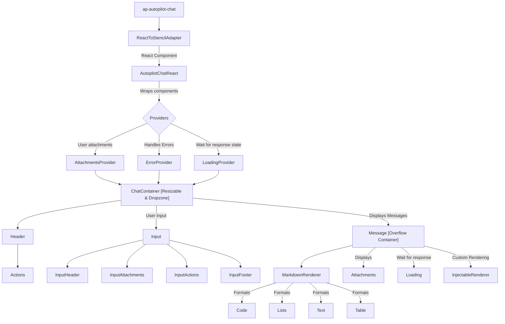

# Autopilot Chat

A flexible chat interface component that provides seamless integration with both React and Angular applications, powered by a globally accessible chat service.

## Global Chat Service

The chat service is exposed globally and can be accessed as:

```typescript
const chatService = window.PortalShell.AutopilotChat;
```

## API Reference

The chat service exposes the following methods:

### Configuration & Initialization

- `getConfig()`: Returns the current configuration
- `initialize(config: AutopilotChatConfiguration, messageRenderers?: AutopilotChatMessageRenderer[])`: Initializes the chat service with the provided configuration and optional message renderers
- `injectMessageRenderer(renderer: AutopilotChatMessageRenderer)`: Injects a custom message renderer into the chat service
- `getMessageRenderer(name: string)`: Gets a message renderer by name

### Chat Control

- `open(config?: AutopilotChatConfiguration, messageRenderers?: AutopilotChatMessageRenderer[])`: Opens the chat interface
- `close()`: Closes the chat interface
- `setChatMode(mode: AutopilotChatMode)`: Sets the chat window mode (SideBySide, FullScreen, or Closed)
- `newChat(config?: AutopilotChatConfiguration, messageRenderers?: AutopilotChatMessageRenderer[])`: Starts a new chat session

### Message Handling

- `setConversation(messages: AutopilotChatMessage[])`: Sets a conversation in the chat interface
- `setPrompt(prompt: AutopilotChatPrompt | string)`: Sets a prompt in the chat interface
- `sendRequest(request: AutopilotChatMessage)`: Sends a user request to the chat
- `sendResponse(response: AutopilotChatMessage)`: Sends an AI assistant response to the chat
- `stopResponse()`: Stops the current response

### Error Handling

- `setError(error: string)`: Sets an error message
- `clearError()`: Clears the current error message

### Event Handling

- `on(event: AutopilotChatEvent, handler: AutopilotChatEventHandler, hijack?: boolean)`: Subscribes to chat events. Returns an unsubscribe function. The handler will be called whenever the specified event is published. If hijack is true, the handler will receive a modified event with hijacked=true when an interceptor has handled the event. This way, apollo will not do the default handling (only the `request` for now).

- `intercept(event: AutopilotChatInterceptableEvent, interceptor: AutopilotChatEventInterceptor)`: Adds an event interceptor for interceptable events (currently only `request` events). Returns a function to remove the interceptor. The interceptor can return true to indicate it has handled the event and prevent further processing. Multiple interceptors can be added and will be called in parallel. If any interceptor returns `true`, the event is considered hijacked and apollo will not do the default handling.


## Component Structure

The component is built with a modular architecture that allows for easy customization and extension.


