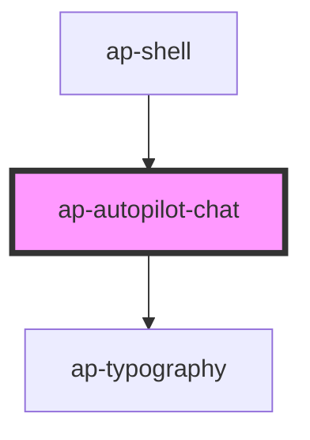

# ap-autopilot-chat

<!-- Auto Generated Below -->

## Properties

| Property              | Attribute | Description | Type                                | Default     |
| --------------------- | --------- | ----------- | ----------------------------------- | ----------- |
| `chatServiceInstance` | --        |             | `AutopilotChatService \| undefined` | `undefined` |

## Dependencies

### Used by

 - [ap-shell](../ap-shell)

### Depends on

- [ap-typography](../ap-typography)

### Graph

----------------------------------------------

Made with ❤️ by UiPath Apollo Team
