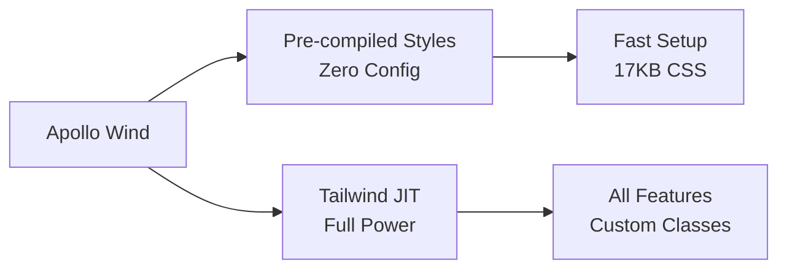
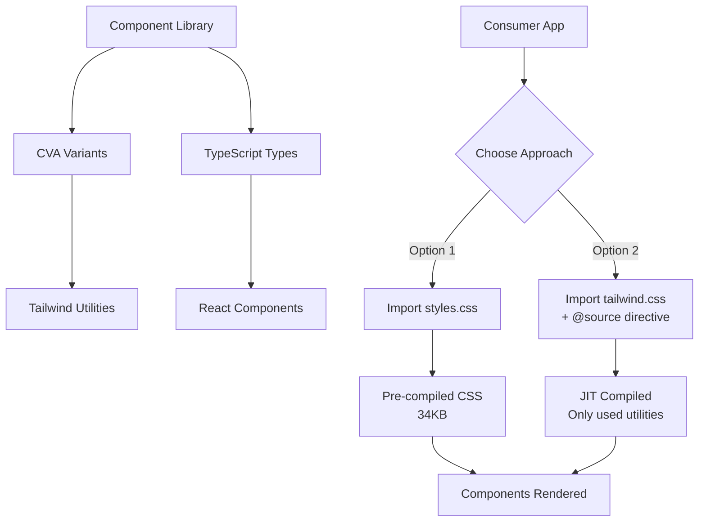

# UiPath Wind Design System

A modern, accessible React component library with bundled Tailwind CSS.
Zero-config for quick starts, full Tailwind JIT for advanced needs.



## Quick Start

```bash
npm install @uipath/wind
```

**Option 1: Zero Config** (Recommended for quick starts)

```tsx
import '@uipath/wind/styles.css'
import { Button } from '@uipath/wind'

<Button>Click me</Button>
```

**Option 2: Full Tailwind JIT** (For advanced customization)

```bash
npm install @uipath/wind postcss
```

```js
// postcss.config.js
export { default } from "@uipath/wind/postcss";
```

```css
/* src/app.css */
@import "@uipath/wind/tailwind.css";
@source "../node_modules/@uipath/wind";
```

```tsx
import './app.css'
import { Button } from '@uipath/wind'

// ✅ All Tailwind utilities work!
<Button className="bg-purple-500 hover:scale-105 w-[200px]">
  Custom Tailwind
</Button>
```

## Comparison

| Feature          | Pre-compiled            | Tailwind JIT                    |
| ---------------- | ----------------------- | ------------------------------- |
| Setup Time       | Instant                 | 5 minutes                       |
| Bundle Size      | ~17KB CSS               | ~varies (JIT)                   |
| Custom Classes   | ❌                      | ✅                              |
| Arbitrary Values | ❌                      | ✅ (`w-[200px]`)                |
| Tailwind Plugins | ❌                      | ✅                              |
| Best For         | Prototypes, Simple Apps | Production, Heavy Customization |

## Architecture



## Example

```tsx
import {
  Button,
  Card,
  CardContent,
  CardHeader,
  CardTitle,
  Input,
  Label,
} from "@uipath/wind";

function LoginForm() {
  return (
    <Card className="w-full max-w-md">
      <CardHeader>
        <CardTitle>Welcome Back</CardTitle>
      </CardHeader>
      <CardContent className="space-y-4">
        <div>
          <Label htmlFor="email">Email</Label>
          <Input id="email" type="email" placeholder="you@example.com" />
        </div>
        <Button className="w-full">Sign In</Button>
      </CardContent>
    </Card>
  );
}
```

## Utilities

### cn() - Class Merger

```tsx
import { cn } from '@uipath/wind'

<Button className={cn('base-class', isActive && 'active-class')}>
  Button
</Button>
```

## Development

```bash
npm install        # Install dependencies
npm run storybook  # Run Storybook on http://localhost:6006
npm test           # Run tests
npm run lint       # Run lint
npm run format     # Run biome format
npm run build      # Build library
```

## Documentation

- 📖 [Complete Usage Guide](./docs/USAGE.md) - Detailed consumption guide

## Tech Stack

- React 19 + TypeScript 5
- Tailwind CSS 4 (bundled)
- CVA (Class Variance Authority)
- Vitest + Testing Library
- Storybook 10
- Vite 7

## Browser Support

Modern browsers: Chrome, Firefox, Safari, Edge (latest versions)

## License

MIT - see [LICENSE](./LICENSE)

---

**Peer Dependencies:** React ≥18.0.0

Built with ❤️ by UiPath | Inspired by [shadcn/ui](https://ui.shadcn.com)
