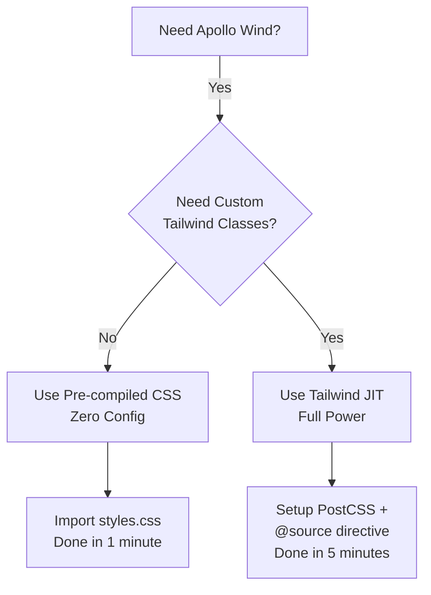
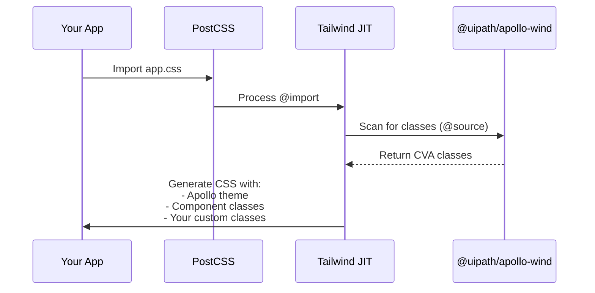

# Apollo Wind Usage Guide

Complete guide to consuming Apollo Wind in your React application.

## Table of Contents

1. [Installation](#installation)
2. [Approach 1: Pre-compiled CSS (Zero Config)](#approach-1-pre-compiled-css)
3. [Approach 2: Tailwind JIT](#approach-2-tailwind-jit)
4. [Components](#components)
5. [Customization](#customization)
6. [Troubleshooting](#troubleshooting)

## Installation

```bash
npm install @uipath/apollo-wind
```

**Peer Dependencies:**

```bash
npm install react@>=18.0.0 react-dom@>=18.0.0
```

## Decision Tree



## Approach 1: Pre-compiled CSS

**Best for:** Quick prototypes, simple apps, teams without Tailwind experience

### Setup (1 minute)

```tsx
// src/main.tsx or src/App.tsx
import "@uipath/apollo-wind/styles.css";
import { Button, Card } from "@uipath/apollo-wind";

function App() {
  return (
    <Card>
      <Button>Click me</Button>
    </Card>
  );
}
```

### What You Get

✅ All Apollo Wind components fully styled ✅ Zero configuration ✅ ~34KB
pre-compiled CSS ❌ No custom Tailwind classes ❌ No arbitrary values
(`w-[200px]`) ❌ No Tailwind plugins

### Bundle Size

```
styles.css: 34KB (minified) / ~6KB (gzipped)
```

---

## Approach 2: Tailwind JIT

**Best for:** Production apps, heavy customization, teams experienced with
Tailwind

### Setup (5 minutes)

**Step 1: Install Dependencies**

```bash
npm install @uipath/apollo-wind postcss
```

> Tailwind CSS is already bundled - no separate installation needed!

**Step 2: Configure PostCSS**

```js
// postcss.config.js (root of your project)
export { default } from "@uipath/apollo-wind/postcss";
```

**Step 3: Create CSS File**

```css
/* src/app.css */

/* Import Apollo Wind Tailwind CSS with theme */
@import "@uipath/apollo-wind/tailwind.css";

/* CRITICAL: Tell Tailwind to scan @uipath/apollo-wind for CVA class names */
@source "../node_modules/@uipath/apollo-wind";

/* Optional: Add custom styles */
@layer components {
  .my-custom-button {
    @apply bg-blue-500 hover:bg-blue-600 text-white px-4 py-2 rounded;
  }
}
```

**Step 4: Import CSS in Your App**

```tsx
// src/main.tsx
import "./app.css";
import { Button } from "@uipath/apollo-wind";

function App() {
  return (
    <>
      {/* ✅ Apollo Wind components work */}
      <Button>Standard Button</Button>

      {/* ✅ All Tailwind utilities work */}
      <Button className="bg-purple-500 hover:scale-105">
        Custom Purple Button
      </Button>

      {/* ✅ Arbitrary values work */}
      <Button className="w-[250px] h-[60px]">
        Custom Size Button
      </Button>

      {/* ✅ Gradients work */}
      <div className="bg-gradient-to-r from-purple-600 to-pink-600">
        Gradient Background
      </div>
    </>
  );
}
```

### What You Get

✅ All Apollo Wind components fully styled ✅ Full Tailwind JIT compilation ✅
All Tailwind utilities (gradients, transforms, filters, etc.) ✅ Arbitrary
values (`w-[200px]`, `bg-[#ff0000]`) ✅ Custom `@apply` directives ✅
Tree-shaken CSS (only used utilities) ⚠️ Requires PostCSS setup

### How It Works



### Why @source Is Critical

Apollo Wind components use **CVA** (Class Variance Authority) to define styles:

```tsx
// Inside @uipath/apollo-wind/dist/index.js
const buttonVariants = cva("inline-flex items-center ...", {
  variants: {
    variant: {
      default: "bg-gray-900 text-gray-50 hover:bg-gray-800",
      destructive: "bg-red-600 text-gray-50 hover:bg-red-500",
    },
  },
});
```

These class strings are in the **compiled JavaScript**. The `@source` directive
tells Tailwind v4 to scan `node_modules/@uipath/apollo-wind` to find these
classes.

**Without @source:** Components render but have no styling (buttons look like
plain text).

### Bundle Size

```
Variable - JIT only includes utilities you actually use
Typical: 40-50KB (includes Apollo Wind component classes + your app classes)
Gzipped: ~7KB
```

---

## Components

### Button

```tsx
import { Button } from '@uipath/apollo-wind'

// Variants
<Button variant="default">Default</Button>
<Button variant="destructive">Delete</Button>
<Button variant="outline">Outline</Button>
<Button variant="ghost">Ghost</Button>
<Button variant="link">Link</Button>

// Sizes
<Button size="sm">Small</Button>
<Button size="default">Default</Button>
<Button size="lg">Large</Button>
<Button size="icon">📧</Button>

// With custom classes (JIT only)
<Button className="bg-purple-500 hover:bg-purple-600">
  Custom
</Button>
```

### Card

```tsx
import { Card, CardHeader, CardTitle, CardDescription, CardContent, CardFooter } from '@uipath/apollo-wind'

<Card>
  <CardHeader>
    <CardTitle>Card Title</CardTitle>
    <CardDescription>Card description</CardDescription>
  </CardHeader>
  <CardContent>
    Main content goes here
  </CardContent>
  <CardFooter>
    <Button>Action</Button>
  </CardFooter>
</Card>
```

### Form Components

```tsx
import { Input, Label, Textarea, Checkbox, Select } from '@uipath/apollo-wind'

<div className="space-y-4">
  <div>
    <Label htmlFor="email">Email</Label>
    <Input id="email" type="email" placeholder="you@example.com" />
  </div>

  <div>
    <Label htmlFor="message">Message</Label>
    <Textarea id="message" placeholder="Your message..." />
  </div>

  <div className="flex items-center space-x-2">
    <Checkbox id="terms" />
    <Label htmlFor="terms">Accept terms</Label>
  </div>

  <Select>
    <option>Option 1</option>
    <option>Option 2</option>
  </Select>
</div>
```

### Avatar

```tsx
import { Avatar, AvatarImage, AvatarFallback } from '@uipath/apollo-wind'

<Avatar>
  <AvatarImage src="/avatar.jpg" alt="User" />
  <AvatarFallback>JD</AvatarFallback>
</Avatar>
```

### Badge

```tsx
import { Badge } from '@uipath/apollo-wind'

<Badge>Default</Badge>
<Badge variant="secondary">Secondary</Badge>
<Badge variant="destructive">Destructive</Badge>
<Badge variant="outline">Outline</Badge>
```

---

## Customization

### Using className

All components accept a `className` prop for customization:

```tsx
<Button className="w-full">Full Width</Button>
<Card className="shadow-2xl">Extra Shadow</Card>
```

### Using cn() Utility

Merge classes safely with the `cn()` utility:

```tsx
import { cn } from '@uipath/apollo-wind'

<Button
  className={cn(
    'base-class',
    isActive && 'active-class',
    isDisabled && 'opacity-50'
  )}
>
  Button
</Button>
```

### With Tailwind JIT

Create custom variants using `@apply`:

```css
@layer components {
  .btn-primary {
    @apply bg-gradient-to-r from-purple-600 to-pink-600 text-white px-6 py-3
      rounded-lg;
    @apply hover:scale-105 active:scale-95 transition-all shadow-lg
      hover:shadow-xl;
  }
}
```

```tsx
<button className="btn-primary">
  Custom Gradient Button
</button>;
```

---

## Troubleshooting

### Pre-compiled Approach

**Problem:** Styles not loading

```tsx
// ❌ Wrong
import "@uipath/apollo-wind/dist/styles.css";

// ✅ Correct
import "@uipath/apollo-wind/styles.css";
```

### Tailwind JIT Approach

**Problem 1:** Tailwind utilities not generating

**Cause:** Missing `postcss.config.js`

**Solution:**

```js
// postcss.config.js - REQUIRED
export { default } from "@uipath/apollo-wind/postcss";
```

**Problem 2:** Components render but have no styling

**Cause:** Missing `@source` directive

**Solution:**

```css
/* app.css */
@import "@uipath/apollo-wind/tailwind.css";
@source "../node_modules/@uipath/apollo-wind"; /* REQUIRED */
```

**Problem 3:** Build errors

**Cause:** PostCSS not installed

**Solution:**

```bash
npm install postcss
```

### Testing

**Problem:** Tests failing with "Cannot find module '@testing-library/dom'"

**Solution:**

```bash
npm install --save-dev @testing-library/dom
```

---

## Framework-Specific Guides

### Next.js

```tsx
// app/layout.tsx
import "@uipath/apollo-wind/styles.css"; // or use Tailwind JIT approach

export default function RootLayout({ children }) {
  return (
    <html>
      <body>{children}</body>
    </html>
  );
}
```

### Vite

```tsx
// src/main.tsx
import "@uipath/apollo-wind/styles.css"; // or use Tailwind JIT approach
import App from "./App";

createRoot(document.getElementById("root")!).render(<App />);
```

### Create React App

```tsx
// src/index.tsx
import "@uipath/apollo-wind/styles.css"; // or use Tailwind JIT approach
import App from "./App";

const root = ReactDOM.createRoot(document.getElementById("root")!);
root.render(<App />);
```

---

## Performance Tips

1. **Tree shake imports:** Import only what you need
   ```tsx
   // ✅ Good
   import { Button } from "@uipath/apollo-wind";

   // ❌ Avoid
   import * as Wind from "@uipath/apollo-wind";
   ```

2. **Use JIT for production:** Smaller bundle sizes
3. **Lazy load heavy components:**
   ```tsx
   const Card = lazy(() =>
     import("@uipath/apollo-wind").then((m) => ({ default: m.Card }))
   );
   ```

---

## Migration Guide

### From styles.css to Tailwind JIT

1. Install PostCSS: `npm install postcss`
2. Create `postcss.config.js`
3. Replace import:
   ```diff
   - import '@uipath/apollo-wind/styles.css'
   + import './app.css'
   ```
4. Create `app.css`:
   ```css
   @import "@uipath/apollo-wind/tailwind.css";
   @source "../node_modules/@uipath/apollo-wind";
   ```

---

## Need Help?

- 📖 [Tailwind JIT Guide](./TAILWIND-USAGE.md) - Full Tailwind setup details
- 🚀 [Quick Start](./QUICK-START.md) - 5-minute getting started
- 🏗️ [Architecture](./ARCHITECTURE.md) - How it works under the hood
- 💬 [GitHub Issues](https://github.com/uipath/wind/issues) - Report bugs or
  request features
