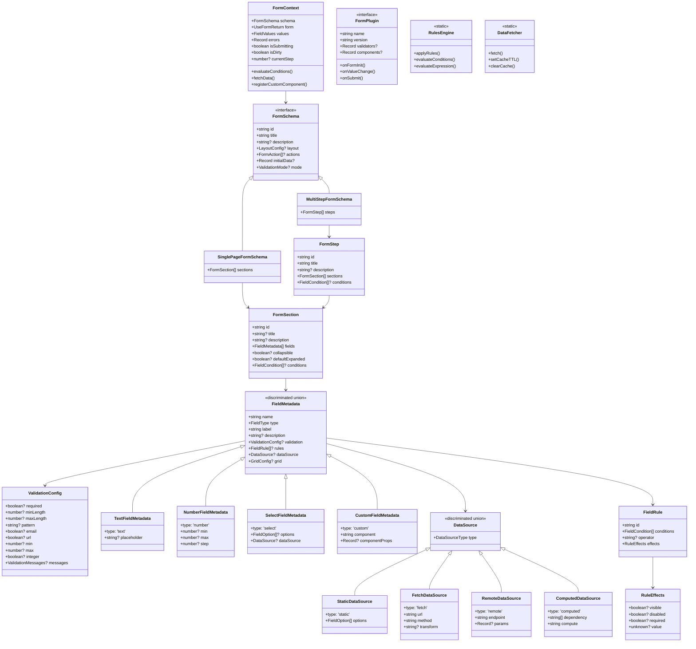
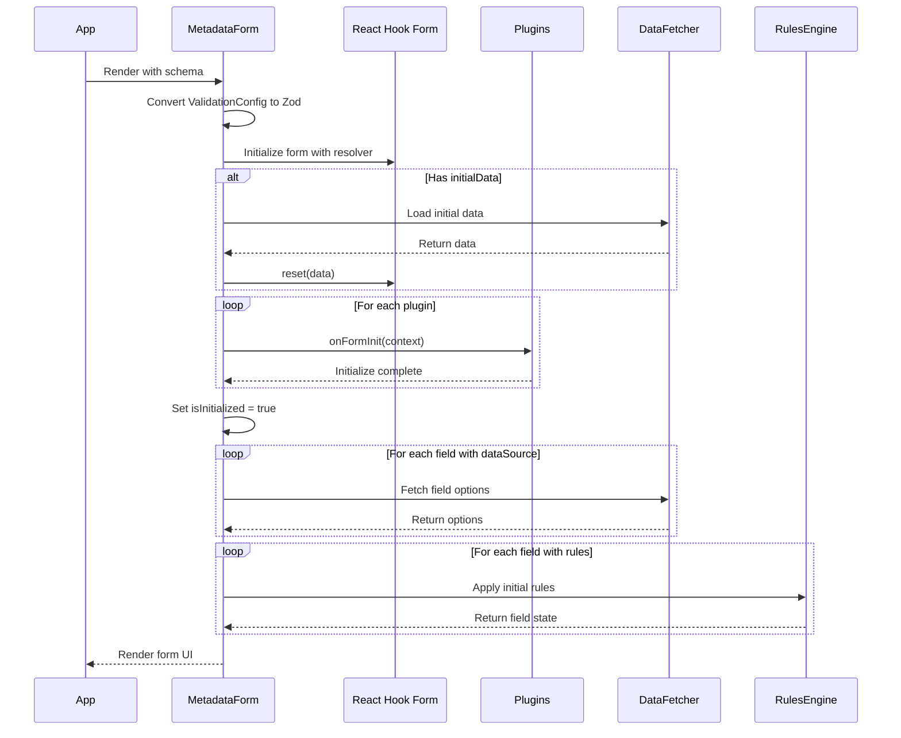
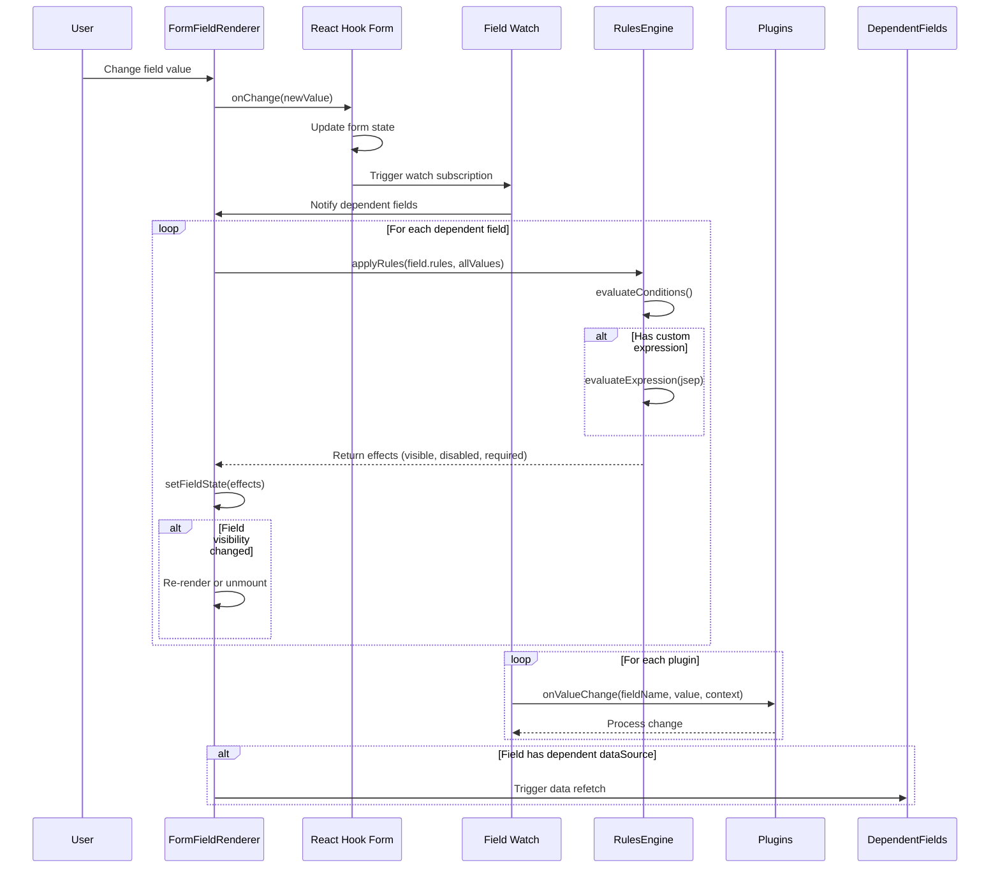
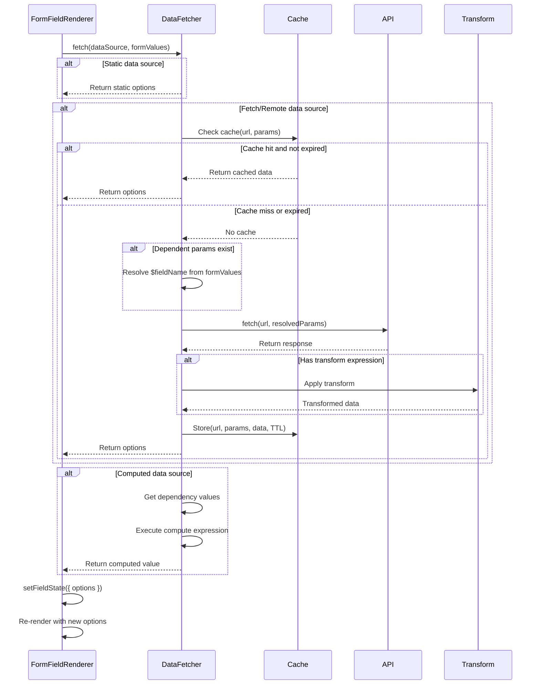
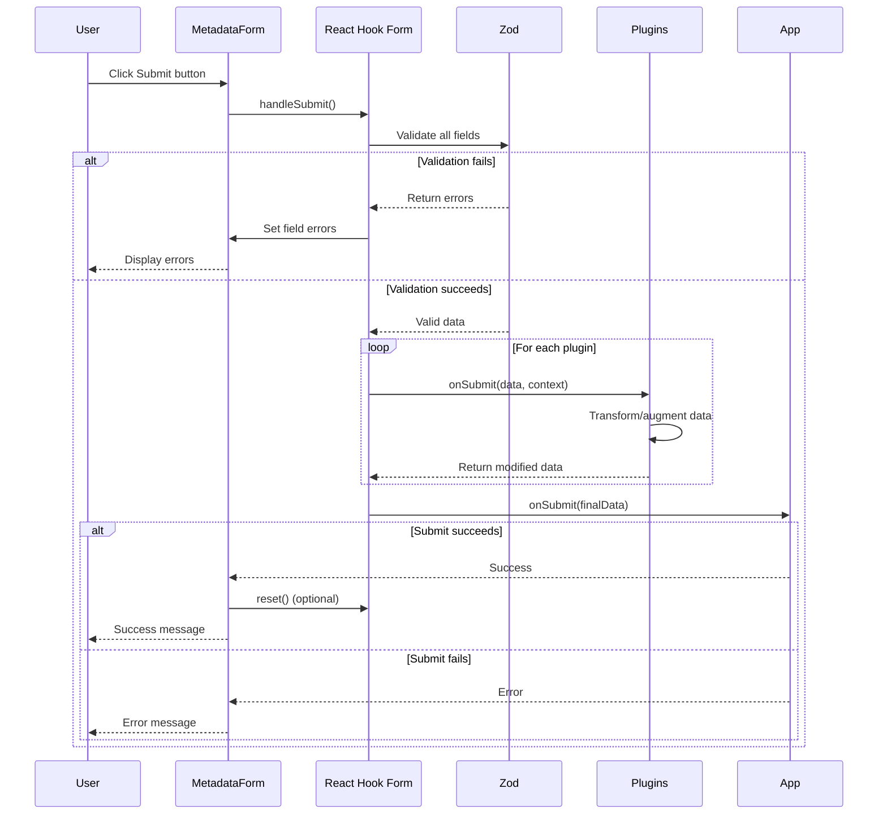
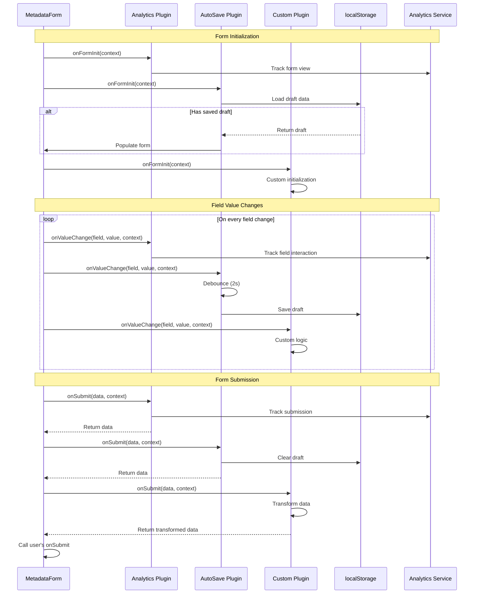

# Apollo-Wind Metadata Form System

A powerful, enterprise-grade, metadata-driven form system built on **React Hook
Form**, **Zod**, and **shadcn/ui** for the apollo-wind design system.

## 🎯 Key Features

### Core Capabilities

- ✅ **100% TypeScript** - Fully typed with discriminated unions and strict type
  safety
- ✅ **JSON Schema Driven** - Define forms in JSON/TypeScript with full type
  inference
- ✅ **React Hook Form** - Best-in-class performance with minimal re-renders
- ✅ **JSON-Serializable Validation** - ValidationConfig objects that can be
  stored in databases and transmitted via APIs
- ✅ **shadcn/ui Integration** - Beautiful, accessible components out of the box
- ✅ **Zero Re-renders** - Optimized field watching with targeted subscriptions
- ✅ **Visual Form Designer** - Drag-and-drop interface for building forms

### Advanced Features

- 🔄 **Data Fetching** - Static, remote, computed, and dependent data sources
  with caching
- 🎨 **Conditional Logic** - Powerful rules engine with jsep for complex
  expressions
- 🔌 **Plugin System** - Extend functionality through lifecycle hooks
- 📊 **Multi-Step Forms** - Wizard-style forms with conditional step navigation
- 💾 **Auto-save** - Draft management with localStorage persistence
- 🎯 **Custom Components** - Type-safe custom field renderers
- 🌍 **Internationalization Ready** - Schema-driven translations support
- ♿ **Accessibility First** - WCAG compliant with proper ARIA attributes

## 📁 Architecture

```
src/forms/
├── form-schema.ts              # Core type definitions (discriminated unions)
├── metadata-form.tsx           # Main form component with RHF integration
├── field-renderer.tsx          # Field type renderers for all built-in types
├── rules-engine.ts             # Conditional logic engine with jsep
├── data-fetcher.ts             # Data source handling with caching
├── validation-converter.ts     # Converts ValidationConfig to Zod at runtime
├── schema-serializer.ts        # Serializes FormSchema to JSON for storage/API
├── form-plugins.tsx            # Plugin examples (analytics, auto-save, etc.)
├── form-designer.tsx           # Visual form builder with live preview
├── form-examples.tsx           # Real-world schema examples
└── index.ts                    # Public API exports
```

### Class Diagram



## 🚀 Quick Start

### 1. Basic Form

```tsx
import { MetadataForm } from '@uipath/apollo-wind/forms';
import type { FormSchema } from '@uipath/apollo-wind/forms';

const schema: FormSchema = {
  id: 'contact-form',
  title: 'Contact Us',
  sections: [
    {
      id: 'info',
      fields: [
        {
          name: 'name',
          type: 'text',
          label: 'Full Name',
          placeholder: 'John Doe',
          validation: {
            required: true,
            minLength: 2,
            messages: { minLength: 'Name must be at least 2 characters' },
          },
        },
        {
          name: 'email',
          type: 'email',
          label: 'Email Address',
          placeholder: 'john@example.com',
          validation: {
            required: true,
            email: true,
            messages: { email: 'Invalid email address' },
          },
        },
        {
          name: 'message',
          type: 'textarea',
          label: 'Message',
          rows: 4,
          validation: {
            required: true,
            minLength: 10,
          },
        },
      ],
    },
  ],
};

function ContactPage() {
  const handleSubmit = async (data: unknown) => {
    console.log('Form submitted:', data);
    // Send to API
  };

  return <MetadataForm schema={schema} onSubmit={handleSubmit} />;
}
```

**Why ValidationConfig?** The validation configuration is a plain
JSON-serializable object, allowing schemas to be stored in databases, fetched
from APIs, and transmitted over the wire. At runtime, the system converts
`ValidationConfig` to Zod schemas for validation.

### 2. Multi-Step Form

```tsx
const onboardingSchema = {
  id: 'onboarding',
  title: 'User Onboarding',
  steps: [
    {
      id: 'personal',
      title: 'Personal Information',
      description: 'Tell us about yourself',
      sections: [{
        id: 's1',
        fields: [
          { name: 'firstName', type: 'text', label: 'First Name' },
          { name: 'lastName', type: 'text', label: 'Last Name' }
        ]
      }]
    },
    {
      id: 'preferences',
      title: 'Preferences',
      description: 'Customize your experience',
      sections: [{
        id: 's2',
        fields: [
          { name: 'theme', type: 'select', label: 'Theme', options: [...] },
          { name: 'notifications', type: 'switch', label: 'Enable Notifications' }
        ]
      }]
    }
  ]
};
```

### 3. With Plugins

```tsx
import { analyticsPlugin, autoSavePlugin } from '@uipath/apollo-wind/forms';

<MetadataForm
  schema={schema}
  plugins={[analyticsPlugin, autoSavePlugin]}
  onSubmit={handleSubmit}
/>;
```

### 4. Visual Form Designer

```tsx
import { FormDesigner } from '@uipath/apollo-wind/forms';

function FormBuilderPage() {
  // FormDesigner is a self-contained visual editor
  // Export the schema from the "Schema" tab in the right panel
  return <FormDesigner />;
}
```

## 🔄 Lifecycle & Flow Diagrams

### Form Initialization Sequence



### Field Change & Rules Evaluation Sequence



### Data Fetching Sequence



### Form Submission Sequence



### Plugin Lifecycle Sequence



## 🎨 Field Types

The system supports 15+ built-in field types with full TypeScript support:

| Type          | Description                 | Props                         |
| ------------- | --------------------------- | ----------------------------- |
| `text`        | Single-line text input      | `placeholder`                 |
| `email`       | Email input with validation | `placeholder`                 |
| `textarea`    | Multi-line text input       | `rows`, `placeholder`         |
| `number`      | Number input with min/max   | `min`, `max`, `step`          |
| `select`      | Single-select dropdown      | `options`, `dataSource`       |
| `multiselect` | Multi-select with search    | `options`, `maxSelected`      |
| `radio`       | Radio button group          | `options`                     |
| `checkbox`    | Single checkbox             | -                             |
| `switch`      | Toggle switch               | -                             |
| `slider`      | Range slider                | `min`, `max`, `step`          |
| `date`        | Date picker                 | `placeholder`                 |
| `datetime`    | Date and time picker        | `use12Hour`                   |
| `file`        | File upload                 | `accept`, `multiple`          |
| `custom`      | Custom component            | `component`, `componentProps` |

## 📊 Data Sources

### Static Options

```typescript
{
  name: 'country',
  type: 'select',
  label: 'Country',
  dataSource: {
    type: 'static',
    options: [
      { label: 'United States', value: 'US' },
      { label: 'Canada', value: 'CA' },
      { label: 'United Kingdom', value: 'UK' }
    ]
  }
}
```

### Remote Data Fetching

```typescript
{
  name: 'users',
  type: 'select',
  label: 'Assign To',
  dataSource: {
    type: 'fetch',
    url: '/api/users',
    method: 'GET',
    transform: 'data.map(u => ({ label: u.name, value: u.id }))'
  }
}
```

### Dependent Data (Cascading Dropdowns)

```typescript
import { DataSourceBuilder } from '@uipath/apollo-wind/forms';

// Parent field
{
  name: 'country',
  type: 'select',
  label: 'Country',
  dataSource: DataSourceBuilder.static([...])
}

// Dependent child field
{
  name: 'state',
  type: 'select',
  label: 'State',
  dataSource: {
    type: 'remote',
    endpoint: '/api/states',
    params: {
      countryCode: '$country'  // References country field
    }
  }
}
```

### Computed Values

```typescript
{
  name: 'total',
  type: 'number',
  label: 'Total Price',
  dataSource: {
    type: 'computed',
    dependency: ['quantity', 'price'],
    compute: '(quantity || 0) * (price || 0)'
  }
}
```

### Data Source Builders

```typescript
import { DataSourceBuilder } from '@uipath/apollo-wind/forms';

// Static
const countries = DataSourceBuilder.static([{ label: 'US', value: 'US' }]);

// Remote GET
const users = DataSourceBuilder.get('/api/users');

// Dependent
const cities = DataSourceBuilder.dependent('/api/cities', 'country', 'countryCode');

// Computed
const total = DataSourceBuilder.computed(['quantity', 'price'], '(quantity || 0) * (price || 0)');
```

## 🎯 Rules Engine

### Basic Show/Hide Rules

```typescript
import { RuleBuilder } from '@uipath/apollo-wind/forms';

{
  name: 'ssn',
  type: 'text',
  label: 'Social Security Number',
  rules: [
    new RuleBuilder('show-ssn-for-us')
      .when('country')
      .is('US')
      .show()
      .require()
      .build()
  ]
}
```

### Multiple Conditions

```typescript
// OR operator
new RuleBuilder('premium-features')
  .when('planType')
  .in(['enterprise', 'premium'])
  .useOperator('OR')
  .when('customerId')
  .matches('^ENT-')
  .show()
  .build();

// AND operator (default)
new RuleBuilder('senior-requirements')
  .when('position')
  .is('senior')
  .when('experience')
  .custom('value >= 5')
  .require()
  .build();
```

### Complex Expressions with jsep

```typescript
import { ExpressionBuilder } from '@uipath/apollo-wind/forms';

// Using ExpressionBuilder
new RuleBuilder('discount-eligible')
  .withCustomExpression(
    ExpressionBuilder.and(
      ExpressionBuilder.greaterThan('orderTotal', 100),
      ExpressionBuilder.equals('customerType', 'premium'),
    ),
  )
  .show()
  .build();

// Or write expressions directly
{
  rules: [
    {
      id: 'complex-rule',
      conditions: [
        {
          when: '',
          custom: 'age >= 18 && (status === "active" || role === "admin")',
        },
      ],
      effects: {
        visible: true,
        required: true,
      },
    },
  ];
}
```

### All Rule Effects

```typescript
rules: [{
  conditions: [...],
  effects: {
    visible: true,        // Show/hide field
    disabled: false,      // Enable/disable field
    required: true,       // Make field required
    value: 'computed',    // Set field value programmatically
  }
}]
```

### Expression Helpers

```typescript
// Built-in expression builders
ExpressionBuilder.equals('status', 'active'); // status == "active"
ExpressionBuilder.greaterThan('age', 18); // age > 18
ExpressionBuilder.isEmpty('field'); // !field || field == ''
ExpressionBuilder.between('score', 0, 100); // score >= 0 && score <= 100
ExpressionBuilder.and('expr1', 'expr2'); // (expr1 && expr2)
ExpressionBuilder.or('expr1', 'expr2'); // (expr1 || expr2)
ExpressionBuilder.sum(['field1', 'field2']); // (field1 || 0) + (field2 || 0)
```

## 🔌 Plugin System

### Creating a Plugin

```typescript
import type { FormContext, FormPlugin, ValidationConfig } from '@uipath/apollo-wind/forms';

export const myPlugin: FormPlugin = {
  name: 'my-plugin',
  version: '1.0.0',

  // Lifecycle hooks
  onFormInit: async (context: FormContext) => {
    console.log('Form initialized:', context.schema.id);
  },

  onValueChange: (fieldName: string, value: unknown, context: FormContext) => {
    console.log(`${fieldName} changed to:`, value);
  },

  onSubmit: async (data: unknown, context: FormContext) => {
    // Transform or validate data before submission
    console.log('Submitting:', data);
    return data;
  },

  // Custom validators (JSON-serializable ValidationConfig)
  validators: {
    ssn: {
      pattern: '^\\d{3}-\\d{2}-\\d{4}$',
      messages: { pattern: 'Invalid SSN format' },
    } as ValidationConfig,
  },

  // Custom components
  components: {
    'my-field': MyCustomFieldComponent,
  },
};
```

### Built-in Plugins

#### Analytics Plugin

Tracks form views, field interactions, and submissions.

```typescript
import { analyticsPlugin } from "@uipath/apollo-wind/forms";

<MetadataForm plugins={[analyticsPlugin]} />;
```

#### Auto-save Plugin

Automatically saves form state to localStorage with debouncing.

```typescript
import { autoSavePlugin } from "@uipath/apollo-wind/forms";

<MetadataForm plugins={[autoSavePlugin]} />;
```

#### Workflow Plugin

Integrates with automation platforms like UiPath Orchestrator.

```typescript
import { workflowPlugin } from "@uipath/apollo-wind/forms";

<MetadataForm plugins={[workflowPlugin]} />;
```

#### Audit Plugin

Maintains field-level history for compliance and auditing.

```typescript
import { auditPlugin } from "@uipath/apollo-wind/forms";

<MetadataForm plugins={[auditPlugin]} />;
```

#### Validation Plugin

Provides common validators (phone, credit card, URL, postal code).

```typescript
import { validationPlugin } from "@uipath/apollo-wind/forms";

<MetadataForm plugins={[validationPlugin]} />;
```

#### Formatting Plugin

Adds custom conditions for business hours and weekend detection.

```typescript
import { formattingPlugin } from "@uipath/apollo-wind/forms";

<MetadataForm plugins={[formattingPlugin]} />;
```

## 🎨 Custom Components

### Register Custom Field Component

```typescript
import type { CustomFieldComponentProps } from "@uipath/apollo-wind/forms";

// Define your custom component
function RichTextEditor({
  value,
  onChange,
  onBlur,
  disabled,
  error,
  field,
}: CustomFieldComponentProps) {
  return (
    <div>
      <Label>{field?.label}</Label>
      <TipTapEditor
        content={value as string}
        onUpdate={onChange}
        onBlur={onBlur}
        editable={!disabled}
      />
      {error && <FormError>{error}</FormError>}
    </div>
  );
}

// Use in schema
const schema = {
  sections: [{
    fields: [{
      name: "content",
      type: "custom",
      label: "Content",
      component: "rich-text-editor",
      componentProps: {
        placeholder: "Start writing...",
        showToolbar: true,
      },
    }],
  }],
};

// Register the component
function MyForm() {
  return (
    <MetadataForm
      schema={schema}
      customComponents={{
        "rich-text-editor": RichTextEditor,
      }}
    />
  );
}
```

### CustomFieldComponentProps Interface

```typescript
interface CustomFieldComponentProps {
  value: unknown;
  onChange: (value: unknown) => void;
  onBlur: () => void;
  name: string;
  field?: FieldMetadata;
  disabled?: boolean;
  required?: boolean;
  error?: string;
  [key: string]: unknown; // Additional props from componentProps
}
```

## 💾 Layout & Styling

### Grid Layout

```typescript
{
  id: 'my-form',
  title: 'Form',
  layout: {
    columns: 2,        // Number of columns
    gap: 6,            // Tailwind gap value
    variant: 'default' // 'default' | 'compact' | 'spacious'
  },
  sections: [...]
}
```

### Field Grid Spans

```typescript
{
  name: 'description',
  type: 'textarea',
  label: 'Description',
  grid: {
    span: 2,          // Spans 2 columns
    order: 1,         // Display order
    breakpoint: 'md'  // Responsive breakpoint
  }
}
```

### Collapsible Sections

```typescript
{
  sections: [{
    id: 'advanced',
    title: 'Advanced Settings',
    collapsible: true,
    defaultExpanded: false,
    fields: [...]
  }]
}
```

## 🎯 TypeScript Type Safety

### Discriminated Union Types

The form system uses discriminated unions for type-safe field definitions:

```typescript
// Each field type has specific properties
type FieldMetadata =
  | { type: 'text'; placeholder?: string }
  | { type: 'number'; min?: number; max?: number; step?: number }
  | { type: 'select'; options?: FieldOption[]; dataSource?: DataSource }
  | { type: 'custom'; component: string; componentProps?: Record<string, unknown> }
  | ... // 15+ field types

// TypeScript enforces valid properties for each type
const field: FieldMetadata = {
  type: 'number',
  min: 0,
  max: 100,
  // placeholder: '...'  // ❌ Error: 'placeholder' doesn't exist on number field
};
```

### Type Guards

```typescript
import { hasMinMaxStep, hasOptions, isCustomField } from '@uipath/apollo-wind/forms';

if (hasOptions(field)) {
  // TypeScript knows field is SelectField | MultiSelectField | RadioField
  const opts = field.options;
}

if (isCustomField(field)) {
  // TypeScript knows field is CustomFieldMetadata
  const component = field.component;
}
```

### Form Context Type

```typescript
interface FormContext<T extends FieldValues = FieldValues> {
  schema: FormSchema;
  form: UseFormReturn<T>;
  values: T;
  errors: Record<string, unknown>;
  isSubmitting: boolean;
  isDirty: boolean;
  currentStep?: number;

  evaluateConditions: (conditions: FieldCondition[]) => boolean;
  fetchData: (source: DataSource) => Promise<FieldOption[]>;
  registerCustomComponent: (
    name: string,
    component: React.ComponentType<CustomFieldComponentProps>,
  ) => void;
}
```

## 💾 Schema Serialization

The form system uses JSON-serializable `ValidationConfig` objects instead of Zod
schemas, enabling true data-driven forms that can be stored and transmitted.

### ValidationConfig Structure

```typescript
interface ValidationConfig {
  // Presence
  required?: boolean;

  // String constraints
  minLength?: number;
  maxLength?: number;
  pattern?: string; // Regex pattern as string
  email?: boolean;
  url?: boolean;

  // Number constraints
  min?: number;
  max?: number;
  integer?: boolean;
  positive?: boolean;
  negative?: boolean;

  // Array constraints
  minItems?: number;
  maxItems?: number;

  // Custom error messages
  messages?: {
    required?: string;
    minLength?: string;
    maxLength?: string;
    pattern?: string;
    min?: string;
    max?: string;
    email?: string;
    // ... etc
  };
}
```

### Serializing Schemas

```typescript
import { schemaToJson, serializeSchema } from '@uipath/apollo-wind/forms';

// Convert schema to JSON-safe object
const jsonObject = serializeSchema(myFormSchema);

// Or convert directly to JSON string
const jsonString = schemaToJson(myFormSchema, 2); // 2-space indent

// Store in database or send via API
await db.formSchemas.insert({ schema: jsonObject });
```

### Loading Schemas from API

```typescript
// Fetch schema from API
const response = await fetch("/api/forms/contact-form");
const schema: FormSchema = await response.json();

// Use directly with MetadataForm
<MetadataForm schema={schema} onSubmit={handleSubmit} />;
```

### Runtime Validation Conversion

The `validationConfigToZod` function converts JSON configs to Zod at runtime:

```typescript
import { validationConfigToZod } from '@uipath/apollo-wind/forms';

// Internal: MetadataForm does this automatically
const zodSchema = validationConfigToZod({ required: true, minLength: 2, email: true }, 'email');
// Returns: z.string().min(2).email()
```

## 🔒 Security Considerations

### Expression Evaluation

The rules engine uses `jsep` for safe expression parsing with a minimal
evaluator:

```typescript
// ✅ Safe: Uses jsep AST parsing
custom: 'age > 18 && status === "active"';

// ⚠️ Production best practices:
// 1. Validate expressions on the backend
// 2. Whitelist allowed expressions
// 3. Sanitize user input
// 4. Set expression complexity limits
```

### Data Fetching

API calls should implement proper security:

```typescript
// ✅ Best practices
const dataSource = {
  type: 'fetch',
  url: '/api/protected-resource',
  method: 'GET',
  // Add authentication in a fetch interceptor or middleware
};

// Backend should:
// 1. Authenticate all requests
// 2. Validate permissions
// 3. Rate limit endpoints
// 4. Sanitize responses
```

### Data Transformation

Transform expressions execute in a sandboxed function:

```typescript
// ⚠️ Be cautious with user-provided transforms
transform: 'data.map(item => ({ label: item.name, value: item.id }))';

// Production: Validate transforms on backend before storing
```

## 📈 Performance Optimizations

### Smart Field Watching

The system only watches fields that are actually used in rules:

```typescript
// ✅ Efficient: Only watches 'country' field
{
  name: 'ssn',
  rules: [
    new RuleBuilder('show-ssn')
      .when('country').is('US')
      .show()
      .build()
  ]
}
// Only re-renders when 'country' changes, not on every field change
```

### Data Source Caching

Remote data is cached with a 5-minute TTL:

```typescript
import { DataFetcher } from '@uipath/apollo-wind/forms';

// Configure cache TTL
DataFetcher.setCacheTTL(10 * 60 * 1000); // 10 minutes

// Clear cache when needed
DataFetcher.clearCache();
DataFetcher.clearCache('/api/users'); // Clear specific pattern
```

### Lazy Section Rendering

Collapsible sections unmount when collapsed, reducing DOM size.

### Optimized Validation

Configurable validation modes:

```typescript
{
  id: 'my-form',
  mode: 'onSubmit',           // Validate only on submit
  reValidateMode: 'onChange', // Re-validate on change after first submit
  sections: [...]
}
```

## 🧪 Testing

### Unit Testing

```typescript
import { render, screen, fireEvent, waitFor } from '@testing-library/react';
import { MetadataForm } from '@uipath/apollo-wind/forms';

describe('MetadataForm', () => {
  it('renders form from schema', () => {
    const schema = {
      id: 'test',
      sections: [{
        id: 's1',
        fields: [
          { name: 'name', type: 'text', label: 'Name' }
        ]
      }]
    };

    render(<MetadataForm schema={schema} onSubmit={jest.fn()} />);
    expect(screen.getByLabelText('Name')).toBeInTheDocument();
  });

  it('handles form submission', async () => {
    const onSubmit = jest.fn();
    const schema = { /* ... */ };

    render(<MetadataForm schema={schema} onSubmit={onSubmit} />);

    fireEvent.change(screen.getByLabelText('Name'), {
      target: { value: 'John Doe' }
    });

    fireEvent.click(screen.getByText('Submit'));

    await waitFor(() => {
      expect(onSubmit).toHaveBeenCalledWith({ name: 'John Doe' });
    });
  });

  it('applies conditional rules', async () => {
    const schema = {
      sections: [{
        fields: [
          { name: 'country', type: 'select', options: [...] },
          {
            name: 'ssn',
            type: 'text',
            rules: [
              new RuleBuilder('show-ssn')
                .when('country').is('US')
                .show()
                .build()
            ]
          }
        ]
      }]
    };

    render(<MetadataForm schema={schema} onSubmit={jest.fn()} />);

    // SSN field should be hidden initially
    expect(screen.queryByLabelText('SSN')).not.toBeInTheDocument();

    // Select US
    fireEvent.change(screen.getByLabelText('Country'), {
      target: { value: 'US' }
    });

    // SSN field should now be visible
    await waitFor(() => {
      expect(screen.getByLabelText('SSN')).toBeInTheDocument();
    });
  });
});
```

## 🎯 Real-World Examples

### UiPath Automation Job Configuration

```typescript
import { automationJobSchema } from "@uipath/apollo-wind/forms";

function AutomationJobPage() {
  const handleSubmit = async (data: unknown) => {
    const jobData = data as Record<string, unknown>;

    // Start automation job
    const response = await fetch("/api/orchestrator/jobs/start", {
      method: "POST",
      headers: { "Content-Type": "application/json" },
      body: JSON.stringify(jobData),
    });

    const result = await response.json();
    console.log("Job started:", result.jobId);
  };

  return <MetadataForm schema={automationJobSchema} onSubmit={handleSubmit} />;
}
```

### Dynamic Survey with Conditional Logic

```typescript
import { dynamicSurveySchema } from "@uipath/apollo-wind/forms";

<MetadataForm
  schema={dynamicSurveySchema}
  plugins={[analyticsPlugin]}
  onSubmit={async (data) => {
    await fetch("/api/surveys/submit", {
      method: "POST",
      body: JSON.stringify(data),
    });
  }}
/>;
```

### Multi-Step Onboarding

```typescript
import { onboardingSchema } from "@uipath/apollo-wind/forms";

<MetadataForm
  schema={onboardingSchema}
  plugins={[autoSavePlugin]}
  onSubmit={async (data) => {
    await fetch("/api/users/onboarding", {
      method: "POST",
      body: JSON.stringify(data),
    });
  }}
/>;
```

## 📚 API Reference

### MetadataForm Props

```typescript
interface MetadataFormProps {
  schema: FormSchema; // Form schema definition
  plugins?: FormPlugin[]; // Optional plugins
  onSubmit?: (data: unknown) => void | Promise<void>;
  className?: string; // CSS class for form wrapper
}
```

### FormDesigner

The `FormDesigner` is a self-contained visual form builder component with its
own internal state. It provides:

- **Left panel**: Sections and fields tree with drag reordering
- **Middle panel**: Configuration forms for selected section/field
- **Right panel**: Live preview and schema export

```tsx
import { FormDesigner } from '@uipath/apollo-wind/forms';

function FormBuilderPage() {
  return <FormDesigner />;
}
```

The designer exports the generated schema via the "Schema" tab in the right
panel, which can be copied and used with `MetadataForm`.

### FormStateViewer Props

```typescript
interface FormStateViewerProps {
  form: UseFormReturn<FieldValues>; // React Hook Form instance
  title?: string; // Title for the viewer
  className?: string; // CSS class for wrapper
  compact?: boolean; // Compact display mode
}
```

The `FormStateViewer` component displays React Hook Form state in a
user-friendly way, showing values, errors, dirty fields, and form metadata.
Useful for debugging forms.

### FormSchema Type

```typescript
type FormSchema = SinglePageFormSchema | MultiStepFormSchema;

interface SinglePageFormSchema {
  id: string;
  title: string;
  description?: string;
  sections: FormSection[];
  layout?: LayoutConfig;
  actions?: FormAction[];
  initialData?: Record<string, unknown>;
  mode?: 'onChange' | 'onBlur' | 'onSubmit' | 'all';
  reValidateMode?: 'onChange' | 'onBlur' | 'onSubmit';
}

interface MultiStepFormSchema {
  id: string;
  title: string;
  description?: string;
  steps: FormStep[];
  layout?: LayoutConfig;
  actions?: FormAction[];
  initialData?: Record<string, unknown>;
  mode?: 'onChange' | 'onBlur' | 'onSubmit' | 'all';
}
```

## 🤝 Contributing

This is a reference implementation for apollo-wind. To extend:

1. Add new field types in `field-renderer.tsx`
2. Create custom plugins in `form-plugins.tsx`
3. Add data transformers in `data-fetcher.ts`
4. Extend rules engine in `rules-engine.ts`

## 📄 License

MIT - Built for the apollo-wind design system

## 🔗 Resources

- [React Hook Form Documentation](https://react-hook-form.com/)
- [Zod Schema Validation](https://github.com/colinhacks/zod)
- [shadcn/ui Components](https://ui.shadcn.com/)
- [jsep Expression Parser](https://github.com/EricSmekens/jsep)
- [UiPath Orchestrator API](https://docs.uipath.com/orchestrator/reference)
