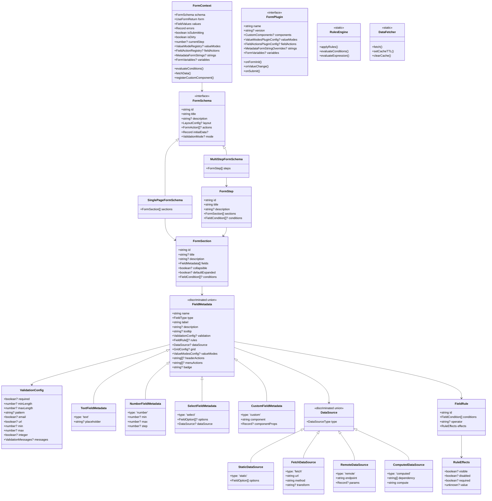
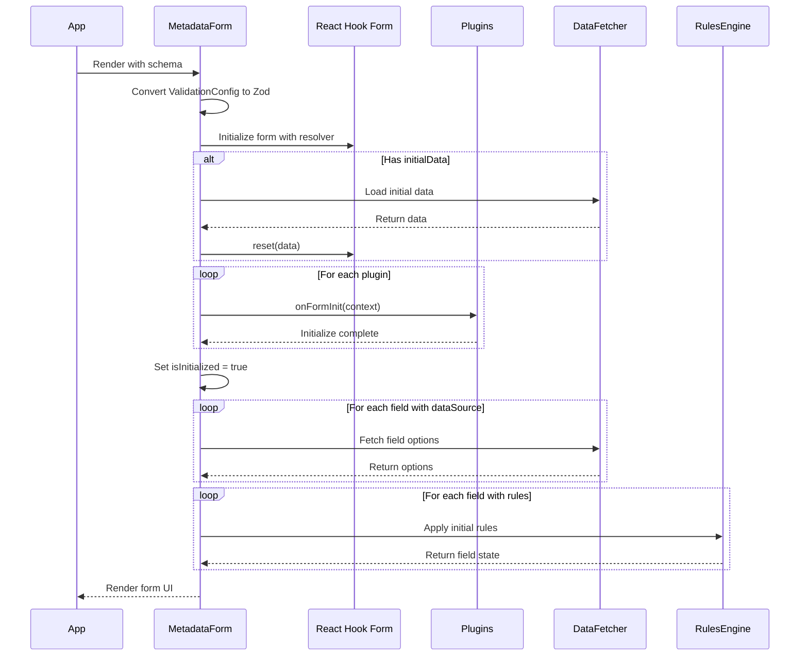
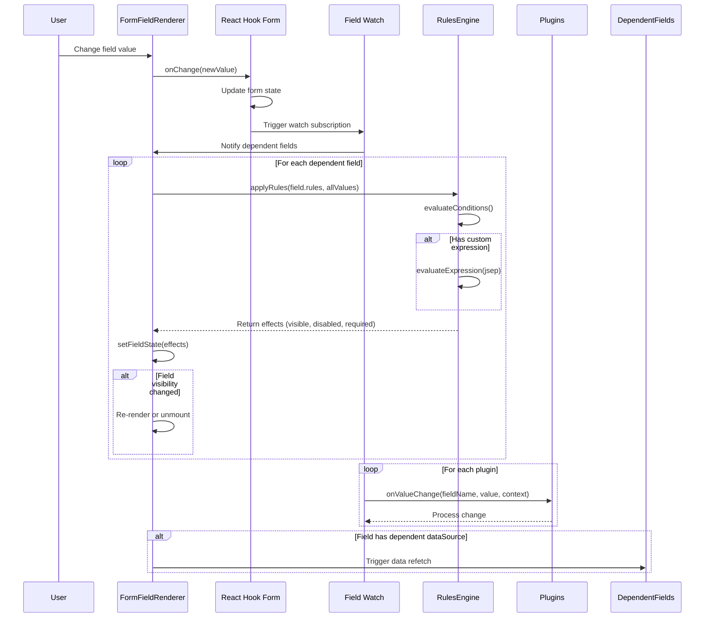
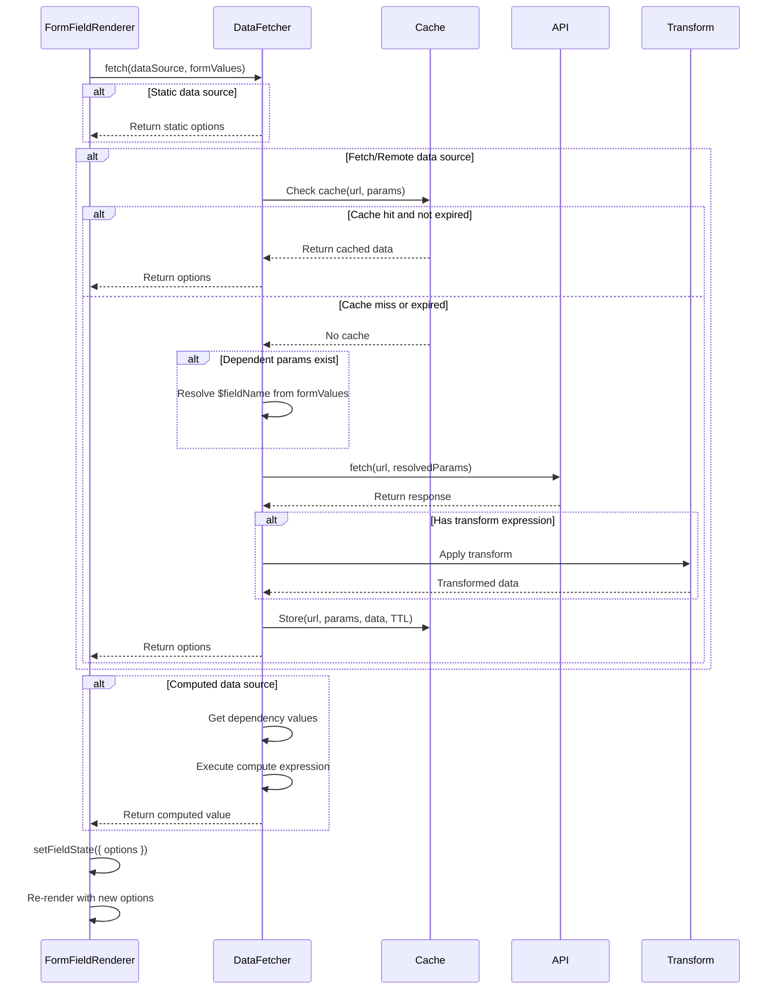
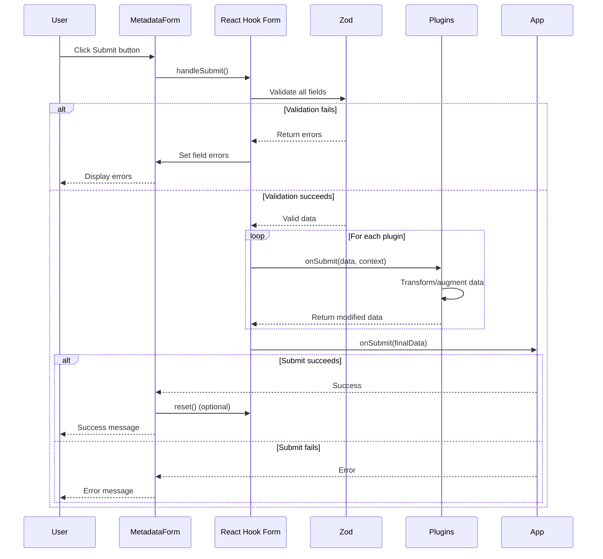
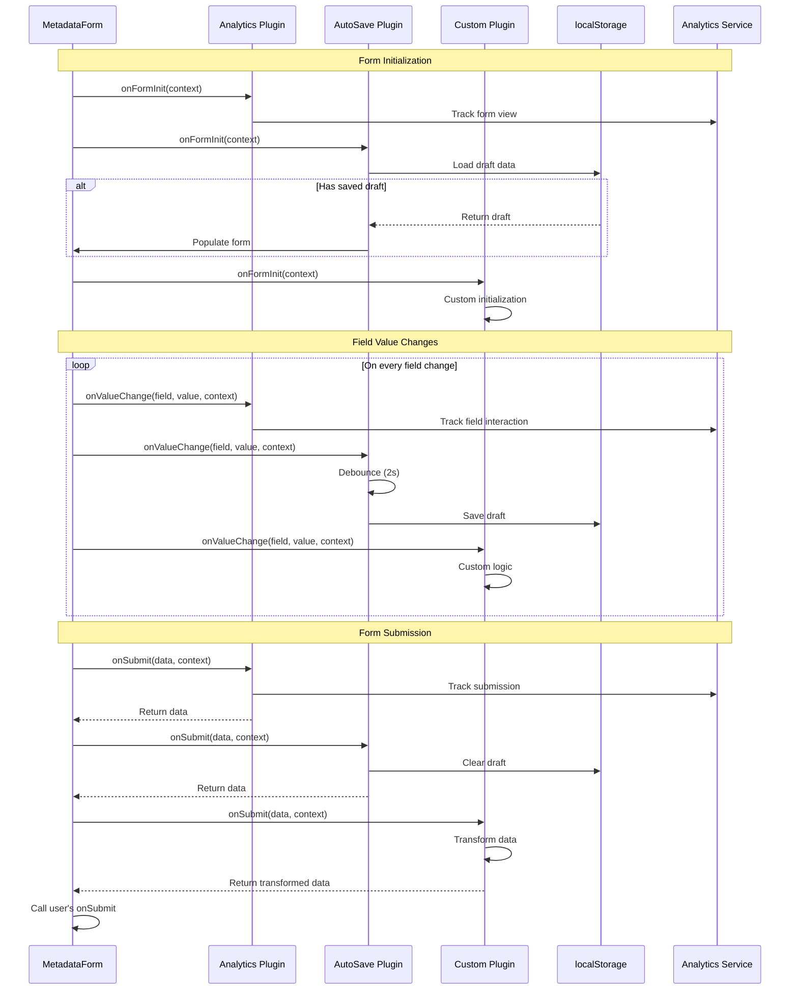

# Apollo-Wind Metadata Form System

A metadata-driven form system built on **React Hook Form**, **Zod**, and **shadcn/ui** for the
apollo-wind design system.

## Where to start

- **Build a form with `MetadataForm`.** Describe the fields; it renders every field's anatomy and
  owns the values, validation, rules, value modes and field actions. This is the fully controlled
  path.
- **Compose the field anatomy by hand** (`FormField`, `FormFieldHeader`, `InputGroup`, …) for a
  single field with no form to belong to, and inside a custom control, so its label, description
  and message match every other field. See [Field anatomy](#-field-anatomy).
- **`QuickFormField`** is for end users configuring their own fields in a HITL Quick Form, not for
  form authors.

Storybook: **Forms/Metadata Form** (one story per capability), **Forms/Value modes**,
**Forms/Field actions**, **Forms/Custom Controls**, **Forms/Designer**, and the guidance pages
**Forms/Guidance Field Anatomy** and **Forms/Guidance Field Type**.

All examples import from `@uipath/apollo-wind/components/forms`; the same API is exported from
`@uipath/apollo-wind`.

## Ownership contract

`MetadataForm` owns form state. Values live in react-hook-form, validation lives in the
schema, and a host interacts through four things — and only these four:

| Host need | Mechanism |
| --- | --- |
| Describe fields and their rules | `schema` (including `validation`, `rules`, `mode`) |
| Observe or drive values | a `FormPlugin`: `onValueChange` to read, `context.form.setValue` to write |
| Own a validation rule the schema cannot express | a plugin calling `context.form.setError` / `clearErrors` |
| Replace the form's state wholesale (undo/redo, switching entity) | remount with a new `key` |

There is deliberately no controlled-value prop. A second source of truth for values means
two things can disagree about what the user typed, and every consumer then reimplements the
reconciliation. `context.form` is the full `UseFormReturn`, so anything RHF can do, a plugin
can do.

**Reference hosts:** `NodePropertyPanel` (apollo-react) drives a schema-built form with
plugins plus a reset key; flow-workbench's `ValidationPlugin` runs per-field AJV and an async
worker, applying every result through `setError`/`clearErrors`, including checks AJV cannot
model.

**Validation that looks like it needs a host usually does not.** `required`, `pattern`,
`minItems`/`maxItems`, `minLength`/`maxLength`, `min`/`max` and a jsep `custom` expression all
live in `validation`. Custom components participate too, once the field declares its
`valueType` — without it a `type: 'custom'` field validates as `z.any()`, where `required` is
a no-op.

## 🎯 Key Features

### Core Capabilities

- ✅ **100% TypeScript** - Fully typed with discriminated unions and strict type
  safety
- ✅ **JSON Schema Driven** - Define forms in JSON/TypeScript with full type
  inference
- ✅ **React Hook Form** - Best-in-class performance with minimal re-renders
- ✅ **JSON-Serializable Validation** - ValidationConfig objects that can be
  stored in databases and transmitted via APIs
- ✅ **shadcn/ui Integration** - Beautiful, accessible components out of the box
- ✅ **Targeted watching** - Rules subscribe only to the fields they read
- ✅ **Visual Form Designer** - Build a schema with a live preview, value modes included

### Advanced Features

- 🔄 **Data Fetching** - Static, remote, computed, and dependent data sources
  with caching
- 🎨 **Conditional Logic** - Powerful rules engine with jsep for complex
  expressions
- 🔌 **Plugin System** - Extend functionality through lifecycle hooks
- 📊 **Multi-Step Forms** - Wizard-style forms with conditional step navigation
- 💾 **Auto-save** - Draft management with localStorage persistence
- 🎯 **Custom Components** - Type-safe custom field renderers
- 🔀 **Value Modes and Field Actions** - A field's value as a fixed value, an expression, a
  variable or a prompt, with Insert variable, AI assist and Clear
- 🌍 **Localisable** - Every built-in string through `FormPlugin.strings`
- ♿ **Accessibility First** - WCAG compliant with proper ARIA attributes

## 📁 Architecture

```
src/components/forms/
├── form-schema.ts              # Core type definitions (discriminated unions)
├── metadata-form.tsx           # Main form component with RHF integration
├── field-renderer.tsx          # Renders each field: plain, custom, or the field anatomy
├── field-control.tsx           # FieldControl: the bare control for each field type
├── mode-aware-field.tsx        # ModeAwareField: the field anatomy with value modes and actions
├── value-modes.ts              # Codecs, mode definitions, control resolution, literalValues
├── field-actions.tsx           # Insert variable, AI assist and Clear action factories
├── form-strings.ts             # MetadataFormStrings and the English defaults
├── string-list-field.tsx       # The string-list field type
├── rules-engine.ts             # Conditional logic engine with jsep
├── data-fetcher.ts             # Data source handling with caching
├── validation-converter.ts     # Converts ValidationConfig to Zod at runtime
├── schema-serializer.ts        # Serializes FormSchema to JSON for storage/API
├── form-plugins.ts             # Built-in plugins (analytics, auto-save, etc.)
├── form-designer.tsx           # Visual form builder with live preview
├── form-state-viewer.tsx       # Debug view of a react-hook-form instance
├── schema-viewer.tsx           # Dialog showing a schema as JSON
└── index.ts                    # Public API exports
```

### Class Diagram


```mermaid
classDiagram
    class FormSchema {
        <<interface>>
        +string id
        +string title
        +string? description
        +LayoutConfig? layout
        +FormAction[]? actions
        +Record initialData?
        +ValidationMode? mode
    }

    class SinglePageFormSchema {
        +FormSection[] sections
    }

    class MultiStepFormSchema {
        +FormStep[] steps
    }

    class FormSection {
        +string id
        +string? title
        +string? description
        +FieldMetadata[] fields
        +boolean? collapsible
        +boolean? defaultExpanded
        +FieldCondition[]? conditions
    }

    class FormStep {
        +string id
        +string title
        +string? description
        +FormSection[] sections
        +FieldCondition[]? conditions
    }

    class FieldMetadata {
        <<discriminated union>>
        +string name
        +FieldType type
        +string label
        +string? description
        +string? tooltip
        +ValidationConfig? validation
        +FieldRule[]? rules
        +DataSource? dataSource
        +GridConfig? grid
        +ValueModesConfig? valueModes
        +string[]? headerActions
        +string[]? menuActions
        +string? badge
    }

    class ValidationConfig {
        +boolean? required
        +number? minLength
        +number? maxLength
        +string? pattern
        +boolean? email
        +boolean? url
        +number? min
        +number? max
        +boolean? integer
        +ValidationMessages? messages
    }

    class TextFieldMetadata {
        +type: 'text'
        +string? placeholder
    }

    class NumberFieldMetadata {
        +type: 'number'
        +number? min
        +number? max
        +number? step
    }

    class SelectFieldMetadata {
        +type: 'select'
        +FieldOption[]? options
        +DataSource? dataSource
    }

    class CustomFieldMetadata {
        +type: 'custom'
        +string component
        +Record? componentProps
    }

    class DataSource {
        <<discriminated union>>
        +DataSourceType type
    }

    class StaticDataSource {
        +type: 'static'
        +FieldOption[] options
    }

    class FetchDataSource {
        +type: 'fetch'
        +string url
        +string method
        +string? transform
    }

    class RemoteDataSource {
        +type: 'remote'
        +string endpoint
        +Record? params
    }

    class ComputedDataSource {
        +type: 'computed'
        +string[] dependency
        +string compute
    }

    class FieldRule {
        +string id
        +FieldCondition[] conditions
        +string? operator
        +RuleEffects effects
    }

    class RuleEffects {
        +boolean? visible
        +boolean? disabled
        +boolean? required
        +unknown? value
    }

    class FormContext {
        +FormSchema schema
        +UseFormReturn form
        +FieldValues values
        +Record errors
        +boolean isSubmitting
        +boolean isDirty
        +number? currentStep
        +ValueModeRegistry? valueModes
        +FieldActionRegistry? fieldActions
        +MetadataFormStrings? strings
        +FormVariables? variables
        +evaluateConditions()
        +fetchData()
        +registerCustomComponent()
    }

    class FormPlugin {
        <<interface>>
        +string name
        +string? version
        +onFormInit()
        +onValueChange()
        +onSubmit()
        +CustomComponents? components
        +ValueModesPluginConfig? valueModes
        +FieldActionsPluginConfig? fieldActions
        +MetadataFormStringOverrides? strings
        +FormVariables? variables
    }

    class RulesEngine {
        <<static>>
        +applyRules()
        +evaluateConditions()
        +evaluateExpression()
    }

    class DataFetcher {
        <<static>>
        +fetch()
        +setCacheTTL()
        +clearCache()
    }

    FormSchema <|-- SinglePageFormSchema
    FormSchema <|-- MultiStepFormSchema
    SinglePageFormSchema --> FormSection
    MultiStepFormSchema --> FormStep
    FormStep --> FormSection
    FormSection --> FieldMetadata
    FieldMetadata <|-- TextFieldMetadata
    FieldMetadata <|-- NumberFieldMetadata
    FieldMetadata <|-- SelectFieldMetadata
    FieldMetadata <|-- CustomFieldMetadata
    FieldMetadata --> ValidationConfig
    FieldMetadata --> DataSource
    FieldMetadata --> FieldRule
    DataSource <|-- StaticDataSource
    DataSource <|-- FetchDataSource
    DataSource <|-- RemoteDataSource
    DataSource <|-- ComputedDataSource
    FieldRule --> RuleEffects
    FormContext --> FormSchema
```

## 🚀 Quick Start

### 1. Basic Form

```tsx
import { MetadataForm } from "@uipath/apollo-wind/components/forms";
import type { FormSchema } from "@uipath/apollo-wind/components/forms";

const schema: FormSchema = {
  id: "contact-form",
  title: "Contact Us",
  sections: [
    {
      id: "info",
      fields: [
        {
          name: "name",
          type: "text",
          label: "Full Name",
          placeholder: "John Doe",
          validation: {
            required: true,
            minLength: 2,
            messages: { minLength: "Name must be at least 2 characters" },
          },
        },
        {
          name: "email",
          type: "email",
          label: "Email Address",
          placeholder: "john@example.com",
          validation: {
            required: true,
            email: true,
            messages: { email: "Invalid email address" },
          },
        },
        {
          name: "message",
          type: "textarea",
          label: "Message",
          rows: 4,
          validation: {
            required: true,
            minLength: 10,
          },
        },
      ],
    },
  ],
};

function ContactPage() {
  const handleSubmit = async (data: unknown) => {
    console.log("Form submitted:", data);
    // Send to API
  };

  return <MetadataForm schema={schema} onSubmit={handleSubmit} />;
}
```

**Why ValidationConfig?** The validation configuration is a plain
JSON-serializable object, allowing schemas to be stored in databases, fetched
from APIs, and transmitted over the wire. At runtime, the system converts
`ValidationConfig` to Zod schemas for validation.

### 2. Multi-Step Form

```tsx
const onboardingSchema = {
  id: 'onboarding',
  title: 'User Onboarding',
  steps: [
    {
      id: 'personal',
      title: 'Personal Information',
      description: 'Tell us about yourself',
      sections: [{
        id: 's1',
        fields: [
          { name: 'firstName', type: 'text', label: 'First Name' },
          { name: 'lastName', type: 'text', label: 'Last Name' }
        ]
      }]
    },
    {
      id: 'preferences',
      title: 'Preferences',
      description: 'Customize your experience',
      sections: [{
        id: 's2',
        fields: [
          { name: 'theme', type: 'select', label: 'Theme', options: [...] },
          { name: 'notifications', type: 'switch', label: 'Enable Notifications' }
        ]
      }]
    }
  ]
};
```

### 3. With Plugins

```tsx
import { analyticsPlugin, autoSavePlugin, MetadataForm } from "@uipath/apollo-wind/components/forms";

<MetadataForm
  schema={schema}
  plugins={[analyticsPlugin, autoSavePlugin]}
  onSubmit={handleSubmit}
/>;
```

### 4. Visual Form Designer

```tsx
import { FormDesigner } from "@uipath/apollo-wind/components/forms";

function FormBuilderPage() {
  // FormDesigner is a self-contained visual editor
  // Export the schema from the "Schema" tab in the right panel
  return <FormDesigner />;
}
```

## 🔄 Lifecycle & Flow Diagrams

### Form Initialization Sequence


```mermaid
sequenceDiagram
    participant App
    participant MetadataForm
    participant RHF as React Hook Form
    participant Plugins
    participant DataFetcher
    participant RulesEngine

    App->>MetadataForm: Render with schema
    MetadataForm->>MetadataForm: Convert ValidationConfig to Zod
    MetadataForm->>RHF: Initialize form with resolver

    alt Has initialData
        MetadataForm->>DataFetcher: Load initial data
        DataFetcher-->>MetadataForm: Return data
        MetadataForm->>RHF: reset(data)
    end

    loop For each plugin
        MetadataForm->>Plugins: onFormInit(context)
        Plugins-->>MetadataForm: Initialize complete
    end

    MetadataForm->>MetadataForm: Set isInitialized = true

    loop For each field with dataSource
        MetadataForm->>DataFetcher: Fetch field options
        DataFetcher-->>MetadataForm: Return options
    end

    loop For each field with rules
        MetadataForm->>RulesEngine: Apply initial rules
        RulesEngine-->>MetadataForm: Return field state
    end

    MetadataForm-->>App: Render form UI
```

### Field Change & Rules Evaluation Sequence


```mermaid
sequenceDiagram
    participant User
    participant Field as FormFieldRenderer
    participant RHF as React Hook Form
    participant Watch as Field Watch
    participant RulesEngine
    participant Plugins
    participant DependentFields

    User->>Field: Change field value
    Field->>RHF: onChange(newValue)
    RHF->>RHF: Update form state

    RHF->>Watch: Trigger watch subscription
    Watch->>Field: Notify dependent fields

    loop For each dependent field
        Field->>RulesEngine: applyRules(field.rules, allValues)
        RulesEngine->>RulesEngine: evaluateConditions()

        alt Has custom expression
            RulesEngine->>RulesEngine: evaluateExpression(jsep)
        end

        RulesEngine-->>Field: Return effects (visible, disabled, required)
        Field->>Field: setFieldState(effects)

        alt Field visibility changed
            Field->>Field: Re-render or unmount
        end
    end

    loop For each plugin
        Watch->>Plugins: onValueChange(fieldName, value, context)
        Plugins-->>Watch: Process change
    end

    alt Field has dependent dataSource
        Field->>DependentFields: Trigger data refetch
    end
```

### Data Fetching Sequence


```mermaid
sequenceDiagram
    participant Field as FormFieldRenderer
    participant DataFetcher
    participant Cache
    participant API
    participant Transform

    Field->>DataFetcher: fetch(dataSource, formValues)

    alt Static data source
        DataFetcher-->>Field: Return static options
    end

    alt Fetch/Remote data source
        DataFetcher->>Cache: Check cache(url, params)

        alt Cache hit and not expired
            Cache-->>DataFetcher: Return cached data
            DataFetcher-->>Field: Return options
        else Cache miss or expired
            Cache-->>DataFetcher: No cache

            alt Dependent params exist
                DataFetcher->>DataFetcher: Resolve $fieldName from formValues
            end

            DataFetcher->>API: fetch(url, resolvedParams)
            API-->>DataFetcher: Return response

            alt Has transform expression
                DataFetcher->>Transform: Apply transform
                Transform-->>DataFetcher: Transformed data
            end

            DataFetcher->>Cache: Store(url, params, data, TTL)
            DataFetcher-->>Field: Return options
        end
    end

    alt Computed data source
        DataFetcher->>DataFetcher: Get dependency values
        DataFetcher->>DataFetcher: Execute compute expression
        DataFetcher-->>Field: Return computed value
    end

    Field->>Field: setFieldState({ options })
    Field->>Field: Re-render with new options
```

### Form Submission Sequence


```mermaid
sequenceDiagram
    participant User
    participant Form as MetadataForm
    participant RHF as React Hook Form
    participant Zod
    participant Plugins
    participant App

    User->>Form: Click Submit button
    Form->>RHF: handleSubmit()

    RHF->>Zod: Validate all fields

    alt Validation fails
        Zod-->>RHF: Return errors
        RHF->>Form: Set field errors
        Form-->>User: Display errors
    else Validation succeeds
        Zod-->>RHF: Valid data

        loop For each plugin
            RHF->>Plugins: onSubmit(data, context)
            Plugins->>Plugins: Transform/augment data
            Plugins-->>RHF: Return modified data
        end

        RHF->>App: onSubmit(finalData)

        alt Submit succeeds
            App-->>Form: Success
            Form->>RHF: reset() (optional)
            Form-->>User: Success message
        else Submit fails
            App-->>Form: Error
            Form-->>User: Error message
        end
    end
```

### Plugin Lifecycle Sequence


```mermaid
sequenceDiagram
    participant MetadataForm
    participant Plugin1 as Analytics Plugin
    participant Plugin2 as AutoSave Plugin
    participant Plugin3 as Custom Plugin
    participant Storage as localStorage
    participant Analytics as Analytics Service

    Note over MetadataForm,Analytics: Form Initialization

    MetadataForm->>Plugin1: onFormInit(context)
    Plugin1->>Analytics: Track form view

    MetadataForm->>Plugin2: onFormInit(context)
    Plugin2->>Storage: Load draft data
    alt Has saved draft
        Storage-->>Plugin2: Return draft
        Plugin2->>MetadataForm: Populate form
    end

    MetadataForm->>Plugin3: onFormInit(context)
    Plugin3->>Plugin3: Custom initialization

    Note over MetadataForm,Analytics: Field Value Changes

    loop On every field change
        MetadataForm->>Plugin1: onValueChange(field, value, context)
        Plugin1->>Analytics: Track field interaction

        MetadataForm->>Plugin2: onValueChange(field, value, context)
        Plugin2->>Plugin2: Debounce (2s)
        Plugin2->>Storage: Save draft

        MetadataForm->>Plugin3: onValueChange(field, value, context)
        Plugin3->>Plugin3: Custom logic
    end

    Note over MetadataForm,Analytics: Form Submission

    MetadataForm->>Plugin1: onSubmit(data, context)
    Plugin1->>Analytics: Track submission
    Plugin1-->>MetadataForm: Return data

    MetadataForm->>Plugin2: onSubmit(data, context)
    Plugin2->>Storage: Clear draft
    Plugin2-->>MetadataForm: Return data

    MetadataForm->>Plugin3: onSubmit(data, context)
    Plugin3->>Plugin3: Transform data
    Plugin3-->>MetadataForm: Return transformed data

    MetadataForm->>MetadataForm: Call user's onSubmit
```

## 🎨 Field Types

The system has 16 built-in field types:

| Type          | Description                                  | Props                                                          |
| ------------- | -------------------------------------------- | -------------------------------------------------------------- |
| `text`        | Single-line text input                       | `placeholder`                                                  |
| `email`       | Email input with validation                  | `placeholder`                                                  |
| `textarea`    | Multi-line text input                        | `rows`, `minRows`, `maxLength`, `placeholder`                  |
| `number`      | Number input with min/max                    | `min`, `max`, `step`                                           |
| `select`      | Single-select dropdown                       | `options`, `dataSource`                                        |
| `multiselect` | Multi-select with search                     | `options`, `maxSelected`, `emptyMessage`, `searchPlaceholder`  |
| `radio`       | Radio button group                           | `options`                                                      |
| `checkbox`    | Single checkbox                              | -                                                              |
| `switch`      | Toggle switch                                | -                                                              |
| `boolean`     | True / False radios with an unset state      | - (value `boolean \| null`)                                    |
| `slider`      | Range slider                                 | `min`, `max`, `step`, `maxRef`                                 |
| `date`        | Date picker                                  | `placeholder`                                                  |
| `datetime`    | Date and time picker                         | `use12Hour`                                                    |
| `file`        | File upload                                  | `accept`, `multiple`, `maxSize`, `showPreview`                 |
| `string-list` | Rows of text with Add and Remove             | `maxItems`, `maxLength`, `minRows`, `addItemLabel`, `removeItemAriaLabel` |
| `custom`      | A component the host registers               | `component`, `componentProps`, `valueType`                     |

Every field also takes `label`, `description`, `placeholder`, `tooltip`, `tooltipAriaLabel`,
`ariaLabel`, `defaultValue`, `validation`, `rules`, `dataSource` and `grid`, and the field anatomy's
`valueModes`, `headerActions`, `menuActions` and `badge`.

## 🧩 Field anatomy

Every field is built from the same parts. `MetadataForm` assembles them from the field's metadata;
for a field with `valueModes`, `headerActions`, `menuActions` or `badge` it renders them through
`ModeAwareField`, and any other field renders the label, the control, and the description or
message.

| Part        | Component                                                                  | From the metadata                                     |
| ----------- | -------------------------------------------------------------------------- | ----------------------------------------------------- |
| Field       | `FormField`                                                                | -                                                     |
| Header      | `FormFieldHeader` (label, required marker, tooltip, badge, actions)        | `label`, `validation.required`, `tooltip`, `badge`, `headerActions` |
| Box         | `InputGroup` (`layout`, `variant`)                                         | the control's registration, or `FIELD_CONTROL_GEOMETRY` |
| Mode glyph  | `ValueModeIndicator` in an `InputGroupAddon`                               | the active mode                                       |
| Control     | `FieldControl`, `VariableValueControl`, `PromptValueControl`, or a registered control | `type`, the active mode, `valueModes.controls` |
| Menu        | `FieldMenu` in a trailing `InputGroupAddon`                                | `valueModes.modes`, then `menuActions`                |
| Description | `FormFieldDescription`                                                     | `description`                                         |
| Message     | `FormFieldError`, or the `error` prop of a control with a message slot     | `validation`                                          |

For a field outside any form, and inside a custom control, compose the same parts (see
[Custom Components](#-custom-components) for a registered control):

```tsx
import {
  FieldMenu,
  FormField,
  FormFieldDescription,
  FormFieldHeader,
  Input,
  InputGroup,
  InputGroupAddon,
  InsertVariableAction,
  type ValueMode,
  ValueModeIndicator,
} from "@uipath/apollo-wind/components/ui";
import { X } from "lucide-react";
import { useState } from "react";

function OrderIdField() {
  const [mode, setMode] = useState<ValueMode>("literal");
  const [value, setValue] = useState("");
  return (
    <FormField>
      <FormFieldHeader
        label="Order id"
        htmlFor="order-id"
        actions={
          <InsertVariableAction
            variables={[{ id: "orderId", label: "orderId", value: "$vars.orderId" }]}
            onInsert={(reference) => {
              setMode("expression");
              setValue(reference);
            }}
          />
        }
      />
      <InputGroup error={value ? undefined : "Enter an order id."}>
        <InputGroupAddon>
          <ValueModeIndicator mode={mode} className="px-0" />
        </InputGroupAddon>
        <Input id="order-id" value={value} onChange={(e) => setValue(e.target.value)} />
        <InputGroupAddon align="inline-end">
          <FieldMenu
            mode={mode}
            onSelect={setMode}
            modes={["literal", "expression"]}
            actions={[{ id: "clear", label: "Clear value", icon: X, onSelect: () => setValue("") }]}
          />
        </InputGroupAddon>
      </InputGroup>
      <FormFieldDescription>The order to look up.</FormFieldDescription>
    </FormField>
  );
}
```

You then own what `MetadataForm` did: the value and its mode, validation, and what each action
writes. Rules for any field, in a form or not:

- Compose a custom field or control from whichever of these parts apply. Never hand-roll label,
  description or message markup, or wrap fields in a local shell.
- Field messages use `FormFieldError` (the `error` token), never `text-destructive`.
- Actions go in the header, never inside the box.
- Localise with each component's `strings` prop, or `FormPlugin.strings` in a form. There is no
  provider.

The Storybook page **Forms/Guidance Field Anatomy** shows both paths side by side.

## 🔀 Value modes and field actions

A field opts in through its metadata; behaviour comes from plugins.

```tsx
import {
  createAiAssistAction,
  createInsertVariableAction,
  type FormPlugin,
  type FormSchema,
  MetadataForm,
} from "@uipath/apollo-wind/components/forms";

const schema: FormSchema = {
  id: "send-email",
  title: "Send email",
  sections: [
    {
      id: "main",
      fields: [
        {
          name: "subject",
          type: "text",
          label: "Subject",
          valueModes: { modes: ["literal", "expression", "variable", "prompt"] },
          headerActions: ["insert-variable", "ai-assist"],
          menuActions: ["clear"],
        },
      ],
    },
  ],
};

// Declared once: MetadataForm rebuilds its registries when a plugin object changes.
const plugins: FormPlugin[] = [
  {
    name: "host",
    // A list, or a function called each time a picker opens.
    variables: [{ id: "orderId", label: "orderId", value: "$vars.orderId" }],
    fieldActions: {
      header: {
        "insert-variable": createInsertVariableAction({}),
        "ai-assist": createAiAssistAction({
          generate: async ({ prompt }) => ({ value: await suggestSubject(prompt) }),
        }),
      },
    },
  },
];

declare function suggestSubject(prompt: string): Promise<string>;

export function SendEmailForm() {
  return <MetadataForm schema={schema} plugins={plugins} onSubmit={console.log} />;
}
```

### `valueModes`

| Key           | Meaning                                                                                  |
| ------------- | ---------------------------------------------------------------------------------------- |
| `modes`       | The modes offered, in menu order. Built in: `literal` (Fixed value), `expression`, `variable`, `prompt`; plugins add more. |
| `defaultMode` | The mode of an empty value. Defaults to the first mode.                                  |
| `switchable`  | Whether the menu offers the modes. Defaults to more than one mode.                       |
| `expectedType`| The value's type as the modes describe it, such as `object`. Defaults to the field type's own. |
| `indicator`   | Whether a glyph ahead of the value marks a mode other than `literal`. Defaults to true.  |
| `controls`    | This field's control per mode, by name in `FormPlugin.valueModes.controlRegistry`.      |
| `codec`       | A codec registered in `FormPlugin.valueModes.codecs`. Defaults to `default`.             |
| `labels`      | Per-field overrides of a mode's title and description.                                   |

Every mode is opt-in per field. The built-in controls: the field type's own control for
`literal`, a plain input for `expression`, `VariableValueControl` (the whole box picks a variable)
for `variable`, and `PromptValueControl` (a textarea in the agent-tinted box) for `prompt`.

### Stored values

With the default codec (`envelopeCodec`) every write is an envelope, fixed values included:

```ts
{ $mode: "literal", value: "Hello" }
{ $mode: "expression", value: "$vars.firstName + ' ' + $vars.lastName" }
{ $mode: "variable", value: "$vars.orderId" }
{ $mode: "prompt" } // cleared: the envelope keeps its mode
```

A cleared value is never `undefined`: a field with modes keeps `{ $mode }`, and a plain field
clears to `null`. A raw value is read as a fixed value, so existing data loads, and the first
write wraps it. Whatever reads the form's values (submit handlers, plugins, saved drafts) must
expect the envelope once a field adopts value modes; that migration is the host's to make. A codec
registered as `default` in `FormPlugin.valueModes.codecs` replaces the envelope form-wide.

**Rules, section conditions and data-source params read a field's fixed value only.** In any
other mode the field reads as `VALUE_MODE_OPAQUE`: set, but equal to nothing, so it matches no
condition. `literalValues(values, schema, codecs?)` gives the same view to host code.

### Plugin `valueModes`

```ts
interface ValueModesPluginConfig {
  codecs?: Record<string, ValueModeCodec>; // `default` replaces the envelope codec
  definitions?: Partial<Record<ValueModeId, ValueModeDefinition>>; // host modes, or changes to built-ins
  controlRegistry?: Record<string, ValueModeControlRegistration>; // controls a field names
  literalControls?: Partial<Record<FieldType, ValueModeControlRegistration>>; // fixed-value control per type
}

interface ValueModeDefinition {
  icon?: LucideIcon;
  title?: string | ((ctx: { field: FieldMetadata }) => string);
  description?: string;
  indicator?: ReactNode;
  control?: ValueModeControlRegistration;
  validate?: (value: unknown, ctx: CodecContext) => string | undefined; // sync
}
```

The control for a mode resolves in order: the field's `valueModes.controls[mode]`, then
`literalControls[fieldType]` (fixed value only), then `definitions[mode].control`, then the built-in
control, then a plain input. A registration (`{ component, layout?, variant?, labelTarget?,
insertable? }`) also places the control in the box.

Validation: a fixed value is checked by its field type's `validation`; any other mode by
`required` and the mode's `validate`.

### Field actions

`headerActions` and `menuActions` name actions registered in `FormPlugin.fieldActions`
(`{ header, menu }`), in render order. Fields list what they offer; there are no defaults.

| Factory                                       | Action                                                                                         |
| --------------------------------------------- | ---------------------------------------------------------------------------------------------- |
| `createInsertVariableAction({ variables?, formatReference?, strings?, id? })` | Inserts a variable. An `insertable` control takes it at the caret; otherwise the field switches to `expression`, then `variable`, asking before it replaces a value. Hidden in Variable mode. |
| `createAiAssistAction({ generate, hint?, placeholder?, strings?, id? })` | Asks for a prompt and writes `generate`'s result in the field's mode, or the `mode` it returns. Skips the write if the field became disabled; closing the prompt does not cancel the request. |
| `createClearAction({ strings?, id? })`         | Clears the value, keeping the mode. Registered as `clear` by default.                         |

Register an action under the same id to replace a built-in.

### Variables and strings

- `FormPlugin.variables` feeds both Insert variable and the `variable` mode: a list, or a function
  called each time a picker opens (never during render). The last plugin that gives them wins.
- `FormPlugin.strings` overrides any built-in string by group (`valueModes`, `boolean`,
  `insertVariable`, `aiAssist`, `clear`, `validation`); later plugins win per string. The English
  defaults are `DEFAULT_METADATA_FORM_STRINGS`.

### Render stability

- Keep plugin objects stable: a module constant, or memoized. A new plugin object rebuilds the
  registries and re-renders every field; a new array of the same plugins is fine.
- Pass `variables` as a function when the list is long or changes.
- Keep codecs pure: no live values captured in a codec.

## 📊 Data Sources

### Static Options

```typescript
{
  name: 'country',
  type: 'select',
  label: 'Country',
  dataSource: {
    type: 'static',
    options: [
      { label: 'United States', value: 'US' },
      { label: 'Canada', value: 'CA' },
      { label: 'United Kingdom', value: 'UK' }
    ]
  }
}
```

### Remote Data Fetching

```typescript
{
  name: 'users',
  type: 'select',
  label: 'Assign To',
  dataSource: {
    type: 'fetch',
    url: '/api/users',
    method: 'GET',
    transform: 'data.map(u => ({ label: u.name, value: u.id }))'
  }
}
```

### Dependent Data (Cascading Dropdowns)

```typescript
import { DataSourceBuilder } from '@uipath/apollo-wind/components/forms';

// Parent field
{
  name: 'country',
  type: 'select',
  label: 'Country',
  dataSource: DataSourceBuilder.static([...])
}

// Dependent child field
{
  name: 'state',
  type: 'select',
  label: 'State',
  dataSource: {
    type: 'remote',
    endpoint: '/api/states',
    params: {
      countryCode: '$country'  // References country field
    }
  }
}
```

### Computed Values

```typescript
{
  name: 'total',
  type: 'number',
  label: 'Total Price',
  dataSource: {
    type: 'computed',
    dependency: ['quantity', 'price'],
    compute: '(quantity || 0) * (price || 0)'
  }
}
```

### Data Source Builders

```typescript
import { DataSourceBuilder } from "@uipath/apollo-wind/components/forms";

// Static
const countries = DataSourceBuilder.static([{ label: "US", value: "US" }]);

// Remote GET
const users = DataSourceBuilder.get("/api/users");

// Dependent
const cities = DataSourceBuilder.dependent(
  "/api/cities",
  "country",
  "countryCode",
);

// Computed
const total = DataSourceBuilder.computed(
  ["quantity", "price"],
  "(quantity || 0) * (price || 0)",
);
```

## 🎯 Rules Engine

### Basic Show/Hide Rules

```typescript
import { RuleBuilder } from '@uipath/apollo-wind/components/forms';

{
  name: 'ssn',
  type: 'text',
  label: 'Social Security Number',
  rules: [
    new RuleBuilder('show-ssn-for-us')
      .when('country')
      .is('US')
      .show()
      .require()
      .build()
  ]
}
```

### Multiple Conditions

```typescript
// OR operator
new RuleBuilder("premium-features")
  .when("planType")
  .in(["enterprise", "premium"])
  .useOperator("OR")
  .when("customerId")
  .matches("^ENT-")
  .show()
  .build();

// AND operator (default)
new RuleBuilder("senior-requirements")
  .when("position")
  .is("senior")
  .when("experience")
  .custom("value >= 5")
  .require()
  .build();
```

### Complex Expressions with jsep

```typescript
import { ExpressionBuilder } from "@uipath/apollo-wind/components/forms";

// Using ExpressionBuilder
new RuleBuilder("discount-eligible")
  .withCustomExpression(
    ExpressionBuilder.and(
      ExpressionBuilder.greaterThan("orderTotal", 100),
      ExpressionBuilder.equals("customerType", "premium"),
    ),
  )
  .show()
  .build();

// Or write expressions directly
{
  rules: [
    {
      id: "complex-rule",
      conditions: [
        {
          when: "",
          custom: 'age >= 18 && (status === "active" || role === "admin")',
        },
      ],
      effects: {
        visible: true,
        required: true,
      },
    },
  ];
}
```

### All Rule Effects

```typescript
rules: [{
  conditions: [...],
  effects: {
    visible: true,        // Show/hide field
    disabled: false,      // Enable/disable field
    required: true,       // Make field required
    value: 'computed',    // Set field value programmatically
  }
}]
```

### Expression Helpers

```typescript
// Built-in expression builders
ExpressionBuilder.equals("status", "active"); // status == "active"
ExpressionBuilder.greaterThan("age", 18); // age > 18
ExpressionBuilder.isEmpty("field"); // !field || field == ''
ExpressionBuilder.between("score", 0, 100); // score >= 0 && score <= 100
ExpressionBuilder.and("expr1", "expr2"); // (expr1 && expr2)
ExpressionBuilder.or("expr1", "expr2"); // (expr1 || expr2)
ExpressionBuilder.sum(["field1", "field2"]); // (field1 || 0) + (field2 || 0)
```

## 🔌 Plugin System

### Creating a Plugin

```typescript
import type { FormContext, FormPlugin } from "@uipath/apollo-wind/components/forms";

export const myPlugin: FormPlugin = {
  name: "my-plugin",
  version: "1.0.0",

  // Lifecycle hooks
  onFormInit: async (context: FormContext) => {
    console.log("Form initialized:", context.schema.id);
  },

  onValueChange: (fieldName: string, value: unknown, context: FormContext) => {
    console.log(`${fieldName} changed to:`, value);
  },

  onSubmit: async (data: unknown, context: FormContext) => {
    // Transform or validate data before submission
    console.log("Submitting:", data);
    return data;
  },

  // Custom components
  components: {
    "my-field": MyCustomFieldComponent,
  },
};
```

`FormPlugin` also types `onFieldRegister`, `validators`, `customConditions` and `customEffects`,
but `MetadataForm` does not call them yet, and rules do not apply the `options` and `validate`
effects `FieldRule` types. Put a rule a plugin owns in `onValueChange` with
`context.form.setError` / `clearErrors`, as in the [ownership contract](#ownership-contract).

### Built-in Plugins

| Plugin             | What it does                                                        |
| ------------------ | ------------------------------------------------------------------- |
| `analyticsPlugin`  | Tracks form views, field interactions and submissions               |
| `autoSavePlugin`   | Saves the form's values to localStorage, debounced                  |
| `workflowPlugin`   | Integrates with automation platforms such as UiPath Orchestrator    |
| `auditPlugin`      | Keeps field-level history for compliance and auditing               |
| `validationPlugin` | Common validators: phone, credit card, URL, postal code (through `validators`, not applied yet) |
| `formattingPlugin` | Custom conditions for business hours and weekends (through `customConditions`, not applied yet) |

Pass them like any plugin, as in [With Plugins](#3-with-plugins).

## 🎨 Custom Components

### Register Custom Field Component

Register the component in a plugin's `components`, then name it in a `custom` field. Declare
`valueType` so `required` and the other constraints apply; without it the field validates as
`z.any()`.

```tsx
import type {
  CustomFieldComponentProps,
  FormPlugin,
  FormSchema,
} from "@uipath/apollo-wind/components/forms";
import { MetadataForm } from "@uipath/apollo-wind/components/forms";
import {
  FormField,
  FormFieldDescription,
  FormFieldError,
  FormFieldLabel,
  Textarea,
} from "@uipath/apollo-wind/components/ui";

// Without value modes or field actions, a custom component renders the whole field,
// composed from the field anatomy parts.
function NotesField({
  name,
  value,
  onChange,
  onBlur,
  disabled,
  required,
  error,
  field,
}: CustomFieldComponentProps) {
  const errorId = `${name}-error`;
  return (
    <FormField>
      <FormFieldLabel htmlFor={name} required={required}>
        {field?.label}
      </FormFieldLabel>
      <Textarea
        id={name}
        value={typeof value === "string" ? value : ""}
        onChange={(e) => onChange(e.target.value)}
        onBlur={onBlur}
        disabled={disabled}
        aria-invalid={error ? true : undefined}
        aria-describedby={error ? errorId : undefined}
      />
      <FormFieldDescription>{field?.description}</FormFieldDescription>
      <FormFieldError id={errorId}>{error}</FormFieldError>
    </FormField>
  );
}

const schema: FormSchema = {
  id: "notes",
  title: "Notes",
  sections: [
    {
      id: "main",
      fields: [
        {
          name: "notes",
          type: "custom",
          component: "notes",
          label: "Notes",
          valueType: "string",
          validation: { required: true },
        },
      ],
    },
  ],
};

// Declared once, so MetadataForm keeps its registries.
const plugins: FormPlugin[] = [{ name: "host", components: { notes: NotesField } }];

export function NotesForm() {
  return <MetadataForm schema={schema} plugins={plugins} />;
}
```

With `valueModes`, `headerActions`, `menuActions` or `badge`, `MetadataForm` renders the anatomy
around the component, which is then only the control. Register it with its place in the box:
`components: { notes: { component: NotesControl, layout: "grow", insertable: true } }`. It also
receives `controlRef`, the handle Insert variable writes through, and `labelId`, for a control
registered with `labelTarget: "labelledby"` that names itself.

### CustomFieldComponentProps Interface

```typescript
interface CustomFieldComponentProps {
  value: unknown; // in the field anatomy: the fixed value, decoded
  onChange: (value: unknown) => void;
  onBlur: () => void;
  name: string;
  field?: FieldMetadata;
  disabled?: boolean;
  required?: boolean;
  error?: string;
  controlRef?: React.Ref<ValueModeControlHandle>; // in the field anatomy
  labelId?: string; // in the field anatomy
  [key: string]: unknown; // Additional props from componentProps
}
```

## 💾 Layout & Styling

### Grid Layout

```typescript
{
  id: 'my-form',
  title: 'Form',
  layout: {
    columns: 2,        // Number of columns
    gap: 6,            // Tailwind gap value
    variant: 'default' // 'default' | 'compact' | 'spacious'
  },
  sections: [...]
}
```

### Field Grid Spans

```typescript
{
  name: 'description',
  type: 'textarea',
  label: 'Description',
  grid: {
    span: 2,          // Spans 2 columns
    order: 1,         // Display order
    breakpoint: 'md'  // Responsive breakpoint
  }
}
```

### Collapsible Sections

```typescript
{
  sections: [{
    id: 'advanced',
    title: 'Advanced Settings',
    collapsible: true,
    defaultExpanded: false,
    fields: [...]
  }]
}
```

## 🎯 TypeScript Type Safety

### Discriminated Union Types

The form system uses discriminated unions for type-safe field definitions:

```typescript
// Each field type has specific properties
type FieldMetadata =
  | { type: 'text'; placeholder?: string }
  | { type: 'number'; min?: number; max?: number; step?: number }
  | { type: 'select'; options?: FieldOption[]; dataSource?: DataSource }
  | { type: 'custom'; component: string; componentProps?: Record<string, unknown> }
  | ... // 16 field types

// TypeScript enforces valid properties for each type
const field: FieldMetadata = {
  type: 'number',
  min: 0,
  max: 100,
  // placeholder: '...'  // ❌ Error: 'placeholder' doesn't exist on number field
};
```

### Type Guards

```typescript
import {
  hasMinMaxStep,
  hasOptions,
  isCustomField,
} from "@uipath/apollo-wind/components/forms";

if (hasOptions(field)) {
  // TypeScript knows field is SelectField | MultiSelectField | RadioField
  const opts = field.options;
}

if (isCustomField(field)) {
  // TypeScript knows field is CustomFieldMetadata
  const component = field.component;
}
```

### Form Context Type

```typescript
interface FormContext<T extends FieldValues = FieldValues> {
  schema: FormSchema;
  form: UseFormReturn<T>;
  values: T;
  errors: Record<string, unknown>;
  isSubmitting: boolean;
  isDirty: boolean;
  currentStep?: number;

  evaluateConditions: (conditions: FieldCondition[]) => boolean;
  fetchData: (source: DataSource) => Promise<FieldOption[]>;
  registerCustomComponent: (
    name: string,
    component: React.ComponentType<CustomFieldComponentProps>,
  ) => void;

  valueModes?: ValueModeRegistry; // codecs, definitions and controls from every plugin
  fieldActions?: FieldActionRegistry; // actions from every plugin
  strings?: MetadataFormStrings; // every plugin's strings over the English defaults
  variables?: FormVariables; // the last plugin's variables
}
```

## 💾 Schema Serialization

The form system uses JSON-serializable `ValidationConfig` objects instead of Zod
schemas, enabling true data-driven forms that can be stored and transmitted.

### ValidationConfig Structure

```typescript
interface ValidationConfig {
  // Presence
  required?: boolean;

  // String constraints
  minLength?: number;
  maxLength?: number;
  pattern?: string; // Regex pattern as string
  email?: boolean;
  url?: boolean;

  // Number constraints
  min?: number;
  max?: number;
  integer?: boolean;
  positive?: boolean;
  negative?: boolean;

  // Array constraints
  minItems?: number;
  maxItems?: number;

  // Custom error messages
  messages?: {
    required?: string;
    minLength?: string;
    maxLength?: string;
    pattern?: string;
    min?: string;
    max?: string;
    email?: string;
    // ... etc
  };
}
```

### Serializing Schemas

```typescript
import {
  schemaToJson,
  serializeSchema,
} from "@uipath/apollo-wind/components/forms/schema-serializer";

// Convert schema to JSON-safe object
const jsonObject = serializeSchema(myFormSchema);

// Or convert directly to JSON string
const jsonString = schemaToJson(myFormSchema, 2); // 2-space indent

// Store in database or send via API
await db.formSchemas.insert({ schema: jsonObject });
```

### Loading Schemas from API

```typescript
// Fetch schema from API
const response = await fetch("/api/forms/contact-form");
const schema: FormSchema = await response.json();

// Use directly with MetadataForm
<MetadataForm schema={schema} onSubmit={handleSubmit} />;
```

### Runtime Validation Conversion

`MetadataForm` converts each field's `ValidationConfig` to Zod at runtime, with
`validationConfigToZod`:

```typescript
import { validationConfigToZod } from "@uipath/apollo-wind/components/forms/validation-converter";

// Internal: MetadataForm does this automatically
const zodSchema = validationConfigToZod(
  { required: true, minLength: 2, email: true },
  "email",
);
// Returns: z.string().min(2).email()
```

## 🔒 Security Considerations

### Validation Is Client-Side

`validation`, rules and value-mode `validate` help people fix a value before they submit it. They
run in the browser, so they are not a control: validate submitted values on the server as well.

### Expression Evaluation

The rules engine uses `jsep` for safe expression parsing with a minimal
evaluator:

```typescript
// ✅ Safe: Uses jsep AST parsing
custom: 'age > 18 && status === "active"';

// ⚠️ Production best practices:
// 1. Validate expressions on the backend
// 2. Keep an allow list of expressions
// 3. Sanitize user input
// 4. Set expression complexity limits
```

### Data Fetching

API calls should implement proper security:

```typescript
// ✅ Best practices
const dataSource = {
  type: "fetch",
  url: "/api/protected-resource",
  method: "GET",
  // Add authentication in a fetch interceptor or middleware
};

// Backend should:
// 1. Authenticate all requests
// 2. Validate permissions
// 3. Rate limit endpoints
// 4. Sanitize responses
```

### Data Transformation

Transform expressions execute in a sandboxed function:

```typescript
// ⚠️ Be cautious with user-provided transforms
transform: "data.map(item => ({ label: item.name, value: item.id }))";

// Production: Validate transforms on backend before storing
```

## 📈 Performance Optimizations

### Smart Field Watching

The system only watches fields that are actually used in rules:

```typescript
// ✅ Efficient: Only watches 'country' field
{
  name: 'ssn',
  rules: [
    new RuleBuilder('show-ssn')
      .when('country').is('US')
      .show()
      .build()
  ]
}
// Only re-renders when 'country' changes, not on every field change
```

### Data Source Caching

Remote data is cached with a 5-minute TTL:

```typescript
import { DataFetcher } from "@uipath/apollo-wind/components/forms";

// Configure cache TTL
DataFetcher.setCacheTTL(10 * 60 * 1000); // 10 minutes

// Clear cache when needed
DataFetcher.clearCache();
DataFetcher.clearCache("/api/users"); // Clear specific pattern
```

### Lazy Section Rendering

Collapsible sections unmount when collapsed, reducing DOM size.

### Optimized Validation

Configurable validation modes:

```typescript
{
  id: 'my-form',
  mode: 'onSubmit',           // Validate only on submit
  reValidateMode: 'onChange', // Re-validate on change after first submit
  sections: [...]
}
```

## 🧪 Testing

### Unit Testing

```tsx
import "@testing-library/jest-dom/vitest";
import { render, screen, waitFor } from "@testing-library/react";
import userEvent from "@testing-library/user-event";
import { describe, expect, it, vi } from "vitest";
import { type FormSchema, MetadataForm, RuleBuilder } from "@uipath/apollo-wind/components/forms";

const schema: FormSchema = {
  id: "test",
  title: "Test",
  sections: [
    {
      id: "s1",
      fields: [
        { name: "name", type: "text", label: "Name" },
        { name: "international", type: "switch", label: "International" },
        {
          name: "passport",
          type: "text",
          label: "Passport",
          rules: [new RuleBuilder("show-passport").when("international").is(true).show().build()],
        },
      ],
    },
  ],
};

describe("MetadataForm", () => {
  it("submits the values", async () => {
    const user = userEvent.setup();
    const onSubmit = vi.fn();
    render(<MetadataForm schema={schema} onSubmit={onSubmit} />);

    await user.type(screen.getByLabelText("Name"), "Ada");
    await user.click(screen.getByRole("button", { name: "Submit" }));

    await waitFor(() => expect(onSubmit).toHaveBeenCalledWith(expect.objectContaining({ name: "Ada" })));
  });

  it("applies conditional rules", async () => {
    const user = userEvent.setup();
    render(<MetadataForm schema={schema} />);
    expect(screen.queryByLabelText("Passport")).not.toBeInTheDocument();

    await user.click(screen.getByRole("switch", { name: "International" }));

    expect(await screen.findByLabelText("Passport")).toBeInTheDocument();
  });
});
```

## 🎯 Examples

Every capability has a live story under **Forms/Metadata Form** in Storybook: basic form, compact
layout, sections and tabs, multi-step wizard, field rules, section conditions, remote data
sources, slider max from another field, file upload, string list and plugins. Each story's
**View Schema** button shows its schema.

## 📚 API Reference

### MetadataForm Props

```typescript
interface MetadataFormProps {
  schema: FormSchema; // Form schema definition
  plugins?: FormPlugin[]; // Keep each plugin object stable (a module constant or memoized)
  onSubmit?: (data: unknown) => void | Promise<void>;
  className?: string; // CSS class for form wrapper
  disabled?: boolean; // Disables every field
  autoComplete?: "off" | "on"; // Browser autocomplete; browser default when omitted
  stepVariant?: "wizard" | "tabs"; // Multi-step presentation (default "wizard")
  sectionVariant?: "card" | "plain"; // Section treatment (default "card")
  activeStepId?: string; // Controlled active tab for stepVariant="tabs"
  onActiveStepChange?: (stepId: string) => void; // Fires when a tab is selected
  container?: "form" | "div"; // "div" for hosts that own submission
}
```

### FormDesigner

The `FormDesigner` is a self-contained visual form builder component with its
own internal state. It provides:

- **Left panel**: Sections and fields tree with drag reordering
- **Middle panel**: Configuration forms for selected section/field
- **Right panel**: Live preview and schema export

```tsx
import { FormDesigner } from "@uipath/apollo-wind/components/forms";

function FormBuilderPage() {
  return <FormDesigner />;
}
```

The designer exports the generated schema via the "Schema" tab in the right
panel, which can be copied and used with `MetadataForm`. Its field settings
include value modes, header and menu actions, and a badge; the preview supplies
variables and the Insert variable and AI assist actions.

### FormStateViewer Props

```typescript
interface FormStateViewerProps {
  form: UseFormReturn<FieldValues>; // React Hook Form instance
  title?: string; // Title for the viewer
  className?: string; // CSS class for wrapper
  compact?: boolean; // Compact display mode
}
```

The `FormStateViewer` component displays React Hook Form state in a
user-friendly way, showing values, errors, dirty fields, and form metadata.
Useful for debugging forms.

### FormSchema Type

```typescript
type FormSchema = SinglePageFormSchema | MultiStepFormSchema;

interface SinglePageFormSchema {
  id: string;
  title: string;
  description?: string;
  version?: string;
  sections: FormSection[];
  layout?: LayoutConfig;
  actions?: FormAction[];
  initialData?: Record<string, unknown>;
  mode?: "onChange" | "onBlur" | "onSubmit" | "all";
  reValidateMode?: "onChange" | "onBlur" | "onSubmit";
  metadata?: Record<string, unknown>;
}

interface MultiStepFormSchema {
  // ...the same fields, with steps in place of sections
  steps: FormStep[];
}

interface FormStep {
  id: string;
  title: string;
  description?: string;
  sections: FormSection[];
  validation?: "onChange" | "onBlur" | "onSubmit";
  canSkip?: boolean;
  conditions?: FieldCondition[]; // Show or hide the whole step
  emptyState?: string; // Tabs variant: message for a step with no visible sections
}
```

## 🤝 Contributing

This is a reference implementation for apollo-wind. To extend:

1. Add new field types in `form-schema.ts`, `field-control.tsx` (with a `FIELD_CONTROL_GEOMETRY`
   entry) and `validation-converter.ts`
2. Create custom plugins in `form-plugins.tsx`
3. Add data transformers in `data-fetcher.ts`
4. Extend rules engine in `rules-engine.ts`

## 📄 License

MIT - Built for the apollo-wind design system

## 🔗 Resources

- [React Hook Form Documentation](https://react-hook-form.com/)
- [Zod Schema Validation](https://github.com/colinhacks/zod)
- [shadcn/ui Components](https://ui.shadcn.com/)
- [jsep Expression Parser](https://github.com/EricSmekens/jsep)
- [UiPath Orchestrator API](https://docs.uipath.com/orchestrator/reference)
